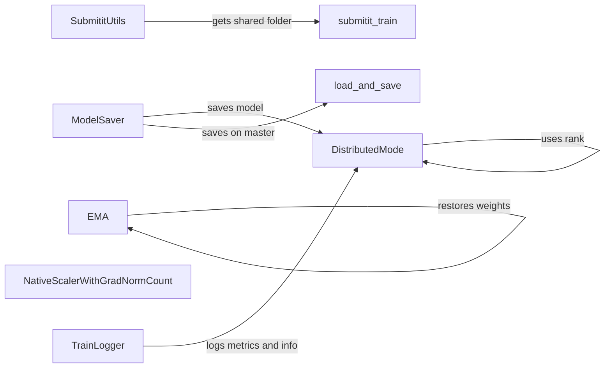

## Component Details

### TrainLogger
The TrainLogger component is responsible for managing logging during the training process. It handles both text-based logging to a file and integration with Weights & Biases (wandb) for experiment tracking. The component initializes a logger and a wandb run (if enabled) and provides methods for logging metrics, learning rates, and general information/warnings, facilitating experiment monitoring and analysis.
- **Related Classes/Methods**: `repos.flow_matching.examples.text.utils.logging.TrainLogger`, `repos.flow_matching.examples.text.utils.logging.get_logger`

### DistributedMode
The DistributedMode component provides utilities for enabling and managing distributed training across multiple devices or machines. It includes functions to get the world size, rank, and determine the main process, which are essential for coordinating training and ensuring proper synchronization in distributed setups. This component abstracts away the complexities of distributed training, making it easier to scale training jobs.
- **Related Classes/Methods**: `repos.flow_matching.examples.image.training.distributed_mode.get_world_size`, `repos.flow_matching.examples.image.training.distributed_mode.get_rank`, `repos.flow_matching.examples.image.training.distributed_mode.is_main_process`, `repos.flow_matching.examples.image.training.distributed_mode.is_dist_avail_and_initialized`

### ModelSaver
The ModelSaver component handles the saving of model checkpoints during training. It ensures that the model is saved only on the master process in distributed training setups to prevent conflicts and maintain consistency. This component encapsulates the logic for saving model checkpoints, including handling distributed training scenarios.
- **Related Classes/Methods**: `repos.flow_matching.examples.image.training.load_and_save.save_model`, `repos.flow_matching.examples.image.training.load_and_save.save_on_master`

### EMA
The EMA (Exponential Moving Average) component implements a moving average of the model's parameters, which can improve training stability and generalization. It maintains a moving average of the model's weights, which is often used for evaluation. This component helps to smooth out the training process and improve the model's performance.
- **Related Classes/Methods**: `repos.flow_matching.examples.image.models.ema.EMA`

### NativeScalerWithGradNormCount
The NativeScalerWithGradNormCount component handles gradient scaling to prevent underflow during mixed-precision training and also tracks gradient norms. This is crucial for stable training with fp16 or bf16 precision. By scaling gradients and monitoring their norms, this component helps to ensure stable and efficient training with mixed precision.
- **Related Classes/Methods**: `repos.flow_matching.examples.image.training.grad_scaler.NativeScalerWithGradNormCount`

### SubmititUtils
The SubmititUtils component provides utilities for running training jobs using submitit, a tool for submitting jobs to Slurm or other cluster management systems. It includes functions to get the initialization file and shared folder, which are needed for distributed training with submitit. This component simplifies the process of submitting and managing training jobs on cluster environments.
- **Related Classes/Methods**: `repos.flow_matching.examples.image.submitit_train.get_init_file`, `repos.flow_matching.examples.image.submitit_train.get_shared_folder`
