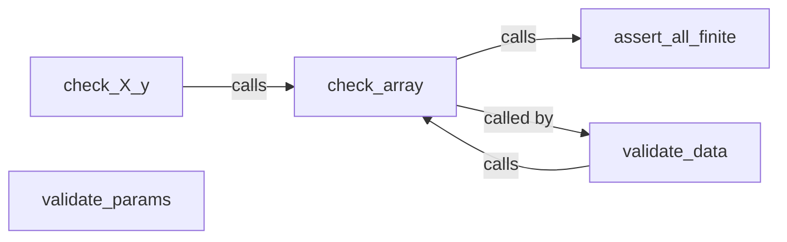

## Component Details

The Utilities and Support Infrastructure component in scikit-learn provides a suite of tools for data and parameter validation, ensuring the library's robustness and reliability. It encompasses functions for checking data types, finiteness, and consistency, as well as validating estimator parameters against defined constraints. These utilities are fundamental to the proper functioning of various scikit-learn estimators and modules, preventing common errors and ensuring data integrity throughout the machine learning pipeline.

### check_X_y
Validates input data X and target y for consistent lengths, finiteness, and converts them to the appropriate format. It serves as a central validation point before fitting estimators, ensuring that the input data is suitable for the intended machine learning task.
- **Related Classes/Methods**: `sklearn.utils.validation:check_X_y`

### check_array
Validates that input is an array with the correct dtype, finiteness, and sparse format. It's a fundamental building block for input validation, ensuring that the input data conforms to the expected array structure and properties.
- **Related Classes/Methods**: `sklearn.utils.validation:check_array`

### validate_params
Validates estimator parameters against the parameter constraints defined in the `_parameter_constraints` metadata. It ensures that the parameters passed to an estimator are valid according to its specification, preventing errors due to invalid parameter settings.
- **Related Classes/Methods**: `sklearn.utils._param_validation:validate_params`

### validate_data
Validates input data. By default, it checks for sparse matrix, converts data to numpy array, and checks for finiteness. It provides a comprehensive validation of input data, covering various aspects such as data type, format, and finiteness.
- **Related Classes/Methods**: `sklearn.utils.validation:validate_data`

### assert_all_finite
Checks if all values in an array are finite (not NaN or inf). It's used to ensure data quality and prevent errors during computation, guaranteeing that the data does not contain any non-finite values that could lead to unexpected results.
- **Related Classes/Methods**: `sklearn.utils.validation:assert_all_finite`
