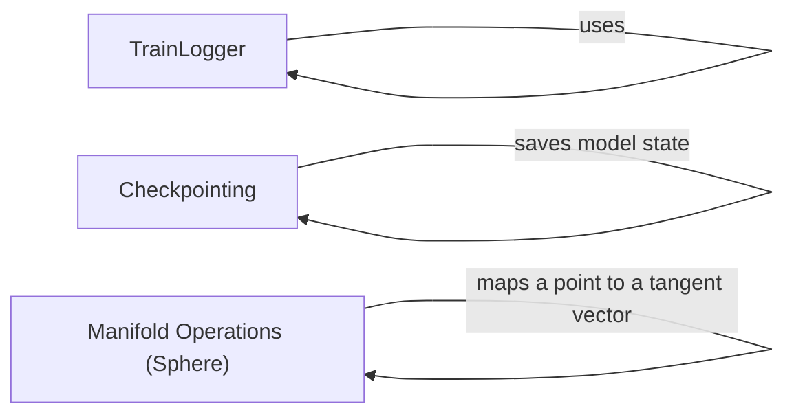

## Component Details

The Utilities and Support component provides essential functionalities for training and evaluation processes, including logging training progress, managing model checkpoints, and performing geometric operations on manifolds. It streamlines the training workflow by offering tools for monitoring, persistence, and mathematical computations.

### TrainLogger
The TrainLogger class is responsible for logging training information, including text-based logs. It initializes a text logger for writing training progress and other relevant information to a file. It allows monitoring the training process.
- **Related Classes/Methods**: `flow_matching.examples.text.utils.logging.TrainLogger`

### Checkpointing
This component provides functionality for managing checkpoints during training. It includes functions for getting the working directories for storing checkpoints and logs, as well as saving and loading model states. It ensures that the training progress can be saved and restored.
- **Related Classes/Methods**: `flow_matching.examples.text.utils.checkpointing`, `flow_matching.examples.image.training.load_and_save:save_model`, `flow_matching.examples.image.submitit_train.Trainer:checkpoint`

### Manifold Operations (Sphere)
This component provides implementations for exponential and logarithmic map operations on a sphere manifold. These operations are used for performing geometric calculations on the sphere. It enables performing calculations on non-euclidean spaces.
- **Related Classes/Methods**: `flow_matching.flow_matching.utils.manifolds.sphere.Sphere:expmap`, `flow_matching.flow_matching.utils.manifolds.sphere.Sphere:logmap`
