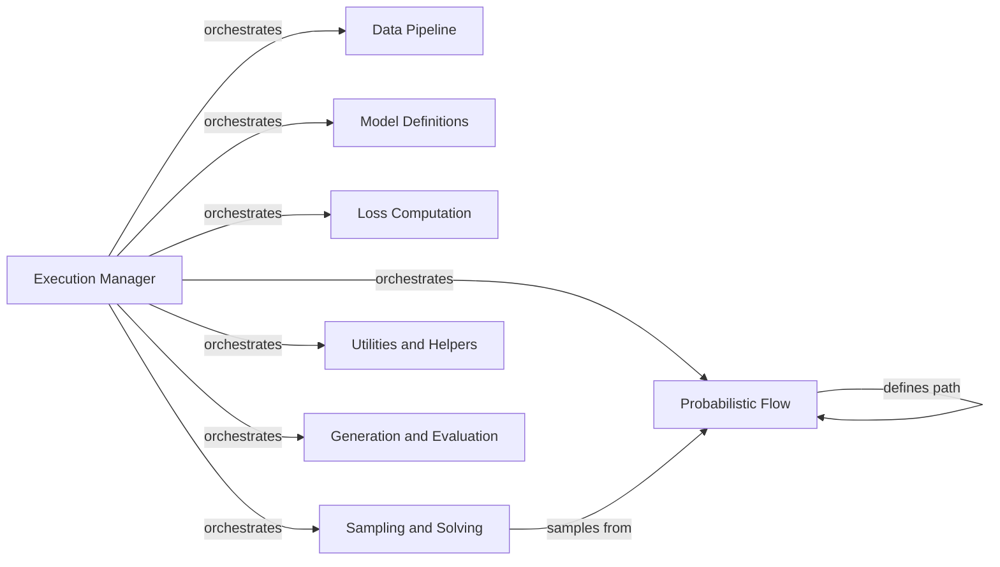

## Component Details

### Execution Manager
This component serves as the central orchestrator for training and evaluation workflows. It initializes and manages the execution of training and evaluation scripts for both text and image-based flow matching models. It coordinates data loading, model instantiation, and the overall training loop, ensuring proper resource allocation and experiment setup.
- **Related Classes/Methods**: `repos.flow_matching.examples.text.train:run_mp_training`, `repos.flow_matching.examples.text.scripts.eval:run_mp_eval`, `repos.flow_matching.examples.image.submitit_train:main`, `repos.flow_matching.examples.image.training.train_loop:train_one_epoch`, `repos.flow_matching.examples.image.training.eval_loop:eval_model`

### Data Pipeline
The Data Pipeline component handles the loading, preprocessing, and preparation of data for both text and image modalities. It abstracts away the complexities of dataset handling, providing a consistent interface for accessing and feeding data to the models. This includes tokenization and detokenization for text data, as well as loading and transforming image data.
- **Related Classes/Methods**: `repos.flow_matching.examples.text.data.data:get_data_state`, `repos.flow_matching.examples.text.data.data:_get_dataset`, `repos.flow_matching.examples.text.data.data:_get_hf_dataset`

### Model Definitions
This component encapsulates the definitions of the neural network architectures used in the flow matching process. It includes both transformer-based models for text generation and UNet-based models for image generation. The component provides modular and reusable model building blocks, such as attention mechanisms, residual connections, and embedding layers.
- **Related Classes/Methods**: `repos.flow_matching.examples.text.model.transformer.Transformer`, `repos.flow_matching.examples.text.model.transformer.DDiTBlock`, `repos.flow_matching.examples.text.model.transformer.DDitFinalLayer`, `repos.flow_matching.examples.text.model.transformer.TimestepEmbedder`, `repos.flow_matching.examples.text.model.rotary:apply_rotary_emb_torch`, `repos.flow_matching.examples.image.models.unet.UNetModel`, `repos.flow_matching.examples.image.models.unet.ResBlock`, `repos.flow_matching.examples.image.models.unet.AttentionBlock`, `repos.flow_matching.examples.image.models.unet.QKVAttention`, `repos.flow_matching.examples.image.models.discrete_unet.DiscreteUNetModel`

### Probabilistic Flow
The Probabilistic Flow component defines the stochastic paths that guide the transformation of data distributions during flow matching. It offers a variety of path constructions, including affine, geodesic, and mixture paths, allowing for flexible control over the flow process. This component also includes schedulers that govern the evolution of these paths over time.
- **Related Classes/Methods**: `flow_matching.path.affine.AffineProbPath`, `flow_matching.path.geodesic.GeodesicProbPath`, `flow_matching.path.mixture.MixtureDiscreteProbPath`, `flow_matching.path.affine.CondOTProbPath`, `flow_matching.path.scheduler.scheduler.PolynomialConvexScheduler`, `flow_matching.path.scheduler.scheduler.VPScheduler`, `flow_matching.path.scheduler.scheduler.CosineScheduler`, `flow_matching.path.scheduler.scheduler.CondOTScheduler`

### Loss Computation
This component defines the loss functions used to train the flow matching models. It provides implementations of various loss functions, such as the generalized KL divergence, which quantify the discrepancy between the learned flow and the target data distribution. These loss functions guide the optimization process, enabling the model to learn the desired data transformations.
- **Related Classes/Methods**: `flow_matching.loss.generalized_loss.MixturePathGeneralizedKL`

### Sampling and Solving
The Sampling and Solving component provides the numerical solvers used to sample from the probabilistic paths defined in the Probabilistic Flow component. It includes both discrete solvers, such as the Mixture Discrete Euler Solver, and ODE solvers for continuous paths. These solvers enable the generation of samples from the learned flow matching models.
- **Related Classes/Methods**: `flow_matching.solver.discrete_solver.MixtureDiscreteEulerSolver`, `flow_matching.solver.ode_solver.ODESolver`, `flow_matching.solver.riemannian_ode_solver.RiemannianODESolver`

### Utilities and Helpers
This component groups together a collection of utility functions and helper classes that support various aspects of the training and evaluation process. It includes tools for distributed training, gradient scaling, exponential moving average (EMA) updates, logging, and checkpointing. These utilities streamline the development and experimentation process.
- **Related Classes/Methods**: `repos.flow_matching.examples.image.training.distributed_mode`, `repos.flow_matching.examples.image.training.grad_scaler.NativeScalerWithGradNormCount`, `repos.flow_matching.examples.image.models.ema.EMA`, `repos.flow_matching.examples.text.utils.logging.TrainLogger`, `repos.flow_matching.examples.text.utils.checkpointing`, `repos.flow_matching.examples.image.training.load_and_save`

### Generation and Evaluation
This component encapsulates the logic for generating samples from the trained models and evaluating their performance. It includes functions for generating samples from the trained model and computing metrics such as entropy and likelihood to assess the quality of the generated samples.
- **Related Classes/Methods**: `repos.flow_matching.examples.text.logic.generate:generate_samples`, `repos.flow_matching.examples.text.logic.evaluate:compute_entropy`, `repos.flow_matching.examples.text.logic.evaluate:estimate_likelihood`