```mermaid
graph LR
    Data_Management["Data Management"]
    Generative_Models["Generative Models"]
    Flow_Definition_and_Scheduling["Flow Definition and Scheduling"]
    Sampling_Solvers["Sampling Solvers"]
    Training_and_Evaluation["Training and Evaluation"]
    Utilities_and_Support["Utilities and Support"]
    Data_Management -- "feeds data to" --> Training_and_Evaluation
    Generative_Models -- "uses" --> Training_and_Evaluation
    Flow_Definition_and_Scheduling -- "defines path for" --> Sampling_Solvers
    Sampling_Solvers -- "samples from" --> Flow_Definition_and_Scheduling
    Training_and_Evaluation -- "evaluates" --> Generative_Models
    Utilities_and_Support -- "logs progress of" --> Training_and_Evaluation
    Sampling_Solvers -- "uses" --> Utilities_and_Support
    Flow_Definition_and_Scheduling -- "uses" --> Utilities_and_Support
    click Data_Management href "https://github.com/CodeBoarding/GeneratedOnBoardings/blob/main/flow_matching/Data Management.md" "Details"
    click Generative_Models href "https://github.com/CodeBoarding/GeneratedOnBoardings/blob/main/flow_matching/Generative Models.md" "Details"
    click Flow_Definition_and_Scheduling href "https://github.com/CodeBoarding/GeneratedOnBoardings/blob/main/flow_matching/Flow Definition and Scheduling.md" "Details"
    click Sampling_Solvers href "https://github.com/CodeBoarding/GeneratedOnBoardings/blob/main/flow_matching/Sampling Solvers.md" "Details"
    click Training_and_Evaluation href "https://github.com/CodeBoarding/GeneratedOnBoardings/blob/main/flow_matching/Training and Evaluation.md" "Details"
    click Utilities_and_Support href "https://github.com/CodeBoarding/GeneratedOnBoardings/blob/main/flow_matching/Utilities and Support.md" "Details"
```

## Component Details

The flow matching project implements a generative modeling approach using flow-based techniques. It encompasses data handling, model architectures for both text and images, probability path definitions, ODE solvers, and training/evaluation loops. The core idea is to learn a continuous transformation (a 'flow') that maps a simple initial distribution to a complex target distribution, enabling the generation of new samples from the target distribution. The project supports various probability path definitions and ODE solvers to control the sampling process, and includes utilities for logging, checkpointing, and geometric operations on manifolds.

### Data Management
This component is responsible for loading, preprocessing, and batching data for both text and image datasets. It handles fetching data from various sources, including Hugging Face datasets, and prepares the data into suitable formats for training and evaluation. The component ensures efficient data flow to the models and manages data iterators.
- **Related Classes/Methods**: `flow_matching.examples.text.data.data:_get_hf_dataset`, `flow_matching.examples.text.data.data:_get_dataset`, `flow_matching.examples.text.data.data:get_data_state`, `flow_matching.examples.image.submitit_train:main`

### Generative Models
This component defines the neural network architectures used for generative modeling. It includes a Transformer-based model for text generation and a UNet-based model for image generation. The component encapsulates the structure and forward pass of these models, including their constituent blocks like attention mechanisms, residual blocks, and normalization layers.
- **Related Classes/Methods**: `flow_matching.examples.text.model.transformer.TimestepEmbedder:forward`, `flow_matching.examples.text.model.transformer.DDiTBlock:__init__`, `flow_matching.examples.text.model.transformer.DDiTBlock:forward`, `flow_matching.examples.text.model.transformer.DDitFinalLayer:__init__`, `flow_matching.examples.text.model.transformer.DDitFinalLayer:forward`, `flow_matching.examples.text.model.transformer.Transformer:__init__`, `flow_matching.examples.text.model.transformer.Transformer:forward`, `flow_matching.examples.image.models.discrete_unet.DiscreteUNetModel:__post_init__`, `flow_matching.examples.image.models.discrete_unet.DiscreteUNetModel:forward`, `flow_matching.examples.image.models.unet.AttentionPool2d:__init__`, `flow_matching.examples.image.models.unet.AttentionPool2d:forward`, `flow_matching.examples.image.models.unet.ResBlock:__init__`, `flow_matching.examples.image.models.unet.ResBlock:_forward`, `flow_matching.examples.image.models.unet.AttentionBlock:__init__`, `flow_matching.examples.image.models.unet.AttentionBlock:_forward`, `flow_matching.examples.image.models.unet.QKVAttentionLegacy:count_flops`, `flow_matching.examples.image.models.unet.QKVAttention:count_flops`, `flow_matching.examples.image.models.unet.UNetModel:__post_init__`, `flow_matching.examples.image.models.unet.UNetModel:forward`

### Flow Definition and Scheduling
This component defines the path between the initial and target distributions and the scheduler for controlling the diffusion process. It includes affine, geodesic, and mixture probability paths, along with various scheduling strategies. This component transforms the model based on the defined schedule, guiding the flow from the initial to the target distribution.
- **Related Classes/Methods**: `flow_matching.flow_matching.path.mixture.MixtureDiscreteProbPath:sample`, `flow_matching.flow_matching.path.mixture.MixtureDiscreteProbPath:posterior_to_velocity`, `flow_matching.flow_matching.path.geodesic.GeodesicProbPath:sample`, `flow_matching.flow_matching.path.affine.AffineProbPath:sample`, `flow_matching.flow_matching.path.affine.CondOTProbPath:__init__`, `flow_matching.flow_matching.path.scheduler.schedule_transform.ScheduleTransformedModel:__init__`, `flow_matching.flow_matching.path.scheduler.scheduler.ConvexScheduler:snr_inverse`, `flow_matching.flow_matching.path.scheduler.scheduler.CondOTScheduler:__call__`, `flow_matching.flow_matching.path.scheduler.scheduler.PolynomialConvexScheduler:__call__`, `flow_matching.flow_matching.path.scheduler.scheduler.VPScheduler:__call__`, `flow_matching.flow_matching.path.scheduler.scheduler.LinearVPScheduler:__call__`, `flow_matching.flow_matching.path.scheduler.scheduler.CosineScheduler:__call__`

### Sampling Solvers
This component implements different ODE solvers for sampling from the learned flow. This includes Riemannian ODE solvers and discrete solvers. The solvers are responsible for generating samples by integrating the learned vector field along the defined probability path, effectively reversing the diffusion process.
- **Related Classes/Methods**: `flow_matching.flow_matching.solver.riemannian_ode_solver.RiemannianODESolver:sample`, `flow_matching.flow_matching.solver.riemannian_ode_solver:interp`, `flow_matching.flow_matching.solver.riemannian_ode_solver:_euler_step`, `flow_matching.flow_matching.solver.riemannian_ode_solver:_midpoint_step`, `flow_matching.flow_matching.solver.riemannian_ode_solver:_rk4_step`, `flow_matching.flow_matching.solver.discrete_solver.MixtureDiscreteEulerSolver:sample`, `flow_matching.flow_matching.solver.ode_solver.ODESolver:compute_likelihood`

### Training and Evaluation
This component manages the training and evaluation processes for the models. This includes optimization steps, loss calculation, gradient scaling, and evaluation metric computation. The component orchestrates the training and evaluation loops, ensuring proper model updates and performance monitoring.
- **Related Classes/Methods**: `flow_matching.examples.text.logic.training:optimization_step`, `flow_matching.examples.text.logic.training:step`, `flow_matching.examples.image.training.train_loop:train_one_epoch`, `flow_matching.examples.image.training.grad_scaler.NativeScalerWithGradNormCount:__call__`, `flow_matching.examples.text.logic.evaluate:compute_entropy`, `flow_matching.examples.text.logic.evaluate:estimate_likelihood`, `flow_matching.examples.image.training.eval_loop.CFGScaledModel:__init__`, `flow_matching.examples.image.training.eval_loop:eval_model`

### Utilities and Support
This component provides utility functions for logging training progress, saving/restoring model checkpoints, and defining manifolds. This component supports the training and evaluation processes by providing essential tools for monitoring, persistence, and geometric operations.
- **Related Classes/Methods**: `flow_matching.examples.text.utils.logging.TrainLogger:__init__`, `flow_matching.examples.text.utils.logging.TrainLogger:_init_text_logger`, `flow_matching.examples.text.utils.checkpointing:get_work_dirs`, `flow_matching.examples.image.training.load_and_save:save_model`, `flow_matching.examples.image.submitit_train.Trainer:checkpoint`, `flow_matching.flow_matching.utils.manifolds.sphere.Sphere:expmap`, `flow_matching.flow_matching.utils.manifolds.sphere.Sphere:logmap`