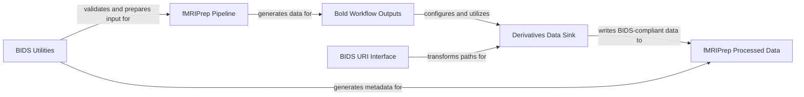

## Details

The `Data I/O & Management` component is crucial for `fMRIPrep`'s adherence to the BIDS standard, managing the entire data lifecycle from input validation to organized output storage. These components are fundamental because they directly address the core requirement of `fMRIPrep` as a "Scientific Data Processing Pipeline" in the "Neuroimaging" domain: BIDS compliance and robust data management. Together, these components form a cohesive system that ensures `fMRIPrep` not only processes neuroimaging data effectively but also does so in a way that is fully compliant with community standards, making the results FAIR (Findable, Accessible, Interoperable, Reusable).

### BIDS Utilities
This module provides a collection of utility functions essential for interacting with BIDS datasets. It handles tasks such as collecting existing derivatives and fieldmaps, validating the input BIDS directory, and generating necessary BIDS-compliant metadata files for derivatives.

**Related Classes/Methods**:

- <a href="https://github.com/nipreps/fmriprep/blob/master/fmriprep/utils/bids.py#L1-L2" target="_blank" rel="noopener noreferrer">`fmriprep.utils.bids` (1:2)</a>
- <a href="https://github.com/nipreps/fmriprep/blob/master/fmriprep/utils/bids.py#L50-L94" target="_blank" rel="noopener noreferrer">`fmriprep.utils.bids:collect_derivatives` (50:94)</a>
- <a href="https://github.com/nipreps/fmriprep/blob/master/fmriprep/utils/bids.py#L97-L119" target="_blank" rel="noopener noreferrer">`fmriprep.utils.bids:collect_fieldmaps` (97:119)</a>
- <a href="https://github.com/nipreps/fmriprep/blob/master/fmriprep/utils/bids.py#L122-L137" target="_blank" rel="noopener noreferrer">`fmriprep.utils.bids:write_bidsignore` (122:137)</a>
- <a href="https://github.com/nipreps/fmriprep/blob/master/fmriprep/utils/bids.py#L140-L194" target="_blank" rel="noopener noreferrer">`fmriprep.utils.bids:write_derivative_description` (140:194)</a>
- <a href="https://github.com/nipreps/fmriprep/blob/master/fmriprep/utils/bids.py#L197-L287" target="_blank" rel="noopener noreferrer">`fmriprep.utils.bids:validate_input_dir` (197:287)</a>

### BIDS URI Interface
This Nipype interface converts input filenames into BIDS URIs. This is vital for maintaining BIDS compliance in the workflow by ensuring that file paths are represented in a standardized, BIDS-compatible format, especially when linking to original BIDS datasets or derivatives.

**Related Classes/Methods**:

- <a href="https://github.com/nipreps/fmriprep/blob/master/fmriprep/interfaces/bids.py#L30-L61" target="_blank" rel="noopener noreferrer">`fmriprep.interfaces.bids.BIDSURI` (30:61)</a>

### Derivatives Data Sink
This Nipype interface is responsible for writing processed data and derivatives to the output directory in a BIDS-compliant manner. It ensures that all generated files are correctly named and organized according to BIDS derivative conventions, facilitating downstream analysis and sharing.

**Related Classes/Methods**:

- `fmriprep.interfaces.io.DerivativesDataSink` (1:2)

### Bold Workflow Outputs
This module defines the specific output nodes and their configurations within the BOLD fMRI processing workflow. It orchestrates how the various processed BOLD-related data (e.g., preprocessed BOLD images, confounds, motion parameters) are collected and directed to the DerivativesDataSink for final storage.

**Related Classes/Methods**:

- <a href="https://github.com/nipreps/fmriprep/blob/master/fmriprep/workflows/bold/outputs.py#L1-L2" target="_blank" rel="noopener noreferrer">`fmriprep.workflows.bold.outputs` (1:2)</a>

### fMRIPrep Pipeline
The main processing pipeline of fMRIPrep.

**Related Classes/Methods**: _None_

### fMRIPrep Processed Data
The BIDS-compliant processed data generated by fMRIPrep.

**Related Classes/Methods**: _None_

### [FAQ](https://github.com/CodeBoarding/GeneratedOnBoardings/tree/main?tab=readme-ov-file#faq)