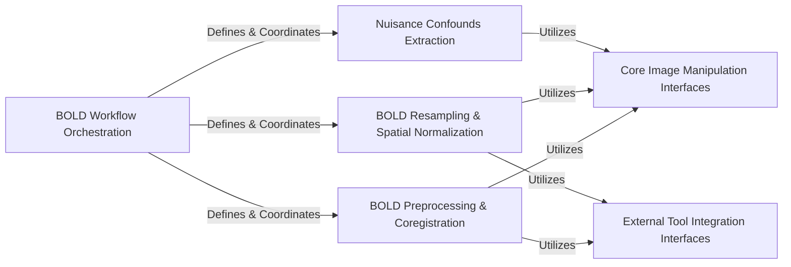

## Details

The `Processing Engine` component in `fMRIPrep` is the operational core, directly implementing the neuroimaging data manipulations. It leverages Nipype to construct complex workflows, integrating both custom-built functionalities and wrappers for external tools. This design adheres to the Scientific Data Processing Pipeline pattern by ensuring modular, reproducible, and efficient data transformation.

### BOLD Workflow Orchestration
This component is the high-level orchestrator for all BOLD (Blood-Oxygen-Level Dependent) functional MRI data processing. It defines the overall sequence of operations, connecting various sub-workflows and interfaces to form a complete processing pipeline for BOLD series. It acts as the central control point for BOLD data flow.

**Related Classes/Methods**:

- <a href="https://github.com/nipreps/fmriprep/blob/master/fmriprep/workflows/bold/base.py#L54-L734" target="_blank" rel="noopener noreferrer">`fmriprep.workflows.bold.base:init_bold_wf` (54:734)</a>

### BOLD Preprocessing & Coregistration
This component handles the initial and crucial steps of BOLD data preparation, including head motion correction, susceptibility distortion correction, and coregistration of functional images to anatomical space. It ensures that BOLD data is accurately aligned and corrected for common artifacts before further analysis.

**Related Classes/Methods**:

- <a href="https://github.com/nipreps/fmriprep/blob/master/fmriprep/workflows/bold/fit.py#L1-L1000" target="_blank" rel="noopener noreferrer">`fmriprep.workflows.bold.fit` (1:1000)</a>
- <a href="https://github.com/nipreps/fmriprep/blob/master/fmriprep/workflows/bold/hmc.py#L1-L1000" target="_blank" rel="noopener noreferrer">`fmriprep.workflows.bold.hmc` (1:1000)</a>
- <a href="https://github.com/nipreps/fmriprep/blob/master/fmriprep/workflows/bold/registration.py#L1-L1000" target="_blank" rel="noopener noreferrer">`fmriprep.workflows.bold.registration` (1:1000)</a>

### BOLD Resampling & Spatial Normalization
This component is responsible for transforming BOLD data into various standardized or subject-specific anatomical spaces (e.g., native, T1w, MNI, FreeSurfer surfaces, CIFTI grayordinates). It performs the necessary interpolations and transformations to bring data into a common reference frame for group analysis or visualization.

**Related Classes/Methods**:

- <a href="https://github.com/nipreps/fmriprep/blob/master/fmriprep/workflows/bold/resampling.py#L1-L1000" target="_blank" rel="noopener noreferrer">`fmriprep.workflows.bold.resampling` (1:1000)</a>
- <a href="https://github.com/nipreps/fmriprep/blob/master/fmriprep/interfaces/resampling.py#L76-L127" target="_blank" rel="noopener noreferrer">`fmriprep.interfaces.resampling:ResampleSeries` (76:127)</a>

### Nuisance Confounds Extraction
This component focuses on identifying and extracting various nuisance signals from the BOLD data, such as motion parameters, physiological noise (e.g., cardiac, respiratory), and tissue-specific signals (e.g., white matter, CSF). These confounds are crucial for regressing out unwanted variance during statistical modeling.

**Related Classes/Methods**:

- <a href="https://github.com/nipreps/fmriprep/blob/master/fmriprep/workflows/bold/confounds.py#L1-L1000" target="_blank" rel="noopener noreferrer">`fmriprep.workflows.bold.confounds` (1:1000)</a>
- <a href="https://github.com/nipreps/fmriprep/blob/master/fmriprep/interfaces/confounds.py#L350-L390" target="_blank" rel="noopener noreferrer">`fmriprep.interfaces.confounds:GatherConfounds` (350:390)</a>

### Core Image Manipulation Interfaces
This component comprises a collection of low-level interfaces that perform direct, fundamental image processing operations. These include general resampling, applying complex spatial transformations, and basic mathematical operations on neuroimages. They serve as the atomic units of data manipulation within the larger workflows.

**Related Classes/Methods**:

- <a href="https://github.com/nipreps/fmriprep/blob/master/fmriprep/interfaces/resampling.py#L1-L1000" target="_blank" rel="noopener noreferrer">`fmriprep.interfaces.resampling` (1:1000)</a>
- <a href="https://github.com/nipreps/fmriprep/blob/master/fmriprep/interfaces/nitransforms.py#L1-L1000" target="_blank" rel="noopener noreferrer">`fmriprep.interfaces.nitransforms` (1:1000)</a>
- <a href="https://github.com/nipreps/fmriprep/blob/master/fmriprep/interfaces/maths.py#L1-L1000" target="_blank" rel="noopener noreferrer">`fmriprep.interfaces.maths` (1:1000)</a>

### External Tool Integration Interfaces
This component provides standardized wrappers for interacting with external neuroimaging software packages (e.g., FreeSurfer, ANTs, Connectome Workbench). These interfaces abstract away the complexities of command-line execution and data formatting for external tools, making them seamlessly callable within Nipype workflows.

**Related Classes/Methods**:

- <a href="https://github.com/nipreps/fmriprep/blob/master/fmriprep/interfaces/workbench.py#L1-L1000" target="_blank" rel="noopener noreferrer">`fmriprep.interfaces.workbench` (1:1000)</a>
- <a href="https://github.com/nipreps/fmriprep/blob/master/fmriprep/interfaces/patches.py#L1-L1000" target="_blank" rel="noopener noreferrer">`fmriprep.interfaces.patches` (1:1000)</a>

### [FAQ](https://github.com/CodeBoarding/GeneratedOnBoardings/tree/main?tab=readme-ov-file#faq)