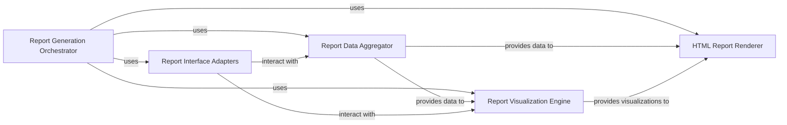

## Details

The `Reporting & Quality Control` subsystem is crucial for assessing data quality, pipeline performance, and communicating results in fMRIPrep. It adheres to the `Scientific Data Processing Pipeline` pattern by providing a dedicated `Reporting Layer` that integrates with the core workflow.

### Report Generation Orchestrator
This is the central component responsible for orchestrating the entire report generation process. It coordinates the collection of data, the creation of visualizations, and the final assembly of the HTML report. It acts as the primary entry point for generating fMRIPrep reports.

**Related Classes/Methods**:

- <a href="https://github.com/nipreps/fmriprep/blob/master/fmriprep/reports/core.py#L1-L1" target="_blank" rel="noopener noreferrer">`fmriprep/reports/core.py` (1:1)</a>

### Report Data Aggregator
This component is responsible for gathering and structuring all necessary data from fMRIPrep's output derivatives (e.g., BIDS derivatives, quality control metrics, anatomical and functional images) that will be presented in the reports. It acts as an interface to the processed data, preparing it for visualization and rendering.

**Related Classes/Methods**:

- <a href="https://github.com/nipreps/fmriprep/blob/master/fmriprep/reports/core.py#L1-L1" target="_blank" rel="noopener noreferrer">`fmriprep/reports/core.py:_get_html_report_info` (1:1)</a>

### Report Visualization Engine
This component handles the creation of various plots, figures, and visual elements that are embedded within the HTML reports. It leverages external plotting libraries (e.g., `matplotlib`, `seaborn`, `bokeh`, `svgutils`) to transform aggregated data into informative graphics, such as brain coverage plots, quality control metrics, and registration overlays.

**Related Classes/Methods**:

- <a href="https://github.com/nipreps/fmriprep/blob/master/fmriprep/reports/core.py#L1-L1" target="_blank" rel="noopener noreferrer">`fmriprep/reports/core.py:_get_svgs` (1:1)</a>

### HTML Report Renderer
This component is responsible for assembling the collected data and generated visualizations into a structured and navigable HTML report. It likely utilizes templating engines and interacts with the `nireports` package (an external dependency) to generate the final, browsable report files.

**Related Classes/Methods**:

- <a href="https://github.com/nipreps/fmriprep/blob/master/fmriprep/reports/core.py#L68-L147" target="_blank" rel="noopener noreferrer">`fmriprep/reports/core.py:generate_reports` (68:147)</a>

### Report Interface Adapters
This component provides Nipype interfaces specifically designed for report-related tasks, such as generating specific report snippets or handling data transformations required for reporting. These interfaces allow the reporting logic to be integrated seamlessly into the Nipype workflow.

**Related Classes/Methods**:

- <a href="https://github.com/nipreps/fmriprep/blob/master/fmriprep/interfaces/reports.py#L1-L1" target="_blank" rel="noopener noreferrer">`fmriprep/interfaces/reports.py` (1:1)</a>

### [FAQ](https://github.com/CodeBoarding/GeneratedOnBoardings/tree/main?tab=readme-ov-file#faq)