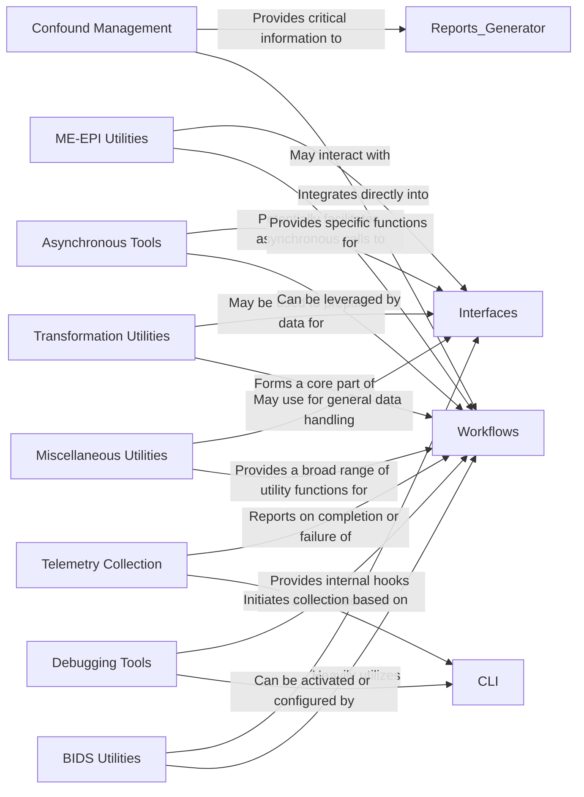

## Details

The `Utility & Support Functions` component in `fMRIPrep` is a critical collection of general-purpose helper modules that ensure code reusability, consistency, and simplified operations across the pipeline. While `getClassHierarchy` did not reveal a deep class structure, the file system analysis of `fmriprep/utils` clearly indicates distinct functional sub-modules, which serve as the fundamental components within this utility layer. These modules are essential for a Scientific Data Processing Pipeline as they encapsulate common, often complex, operations, promoting modularity and maintainability.

### BIDS Utilities
This module provides essential helper functions for interacting with BIDS (Brain Imaging Data Structure) datasets. It includes functionalities for parsing BIDS entities from file paths, generating BIDS-compliant output paths, and potentially validating BIDS structures. Its role is fundamental in ensuring that `fMRIPrep` adheres to neuroimaging data standards for both input and output.

**Related Classes/Methods**:

- <a href="https://github.com/nipreps/fmriprep/blob/master/fmriprep/utils/bids.py#L1-L1" target="_blank" rel="noopener noreferrer">`fmriprep.utils.bids` (1:1)</a>

### Confound Management
Dedicated to the calculation, extraction, and management of physiological and motion-related confound regressors from fMRI data. These regressors are crucial for denoising and improving the statistical validity of fMRI analyses by accounting for non-neuronal signal fluctuations.

**Related Classes/Methods**:

- <a href="https://github.com/nipreps/fmriprep/blob/master/fmriprep/utils/confounds.py#L1-L1" target="_blank" rel="noopener noreferrer">`fmriprep.utils.confounds` (1:1)</a>

### Debugging Tools
Offers a suite of utilities designed to assist in debugging the `fMRIPrep` pipeline. This can include enhanced logging mechanisms, tools for inspecting pipeline state, or functions for generating simplified test cases, aiding developers and users in troubleshooting issues.

**Related Classes/Methods**:

- <a href="https://github.com/nipreps/fmriprep/blob/master/fmriprep/utils/debug.py#L1-L1" target="_blank" rel="noopener noreferrer">`fmriprep.utils.debug` (1:1)</a>

### Telemetry Collection
Manages the collection and reporting of anonymous usage statistics and error information. This data is vital for the `fMRIPrep` development team to understand user environments, identify common issues, and prioritize future improvements, while respecting user privacy.

**Related Classes/Methods**:

- <a href="https://github.com/nipreps/fmriprep/blob/master/fmriprep/utils/telemetry.py#L1-L1" target="_blank" rel="noopener noreferrer">`fmriprep.utils.telemetry` (1:1)</a>

### Miscellaneous Utilities
A versatile collection of general-purpose helper functions that do not fit into more specialized categories. This includes common operations such as file system manipulations, string processing, basic data transformations, and other widely applicable functionalities used throughout the project.

**Related Classes/Methods**:

- <a href="https://github.com/nipreps/fmriprep/blob/master/fmriprep/utils/misc.py#L1-L1" target="_blank" rel="noopener noreferrer">`fmriprep.utils.misc` (1:1)</a>

### Transformation Utilities
Contains functions specifically designed for applying and managing spatial transformations in neuroimaging data. This includes operations like coregistration, normalization to standard templates, and resampling, which are fundamental for aligning and comparing brain images across subjects and studies.

**Related Classes/Methods**:

- <a href="https://github.com/nipreps/fmriprep/blob/master/fmriprep/utils/transforms.py#L1-L1" target="_blank" rel="noopener noreferrer">`fmriprep.utils.transforms` (1:1)</a>

### Asynchronous Tools
Provides utilities for managing asynchronous operations, which can be crucial for optimizing pipeline performance. This might include functions for parallelizing independent processing steps or handling non-blocking I/O, thereby improving the overall efficiency of the data processing.

**Related Classes/Methods**:

- <a href="https://github.com/nipreps/fmriprep/blob/master/fmriprep/utils/asynctools.py#L1-L1" target="_blank" rel="noopener noreferrer">`fmriprep.utils.asynctools` (1:1)</a>

### ME-EPI Utilities
A specialized module containing utilities tailored for Multi-Echo EPI (ME-EPI) data processing. This includes functions for combining different echoes, handling ME-EPI specific artifacts, or preparing data for advanced ME-EPI denoising techniques.

**Related Classes/Methods**:

- <a href="https://github.com/nipreps/fmriprep/blob/master/fmriprep/utils/meepi.py#L1-L1" target="_blank" rel="noopener noreferrer">`fmriprep.utils.meepi` (1:1)</a>

### [FAQ](https://github.com/CodeBoarding/GeneratedOnBoardings/tree/main?tab=readme-ov-file#faq)