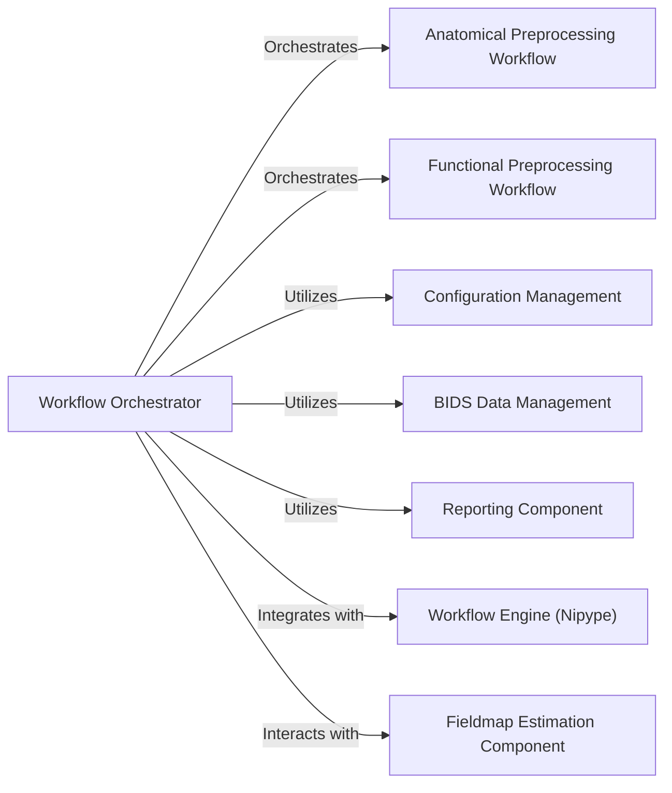

## Details

These components and their relationships highlight the core functionality of fMRIPrep as a scientific data processing pipeline, emphasizing its modularity, data-driven nature, and reliance on a workflow engine for robust execution.

### Workflow Orchestrator [[Expand]](./Workflow_Orchestrator.md)
The central control component that constructs and manages the overall fMRIPrep processing pipeline using Nipype. It coordinates the execution of subject-level and BOLD-specific workflows, handling data flow and dependencies between processing steps.

**Related Classes/Methods**:

- <a href="https://github.com/nipreps/fmriprep/blob/master/fmriprep/cli/workflow.py#L34-L165" target="_blank" rel="noopener noreferrer">`fmriprep.cli.workflow:build_workflow` (34:165)</a>
- <a href="https://github.com/nipreps/fmriprep/blob/master/fmriprep/workflows/base.py#L49-L113" target="_blank" rel="noopener noreferrer">`fmriprep.workflows.base:init_fmriprep_wf` (49:113)</a>
- <a href="https://github.com/nipreps/fmriprep/blob/master/fmriprep/workflows/base.py#L116-L852" target="_blank" rel="noopener noreferrer">`fmriprep.workflows.base:init_single_subject_wf` (116:852)</a>

### Anatomical Preprocessing Workflow

**Related Classes/Methods**: _None_

### Functional Preprocessing Workflow

**Related Classes/Methods**: _None_

### Configuration Management

**Related Classes/Methods**: _None_

### BIDS Data Management

**Related Classes/Methods**: _None_

### Reporting Component

**Related Classes/Methods**: _None_

### Workflow Engine (Nipype)

**Related Classes/Methods**: _None_

### Fieldmap Estimation Component

**Related Classes/Methods**: _None_

### [FAQ](https://github.com/CodeBoarding/GeneratedOnBoardings/tree/main?tab=readme-ov-file#faq)