```mermaid
graph LR
    User_Interface_Configuration["User Interface & Configuration"]
    Data_I_O_Management["Data I/O & Management"]
    Workflow_Orchestrator["Workflow Orchestrator"]
    Processing_Engine["Processing Engine"]
    Reporting_Quality_Control["Reporting & Quality Control"]
    Utility_Support_Functions["Utility & Support Functions"]
    User_Interface_Configuration -- "Invokes" --> Workflow_Orchestrator
    User_Interface_Configuration -- "Configures" --> Workflow_Orchestrator
    Data_I_O_Management -- "Provides input to" --> Workflow_Orchestrator
    Data_I_O_Management -- "Receives output from" --> Processing_Engine
    Workflow_Orchestrator -- "Orchestrates" --> Processing_Engine
    Workflow_Orchestrator -- "Triggers" --> Reporting_Quality_Control
    Processing_Engine -- "Processes data from" --> Data_I_O_Management
    Processing_Engine -- "Sends processed data to" --> Data_I_O_Management
    Reporting_Quality_Control -- "Gathers information from" --> Data_I_O_Management
    Reporting_Quality_Control -- "Gathers information from" --> Processing_Engine
    Utility_Support_Functions -- "Supports" --> User_Interface_Configuration
    Utility_Support_Functions -- "Supports" --> Workflow_Orchestrator
    Utility_Support_Functions -- "Supports" --> Processing_Engine
    Utility_Support_Functions -- "Supports" --> Data_I_O_Management
    Utility_Support_Functions -- "Supports" --> Reporting_Quality_Control
    click User_Interface_Configuration href "https://github.com/CodeBoarding/GeneratedOnBoardings/blob/main/fmriprep/User_Interface_Configuration.md" "Details"
    click Data_I_O_Management href "https://github.com/CodeBoarding/GeneratedOnBoardings/blob/main/fmriprep/Data_I_O_Management.md" "Details"
    click Workflow_Orchestrator href "https://github.com/CodeBoarding/GeneratedOnBoardings/blob/main/fmriprep/Workflow_Orchestrator.md" "Details"
    click Processing_Engine href "https://github.com/CodeBoarding/GeneratedOnBoardings/blob/main/fmriprep/Processing_Engine.md" "Details"
    click Reporting_Quality_Control href "https://github.com/CodeBoarding/GeneratedOnBoardings/blob/main/fmriprep/Reporting_Quality_Control.md" "Details"
    click Utility_Support_Functions href "https://github.com/CodeBoarding/GeneratedOnBoardings/blob/main/fmriprep/Utility_Support_Functions.md" "Details"
```

## Details

The `fmriprep` architecture is designed as a robust Scientific Data Processing Pipeline, emphasizing modularity, reproducibility, and adherence to BIDS standards. The core data flow revolves around a central orchestrator that manages specialized processing modules, with clear separation for user interaction, data handling, and reporting.

### User Interface & Configuration [[Expand]](./User_Interface_Configuration.md)
Serves as the primary entry point for users, parsing command-line arguments, initializing the application environment, and managing all pipeline settings and parameters. It acts as the control plane for initiating and configuring the fMRIPrep execution.

**Related Classes/Methods**:

- `fmriprep.cli.*`
- <a href="https://github.com/nipreps/fmriprep/blob/master/fmriprep/config.py" target="_blank" rel="noopener noreferrer">`fmriprep.config.*`</a>
- <a href="https://github.com/nipreps/fmriprep/blob/master/wrapper/src/fmriprep_docker/__main__.py#L405-L596" target="_blank" rel="noopener noreferrer">`wrapper.src.fmriprep_docker.__main__.main` (405:596)</a>

### Data I/O & Management [[Expand]](./Data_I_O_Management.md)
Responsible for interacting with BIDS datasets. It collects input data, extracts relevant metadata, and manages the organized storage of all generated output derivatives, ensuring BIDS compliance for both input and output.

**Related Classes/Methods**:

- <a href="https://github.com/nipreps/fmriprep/blob/master/fmriprep/utils/bids.py" target="_blank" rel="noopener noreferrer">`fmriprep.utils.bids.*`</a>
- <a href="https://github.com/nipreps/fmriprep/blob/master/fmriprep/interfaces/bids.py#L30-L61" target="_blank" rel="noopener noreferrer">`fmriprep.interfaces.bids.BIDSURI` (30:61)</a>
- `fmriprep.interfaces.DerivativesDataSink`
- <a href="https://github.com/nipreps/fmriprep/blob/master/fmriprep/workflows/bold/outputs.py" target="_blank" rel="noopener noreferrer">`fmriprep.workflows.bold.outputs.*`</a>

### Workflow Orchestrator [[Expand]](./Workflow_Orchestrator.md)
The central control component that constructs and manages the overall fMRIPrep processing pipeline using Nipype. It coordinates the execution of subject-level and BOLD-specific workflows, handling data flow and dependencies between processing steps.

**Related Classes/Methods**:

- <a href="https://github.com/nipreps/fmriprep/blob/master/fmriprep/cli/workflow.py#L34-L165" target="_blank" rel="noopener noreferrer">`fmriprep.cli.workflow.build_workflow` (34:165)</a>
- <a href="https://github.com/nipreps/fmriprep/blob/master/fmriprep/workflows/base.py#L49-L113" target="_blank" rel="noopener noreferrer">`fmriprep.workflows.base.init_fmriprep_wf` (49:113)</a>
- <a href="https://github.com/nipreps/fmriprep/blob/master/fmriprep/workflows/base.py#L116-L852" target="_blank" rel="noopener noreferrer">`fmriprep.workflows.base.init_single_subject_wf` (116:852)</a>

### Processing Engine [[Expand]](./Processing_Engine.md)
Encapsulates the specific Nipype workflows and core interfaces dedicated to performing neuroimaging operations. This includes wrapping external tools (e.g., FreeSurfer, ANTs) and implementing custom data transformations and calculations. It performs the actual data manipulation.

**Related Classes/Methods**:

- `fmriprep.workflows.bold.*`
- `fmriprep.interfaces.*`
- <a href="https://github.com/nipreps/fmriprep/blob/master/fmriprep/interfaces/confounds.py#L350-L390" target="_blank" rel="noopener noreferrer">`fmriprep.interfaces.confounds.GatherConfounds` (350:390)</a>
- <a href="https://github.com/nipreps/fmriprep/blob/master/fmriprep/interfaces/resampling.py#L76-L127" target="_blank" rel="noopener noreferrer">`fmriprep.interfaces.resampling.ResampleSeries` (76:127)</a>
- <a href="https://github.com/nipreps/fmriprep/blob/master/fmriprep/interfaces/workbench.py" target="_blank" rel="noopener noreferrer">`fmriprep.interfaces.workbench.*`</a>
- <a href="https://github.com/nipreps/fmriprep/blob/master/fmriprep/interfaces/patches.py" target="_blank" rel="noopener noreferrer">`fmriprep.interfaces.patches.*`</a>

### Reporting & Quality Control [[Expand]](./Reporting_Quality_Control.md)
Generates comprehensive HTML reports that summarize the preprocessing steps, display quality control metrics, and visualize key outputs. These reports are crucial for assessing data quality, pipeline performance, and communicating results to users.

**Related Classes/Methods**:

- <a href="https://github.com/nipreps/fmriprep/blob/master/fmriprep/reports/core.py#L68-L147" target="_blank" rel="noopener noreferrer">`fmriprep.reports.core.generate_reports` (68:147)</a>
- <a href="https://github.com/nipreps/fmriprep/blob/master/fmriprep/interfaces/reports.py" target="_blank" rel="noopener noreferrer">`fmriprep.interfaces.reports.*`</a>

### Utility & Support Functions [[Expand]](./Utility_Support_Functions.md)
A collection of general-purpose helper functions used across various components. This includes debugging tools, telemetry for usage statistics, confound calculation, and memory estimation, providing common reusable functionalities.

**Related Classes/Methods**:

- `fmriprep.utils.*`
- <a href="https://github.com/nipreps/fmriprep/blob/master/fmriprep/utils/debug.py" target="_blank" rel="noopener noreferrer">`fmriprep.utils.debug.*`</a>
- <a href="https://github.com/nipreps/fmriprep/blob/master/fmriprep/utils/telemetry.py" target="_blank" rel="noopener noreferrer">`fmriprep.utils.telemetry.*`</a>
- <a href="https://github.com/nipreps/fmriprep/blob/master/fmriprep/utils/confounds.py" target="_blank" rel="noopener noreferrer">`fmriprep.utils.confounds.*`</a>
- <a href="https://github.com/nipreps/fmriprep/blob/master/fmriprep/utils/misc.py" target="_blank" rel="noopener noreferrer">`fmriprep.utils.misc.*`</a>

### [FAQ](https://github.com/CodeBoarding/GeneratedOnBoardings/tree/main?tab=readme-ov-file#faq)