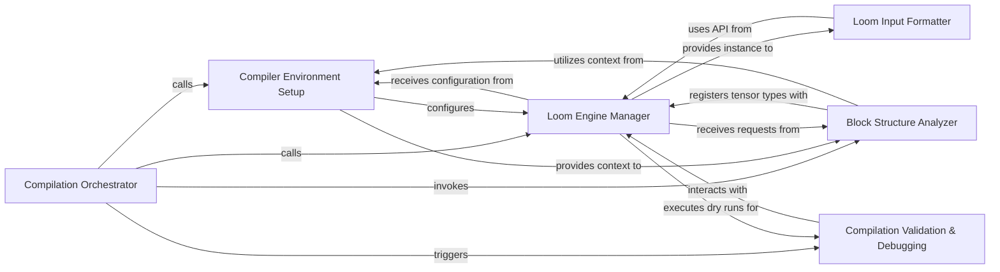

## Details

The `Block-to-Loom Compiler` subsystem is the critical intermediary responsible for translating high-level Fold Blocks API definitions into an optimized, lower-level representation executable by the Loom dynamic batching engine. Its primary function is to bridge the gap between user-defined logic and the runtime execution environment, focusing on dynamic input processing and efficient TensorFlow integration.

### Compilation Orchestrator
Serves as the primary entry point for the entire Block-to-Loom compilation process. It orchestrates the high-level flow, initiating the setup of the compiler environment and subsequent compilation steps. This component is fundamental as it defines the overall compilation pipeline.

**Related Classes/Methods**:

- <a href="https://github.com/tensorflow/fold/blob/master/tensorflow_fold/blocks/block_compiler.py#L274-L295" target="_blank" rel="noopener noreferrer">`tensorflow_fold.blocks.block_compiler.compile`:274-295</a>

### Compiler Environment Setup
Initializes the compiler's operational environment, including setting up metrics, preparing the Loom instance, and establishing the necessary context for the recursive block compilation process. It also registers custom operations, extending the compiler's capabilities. This component is crucial for preparing the execution context.

**Related Classes/Methods**:

- <a href="https://github.com/tensorflow/fold/blob/master/tensorflow_fold/blocks/block_compiler.py#L297-L329" target="_blank" rel="noopener noreferrer">`tensorflow_fold.blocks.block_compiler._setup`:297-329</a>
- <a href="https://github.com/tensorflow/fold/blob/master/tensorflow_fold/blocks/block_compiler.py#L60-L70" target="_blank" rel="noopener noreferrer">`tensorflow_fold.blocks.block_compiler.register_op`:60-70</a>

### Block Structure Analyzer
Recursively traverses the high-level Fold block hierarchy. During this traversal, it analyzes each block's structure and registers its associated tensor types within the compiler's internal tracking system, ensuring all data types are properly recognized for Loom's dynamic batching. This component is central to interpreting the high-level API.

**Related Classes/Methods**:

- <a href="https://github.com/tensorflow/fold/blob/master/tensorflow_fold/blocks/block_compiler.py#L331-L365" target="_blank" rel="noopener noreferrer">`tensorflow_fold.blocks.block_compiler._compile_blocks`:331-365</a>
- <a href="https://github.com/tensorflow/fold/blob/master/tensorflow_fold/blocks/block_compiler.py#L72-L74" target="_blank" rel="noopener noreferrer">`tensorflow_fold.blocks.block_compiler.register_tensor`:72-74</a>

### Loom Engine Manager
Manages the initialization of the Loom engine and provides a direct interface for interaction. It is responsible for creating and configuring the `_TaggedLoom` instance, which is crucial for interacting with Loom's low-level dynamic batching operations. This component is the direct interface to the core dynamic batching engine.

**Related Classes/Methods**:

- <a href="https://github.com/tensorflow/fold/blob/master/tensorflow_fold/blocks/block_compiler.py#L370-L416" target="_blank" rel="noopener noreferrer">`tensorflow_fold.blocks.block_compiler.init_loom`:370-416</a>
- <a href="https://github.com/tensorflow/fold/blob/master/tensorflow_fold/blocks/block_compiler.py#L113-L139" target="_blank" rel="noopener noreferrer">`tensorflow_fold.blocks.block_compiler.create_tagged_loom`:113-139</a>

### Loom Input Formatter
Prepares and formats the input data into a batched structure suitable for execution by the Loom engine. This component handles the transformation of raw input into Loom-compatible representations, aligning with the project's focus on dynamic input processing. This component is vital for data ingestion into the dynamic graph.

**Related Classes/Methods**:

- <a href="https://github.com/tensorflow/fold/blob/master/tensorflow_fold/blocks/block_compiler.py#L442-L491" target="_blank" rel="noopener noreferrer">`tensorflow_fold.blocks.block_compiler.build_feed_dict`:442-491</a>
- <a href="https://github.com/tensorflow/fold/blob/master/tensorflow_fold/blocks/block_compiler.py#L493-L530" target="_blank" rel="noopener noreferrer">`tensorflow_fold.blocks.block_compiler.build_loom_input_batched`:493-530</a>

### Compilation Validation & Debugging
Orchestrates the evaluation process, which includes initializing variables and performing dry runs of the compiled Loom graph. This is critical for validating the compilation output and debugging without requiring full TensorFlow session execution. This component ensures the correctness of the compiled output.

**Related Classes/Methods**:

- <a href="https://github.com/tensorflow/fold/blob/master/tensorflow_fold/blocks/block_compiler.py#L674-L740" target="_blank" rel="noopener noreferrer">`tensorflow_fold.blocks.block_compiler._eval`:674-740</a>

### [FAQ](https://github.com/CodeBoarding/GeneratedOnBoardings/tree/main?tab=readme-ov-file#faq)