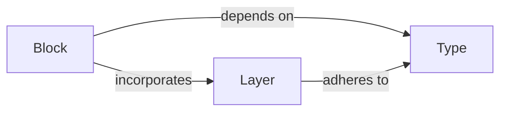

## Details

The Fold Blocks API (Computation Graph Definition) subsystem provides the high-level, declarative interface for users to define complex computation graphs using composable "blocks" within TensorFlow Fold. It is the primary interface for specifying deep learning models and data transformations.

### Block
Serves as the fundamental building block for defining computation graphs. It encapsulates operations or transformations, manages their composition, and orchestrates the flow of data. It is responsible for the structural integrity of the graph and initiating type propagation. Block instances represent the nodes and connections in the user-defined computation graph. This component is crucial for enabling the declarative definition of complex models, aligning with the "Machine Learning Library" pattern by providing abstract computational units.

**Related Classes/Methods**:

- <a href="https://github.com/tensorflow/fold/blob/master/tensorflow_fold/blocks/blocks.py" target="_blank" rel="noopener noreferrer">`tensorflow_fold.blocks.blocks.Block`</a>

### Layer
Implements specific neural network operations (layers) that can be integrated into the Fold block framework. It handles the internal logic of these layers, including TensorFlow variable creation and processing of input data batches. Layer instances provide the actual computational logic within the Block framework. This component directly supports the "Deep Learning Toolkit" aspect by providing concrete, reusable neural network operations.

**Related Classes/Methods**:

- <a href="https://github.com/tensorflow/fold/blob/master/tensorflow_fold/blocks/layers.py#L33-L102" target="_blank" rel="noopener noreferrer">`tensorflow_fold.blocks.layers.Layer`:33-102</a>

### Type
Defines and manages the type system for the Fold computation graph. It ensures type safety, enables type inference, and validates data flow between connected blocks, preventing mismatches and aiding graph optimization. This component is crucial for the declarative nature of the API, allowing for early detection of graph inconsistencies and ensuring robust model definition. It underpins the reliability and correctness of the computation graph, a vital aspect for any "Machine Learning Library."

**Related Classes/Methods**:

- <a href="https://github.com/tensorflow/fold/blob/master/tensorflow_fold/blocks/result_types.py" target="_blank" rel="noopener noreferrer">`tensorflow_fold.blocks.result_types.Type`</a>

### [FAQ](https://github.com/CodeBoarding/GeneratedOnBoardings/tree/main?tab=readme-ov-file#faq)