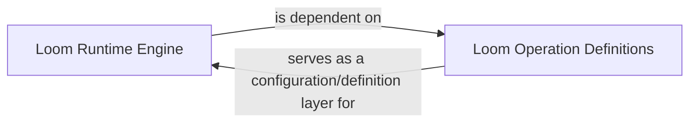

## Details

The `Loom Dynamic Batching Engine (Runtime)` subsystem is a critical part of the project, focusing on bridging the gap between variable-sized structured inputs and TensorFlow's static graph model.

### Loom Runtime Engine
This is the core runtime engine responsible for dynamically batching variable-sized structured inputs into fixed-size tensors. It orchestrates the execution of operations defined by the `Loom Operation Definitions`, effectively bridging Fold's dynamic input structures with TensorFlow's static graph execution model. It manages the lifecycle of the Loom, including initialization, network construction, input serialization, and output retrieval.

**Related Classes/Methods**:

- <a href="https://github.com/tensorflow/fold/blob/master/tensorflow_fold/loom/loom.py" target="_blank" rel="noopener noreferrer">`tensorflow_fold.loom.loom.Loom`</a>

### Loom Operation Definitions
This component defines the blueprint for all operations executable by the `Loom Runtime Engine`. It provides the fundamental operations and their necessary type and shape information (input_type_shapes, output_type_shapes) that the `Loom Runtime Engine` uses to correctly process and batch data. It acts as a configuration and definition layer for the dynamic batching process.

**Related Classes/Methods**:

- <a href="https://github.com/tensorflow/fold/blob/master/tensorflow_fold/blocks/loom_ops.py" target="_blank" rel="noopener noreferrer">`tensorflow_fold/blocks/loom_ops.py`</a>

### [FAQ](https://github.com/CodeBoarding/GeneratedOnBoardings/tree/main?tab=readme-ov-file#faq)