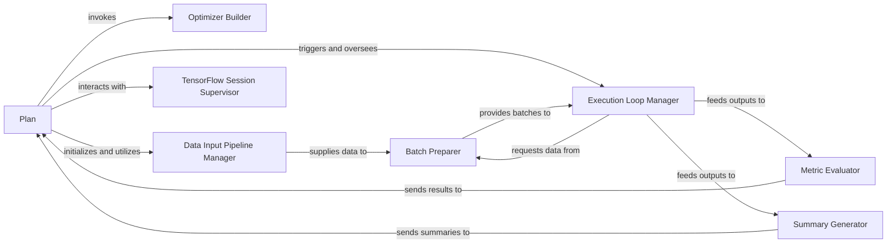

## Details

The `Model Training & Evaluation Orchestration` subsystem is responsible for managing the complete lifecycle of a Fold model, from setting up training loops and managing TensorFlow sessions to optimizing parameters and evaluating performance.

### Plan
The primary class that orchestrates the entire training and evaluation process, managing the end-to-end lifecycle, including setting up training loops, managing TensorFlow sessions, optimizing parameters, and evaluating model performance. It acts as the central coordinator.

**Related Classes/Methods**:

- <a href="https://github.com/tensorflow/fold/blob/master/tensorflow_fold/blocks/plan.py" target="_blank" rel="noopener noreferrer">`tensorflow_fold.blocks.plan.Plan`</a>

### Optimizer Builder
Functions responsible for configuring and instantiating TensorFlow optimizers, providing the necessary TensorFlow optimizer instances based on configuration.

**Related Classes/Methods**:

- <a href="https://github.com/tensorflow/fold/blob/master/tensorflow_fold/blocks/plan.py#L908-L914" target="_blank" rel="noopener noreferrer">`tensorflow_fold.blocks.plan.build_optimizer`:908-914</a>
- <a href="https://github.com/tensorflow/fold/blob/master/tensorflow_fold/blocks/plan.py#L137-L200" target="_blank" rel="noopener noreferrer">`tensorflow_fold.blocks.plan.build_optimizer_from_params`:137-200</a>

### Data Input Pipeline Manager
Functions that set up the data input pipeline using Loom and TensorFlow queues, establishing and managing the efficient flow of structured data into the Fold model.

**Related Classes/Methods**:

- <a href="https://github.com/tensorflow/fold/blob/master/tensorflow_fold/blocks/plan.py#L1209-L1211" target="_blank" rel="noopener noreferrer">`tensorflow_fold.blocks.plan.init_loom`:1209-1211</a>
- <a href="https://github.com/tensorflow/fold/blob/master/tensorflow_fold/blocks/plan.py#L893-L899" target="_blank" rel="noopener noreferrer">`tensorflow_fold.blocks.plan._create_queue`:893-899</a>
- <a href="https://github.com/tensorflow/fold/blob/master/tensorflow_fold/blocks/plan.py#L858-L864" target="_blank" rel="noopener noreferrer">`tensorflow_fold.blocks.plan._setup_dequeuing`:858-864</a>
- <a href="https://github.com/tensorflow/fold/blob/master/tensorflow_fold/blocks/plan.py#L844-L856" target="_blank" rel="noopener noreferrer">`tensorflow_fold.blocks.plan._setup_enqueuing`:844-856</a>

### TensorFlow Session Supervisor
The function that manages the TensorFlow session, including checkpointing and global step tracking, overseeing the TensorFlow session and handling model saving/restoring.

**Related Classes/Methods**:

- <a href="https://github.com/tensorflow/fold/blob/master/tensorflow_fold/blocks/plan.py#L665-L675" target="_blank" rel="noopener noreferrer">`tensorflow_fold.blocks.plan.create_supervisor`:665-675</a>

### Execution Loop Manager
The core method that implements the iterative training or evaluation loop, running batches, and triggering parameter updates.

**Related Classes/Methods**:

- <a href="https://github.com/tensorflow/fold/blob/master/tensorflow_fold/blocks/plan.py#L1219-L1222" target="_blank" rel="noopener noreferrer">`tensorflow_fold.blocks.plan._run`:1219-1222</a>

### Batch Preparer
Functions that transform raw input data into batched formats suitable for TensorFlow operations and construct the `feed_dict` required for TensorFlow session runs.

**Related Classes/Methods**:

- <a href="https://github.com/tensorflow/fold/blob/master/tensorflow_fold/blocks/plan.py#L1054-L1060" target="_blank" rel="noopener noreferrer">`tensorflow_fold.blocks.plan.prepare_batches`:1054-1060</a>
- <a href="https://github.com/tensorflow/fold/blob/master/tensorflow_fold/blocks/plan.py#L1066-L1073" target="_blank" rel="noopener noreferrer">`tensorflow_fold.blocks.plan._by_input_tensor`:1066-1073</a>
- <a href="https://github.com/tensorflow/fold/blob/master/tensorflow_fold/blocks/plan.py#L1052-L1064" target="_blank" rel="noopener noreferrer">`tensorflow_fold.blocks.plan._by_feed_dict`:1052-1064</a>

### Metric Evaluator
Functions responsible for calculating and updating various performance metrics (e.g., accuracy, loss) based on the model's outputs.

**Related Classes/Methods**:

- <a href="https://github.com/tensorflow/fold/blob/master/tensorflow_fold/blocks/metrics.py#L91-L104" target="_blank" rel="noopener noreferrer">`tensorflow_fold.blocks.metrics._update_input_type`:91-104</a>

### Summary Generator
The function that generates TensorFlow summaries for visualization tools like TensorBoard, creating summaries for visualizing training progress and model performance over time.

**Related Classes/Methods**:

- <a href="https://github.com/tensorflow/fold/blob/master/tensorflow_fold/blocks/plan.py" target="_blank" rel="noopener noreferrer">`tensorflow_fold.blocks.plan.compute_summaries`</a>

### [FAQ](https://github.com/CodeBoarding/GeneratedOnBoardings/tree/main?tab=readme-ov-file#faq)