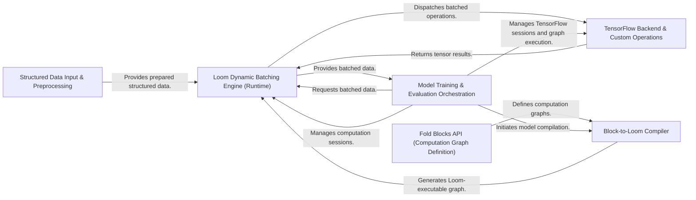

## Details

The TensorFlow Fold architecture is designed to efficiently process variable-structured data within TensorFlow's static graph paradigm. It achieves this through a layered approach, starting with `Structured Data Input & Preprocessing` which prepares raw data. The `Fold Blocks API` allows users to declaratively define computation graphs, which are then translated by the `Block-to-Loom Compiler` into an optimized representation. The core `Loom Dynamic Batching Engine` dynamically batches these variable-sized inputs for efficient execution on the `TensorFlow Backend & Custom Operations`, which leverages custom C++ operations for performance. Finally, the `Model Training & Evaluation Orchestration` component oversees the entire lifecycle, managing data flow, compilation, and TensorFlow session execution for training and evaluation. This design ensures a clear separation of concerns, enabling flexible model definition and high-performance execution of structured data.

### Structured Data Input & Preprocessing
Responsible for ingesting and initially preparing variable-structured input data, converting it into a format suitable for Fold's internal processing. This component handles data loading, parsing, and initial structuring.

**Related Classes/Methods**:

- <a href="https://github.com/tensorflow/fold/blob/master/tensorflow_fold/blocks/util.py" target="_blank" rel="noopener noreferrer">`tensorflow_fold/blocks/util.py`</a>

### Fold Blocks API (Computation Graph Definition) [[Expand]](./Fold_Blocks_API_Computation_Graph_Definition_.md)
Provides the high-level, declarative API for users to define complex computation graphs using composable "blocks." This is the primary interface for users to specify their deep learning models and data transformations.

**Related Classes/Methods**:

- <a href="https://github.com/tensorflow/fold/blob/master/tensorflow_fold/blocks/blocks.py#L482-L484" target="_blank" rel="noopener noreferrer">`tensorflow_fold.blocks.blocks.py`:482-484</a>
- <a href="https://github.com/tensorflow/fold/blob/master/tensorflow_fold/blocks/layers.py" target="_blank" rel="noopener noreferrer">`tensorflow_fold/blocks/layers.py`</a>
- <a href="https://github.com/tensorflow/fold/blob/master/tensorflow_fold/blocks/result_types.py#L165-L167" target="_blank" rel="noopener noreferrer">`tensorflow_fold.blocks.result_types.py`:165-167</a>

### Block-to-Loom Compiler [[Expand]](./Block_to_Loom_Compiler.md)
The crucial intermediary that translates the high-level Fold Blocks API definitions into a lower-level, optimized representation executable by the Loom dynamic batching engine. This component bridges the gap between user-defined logic and the runtime.

**Related Classes/Methods**:

- <a href="https://github.com/tensorflow/fold/blob/master/tensorflow_fold/blocks/block_compiler.py" target="_blank" rel="noopener noreferrer">`tensorflow_fold/blocks/block_compiler.py`</a>

### Loom Dynamic Batching Engine (Runtime) [[Expand]](./Loom_Dynamic_Batching_Engine_Runtime_.md)
The core runtime engine that dynamically batches variable-sized structured inputs into fixed-size tensors. It manages the execution of operations defined by the Block Compiler, effectively bridging the gap to TensorFlow's static graph model.

**Related Classes/Methods**:

- <a href="https://github.com/tensorflow/fold/blob/master/tensorflow_fold/loom/loom.py" target="_blank" rel="noopener noreferrer">`tensorflow_fold/loom/loom.py`</a>
- <a href="https://github.com/tensorflow/fold/blob/master/tensorflow_fold/blocks/loom_ops.py" target="_blank" rel="noopener noreferrer">`tensorflow_fold/blocks/loom_ops.py`</a>

### TensorFlow Backend & Custom Operations [[Expand]](./TensorFlow_Backend_Custom_Operations.md)
The low-level layer responsible for executing the batched operations within TensorFlow. This includes custom C++ operations essential for the performance-critical aspects of the dynamic batching process, interfacing directly with TensorFlow's C++ API.

**Related Classes/Methods**:

- <a href="https://github.com/tensorflow/fold/blob/master/tensorflow_fold/llgtm/backend/tf_evaluator.cc" target="_blank" rel="noopener noreferrer">`tensorflow_fold/llgtm/backend/tf_evaluator.cc`</a>
- <a href="https://github.com/tensorflow/fold/blob/master/tensorflow_fold/llgtm/backend/tf_evaluator.h" target="_blank" rel="noopener noreferrer">`tensorflow_fold/llgtm/backend/tf_evaluator.h`</a>

### Model Training & Evaluation Orchestration [[Expand]](./Model_Training_Evaluation_Orchestration.md)
Manages the end-to-end lifecycle of a Fold model, including setting up training loops, managing TensorFlow sessions, optimizing parameters, and evaluating model performance.

**Related Classes/Methods**:

- <a href="https://github.com/tensorflow/fold/blob/master/tensorflow_fold/blocks/plan.py" target="_blank" rel="noopener noreferrer">`tensorflow_fold/blocks/plan.py`</a>
- <a href="https://github.com/tensorflow/fold/blob/master/tensorflow_fold/blocks/metrics.py" target="_blank" rel="noopener noreferrer">`tensorflow_fold/blocks/metrics.py`</a>

### [FAQ](https://github.com/CodeBoarding/GeneratedOnBoardings/tree/main?tab=readme-ov-file#faq)