```mermaid
graph LR
    User_Interface_UI_Frontend_["User Interface (UI/Frontend)"]
    Django_Application_Core["Django Application Core"]
    Django_Models_ORM_Layer_["Django Models (ORM Layer)"]
    Django_Views_Controllers["Django Views/Controllers"]
    Django_Templates["Django Templates"]
    Database_PostgreSQL_["Database (PostgreSQL)"]
    Web_Server_NGINX_["Web Server (NGINX)"]
    Configuration_Management["Configuration Management"]
    Unclassified["Unclassified"]
    User_Interface_UI_Frontend_ -- "receives content from" --> Django_Templates
    User_Interface_UI_Frontend_ -- "receives static assets from" --> Web_Server_NGINX_
    Web_Server_NGINX_ -- "forwards requests to" --> Django_Application_Core
    Web_Server_NGINX_ -- "serves static assets to" --> User_Interface_UI_Frontend_
    Django_Application_Core -- "dispatches requests to" --> Django_Views_Controllers
    Django_Application_Core -- "utilizes settings from" --> Configuration_Management
    Django_Views_Controllers -- "accesses/modifies data via" --> Django_Models_ORM_Layer_
    Django_Views_Controllers -- "renders output using" --> Django_Templates
    Django_Models_ORM_Layer_ -- "interacts with" --> Database_PostgreSQL_
    Django_Models_ORM_Layer_ -- "provides data to" --> Django_Views_Controllers
    Django_Templates -- "generates content for" --> User_Interface_UI_Frontend_
    Django_Templates -- "receives context from" --> Django_Views_Controllers
    Database_PostgreSQL_ -- "stores/retrieves data for" --> Django_Models_ORM_Layer_
    Database_PostgreSQL_ -- "configured by" --> Configuration_Management
    Configuration_Management -- "provides settings to" --> Django_Application_Core
    Configuration_Management -- "configures connection for" --> Database_PostgreSQL_
    click Database_PostgreSQL_ href "https://github.com/CodeBoarding/GeneratedOnBoardings/blob/main/foodgram-project/Database_PostgreSQL_.md" "Details"
```

## Details

The foodgram project is a Django-based web application. The core flow involves a Web Server (NGINX) acting as a reverse proxy, serving static assets directly to the User Interface (UI/Frontend) and forwarding dynamic requests to the Django Application Core. The Django Application Core uses foodgram/urls.py for routing, foodgram/wsgi.py or foodgram/asgi.py as entry points, and relies on Configuration Management (from foodgram/settings.py) for its operational parameters. Requests are then dispatched to Django Views/Controllers (defined in */views.py), which encapsulate business logic. These views interact with Django Models (ORM Layer) (defined in */models.py) to perform database operations on the Database (PostgreSQL). Finally, Django Views/Controllers render responses using Django Templates (from */templates/*.html), which generate dynamic HTML content for the User Interface (UI/Frontend).

### User Interface (UI/Frontend)
This component is responsible for the client-side presentation, rendering HTML templates, applying CSS styles, and executing JavaScript for interactive elements. It forms the visual and interactive layer of the application.

**Related Classes/Methods**:

### Django Application Core
The foundational component of the Django application, responsible for managing the overall request/response lifecycle. It includes URL routing, middleware processing, and dispatching requests to the appropriate views.

**Related Classes/Methods**:

- <a href="https://github.com/plaunezkiy/foodgram-project/blob/masterfoodgram/urls.py" target="_blank" rel="noopener noreferrer">`foodgram/urls.py`</a>
- <a href="https://github.com/plaunezkiy/foodgram-project/blob/masterfoodgram/wsgi.py" target="_blank" rel="noopener noreferrer">`foodgram/wsgi.py`</a>
- <a href="https://github.com/plaunezkiy/foodgram-project/blob/masterfoodgram/asgi.py" target="_blank" rel="noopener noreferrer">`foodgram/asgi.py`</a>

### Django Models (ORM Layer)
This component defines the application's data structures and relationships using Django's Object-Relational Mapper (ORM). It acts as the primary interface for the application to perform CRUD (Create, Read, Update, Delete) operations on the database.

**Related Classes/Methods**:

- `*/models.py`

### Django Views/Controllers
These components encapsulate the application's business logic. They receive requests from the Django Application Core, interact with the Django Models to process data, and prepare the context required for rendering templates.

**Related Classes/Methods**:

- `*/views.py`

### Django Templates
This component consists of HTML files embedded with Django's template language. They are responsible for the dynamic generation of HTML content, receiving data from Django Views/Controllers to construct the final web pages.

**Related Classes/Methods**:

- `*/templates/*.html`

### Database (PostgreSQL) [[Expand]](./Database_PostgreSQL_.md)
The persistent data store for the entire application. It securely holds all structured data, including user accounts, recipe details, ingredients, tags, and shopping list items.

**Related Classes/Methods**:

- `PostgreSQL Database System`

### Web Server (NGINX)
This component acts as a reverse proxy, forwarding dynamic requests to the Django application server (e.g., Gunicorn/uWSGI). It also efficiently serves static files (CSS, JavaScript, images) and user-uploaded media directly to clients.

**Related Classes/Methods**:

- <a href="https://github.com/plaunezkiy/foodgram-project/blob/masternginx/nginx.conf" target="_blank" rel="noopener noreferrer">`nginx/nginx.conf`</a>

### Configuration Management
This component centralizes all application-wide settings, including database connection parameters, secret keys, installed Django apps, and static/media file configurations. It ensures the application is properly configured for different environments.

**Related Classes/Methods**:

- <a href="https://github.com/plaunezkiy/foodgram-project/blob/masterfoodgram/settings.py" target="_blank" rel="noopener noreferrer">`foodgram/settings.py`</a>

### Unclassified
Component for all unclassified files and utility functions (Utility functions/External Libraries/Dependencies)

**Related Classes/Methods**: _None_

### [FAQ](https://github.com/CodeBoarding/GeneratedOnBoardings/tree/main?tab=readme-ov-file#faq)