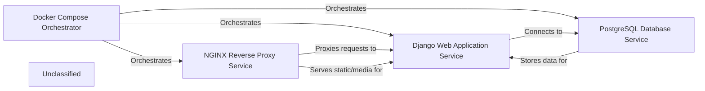

## Details

The Foodgram project is a multi-container web application orchestrated by Docker Compose. The Docker Compose Orchestrator defines and manages the lifecycle of three primary services: the Django Web Application Service, the PostgreSQL Database Service, and the NGINX Reverse Proxy Service. The NGINX Reverse Proxy Service acts as the entry point for all incoming requests, efficiently serving static and media files directly, and forwarding dynamic requests to the Django Web Application Service. The Django Web Application Service handles the core business logic and interacts with the PostgreSQL Database Service for persistent data storage. The PostgreSQL Database Service is solely responsible for storing and managing the application's data. This architecture ensures a clear separation of concerns, scalability, and efficient resource utilization.

### Docker Compose Orchestrator
The central configuration for defining and running the multi-container Docker application. It orchestrates the build, network, and volume configurations for all services.

**Related Classes/Methods**:

- <a href="https://github.com/plaunezkiy/foodgram-project/blob/masterdocker-compose.yaml" target="_blank" rel="noopener noreferrer">`docker-compose.yaml`</a>

### Django Web Application Service
The containerized environment for the core Django application, responsible for executing business logic, interacting with the database, and rendering dynamic content.

**Related Classes/Methods**:

- <a href="https://github.com/plaunezkiy/foodgram-project/blob/masterDockerfile" target="_blank" rel="noopener noreferrer">`Dockerfile`</a>
- <a href="https://github.com/plaunezkiy/foodgram-project/blob/masterfoodgram/wsgi.py" target="_blank" rel="noopener noreferrer">`foodgram/wsgi.py`</a>

### PostgreSQL Database Service
The dedicated container for the PostgreSQL database, providing persistent storage for all application data.

**Related Classes/Methods**:

- <a href="https://github.com/plaunezkiy/foodgram-project/blob/masterdocker-compose.yaml" target="_blank" rel="noopener noreferrer">`docker-compose.yaml`</a>

### NGINX Reverse Proxy Service
The containerized NGINX server, acting as a reverse proxy to forward dynamic requests to the Django application and efficiently serving static and media files.

**Related Classes/Methods**:

- <a href="https://github.com/plaunezkiy/foodgram-project/blob/masterDockerfile" target="_blank" rel="noopener noreferrer">`Dockerfile`</a>
- <a href="https://github.com/plaunezkiy/foodgram-project/blob/masternginx/nginx.conf" target="_blank" rel="noopener noreferrer">`nginx/nginx.conf`</a>

### Unclassified
Component for all unclassified files and utility functions (Utility functions/External Libraries/Dependencies)

**Related Classes/Methods**: _None_

### [FAQ](https://github.com/CodeBoarding/GeneratedOnBoardings/tree/main?tab=readme-ov-file#faq)