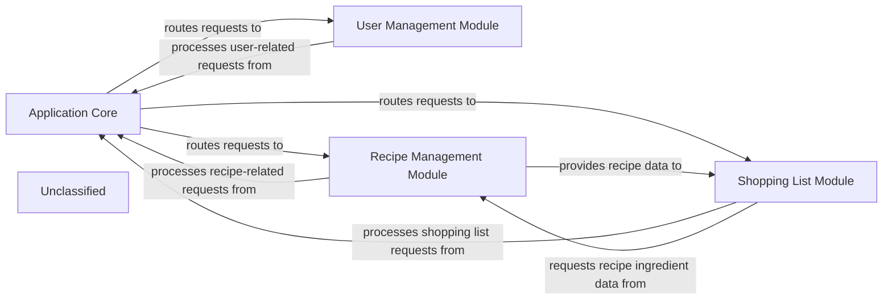

## Details

The project architecture for Foodgram is structured around a core application and several distinct modules, each responsible for specific functionalities. The Application Core serves as the central nervous system, handling global configurations, URL routing, and acting as the primary entry point for all incoming requests. It dispatches these requests to the appropriate feature modules, ensuring a streamlined flow of operations. The User Management Module is dedicated to all user-related operations, including registration, authentication, and profile management. It defines the user data model and processes user-specific interactions, persisting user information in the database. The Recipe Management Module is a comprehensive system for handling recipes. It allows for the creation, retrieval, updating, and deletion of recipes, along with managing associated ingredients and tags. This module also supports user interactions such as favoriting recipes, processes all recipe-related requests, and provides forms for user input and custom template functionalities. Finally, the Shopping List Module enables users to create, view, and modify their personalized shopping lists. It processes requests related to shopping lists, interacts with the database for data persistence, and can derive ingredient requirements directly from saved recipes, facilitating meal planning.

### Application Core
The foundational configuration, URL routing, and entry point for the entire Django application, orchestrating request handling and dispatching to specific feature modules. It defines global settings and the primary URL patterns.

**Related Classes/Methods**:

- <a href="https://github.com/plaunezkiy/foodgram-project/blob/masterfoodgram/settings.py" target="_blank" rel="noopener noreferrer">`foodgram.settings`</a>
- <a href="https://github.com/plaunezkiy/foodgram-project/blob/masterfoodgram/wsgi.py" target="_blank" rel="noopener noreferrer">`foodgram.wsgi`</a>
- <a href="https://github.com/plaunezkiy/foodgram-project/blob/masterfoodgram/urls.py#L1-L20" target="_blank" rel="noopener noreferrer">`foodgram.urls`:1-20</a>

### User Management Module
Manages all aspects of user accounts, including authentication, registration, profile management, and defining the user data model. It handles user-specific HTTP requests and interacts with the database for user data persistence.

**Related Classes/Methods**:

- <a href="https://github.com/plaunezkiy/foodgram-project/blob/masterusers/models.py" target="_blank" rel="noopener noreferrer">`users.models`</a>
- <a href="https://github.com/plaunezkiy/foodgram-project/blob/masterusers/views.py" target="_blank" rel="noopener noreferrer">`users.views`</a>

### Recipe Management Module
Handles the creation, retrieval, updating, and deletion of recipes, including managing ingredients, tags, and user interactions like favorites. It processes recipe-related requests, interacts with the database for recipe data, and provides forms for user input and custom template functionality.

**Related Classes/Methods**:

- <a href="https://github.com/plaunezkiy/foodgram-project/blob/masterrecipes/models.py" target="_blank" rel="noopener noreferrer">`recipes.models`</a>
- <a href="https://github.com/plaunezkiy/foodgram-project/blob/masterrecipes/views.py" target="_blank" rel="noopener noreferrer">`recipes.views`</a>
- <a href="https://github.com/plaunezkiy/foodgram-project/blob/masterrecipes/forms.py" target="_blank" rel="noopener noreferrer">`recipes.forms`</a>
- <a href="https://github.com/plaunezkiy/foodgram-project/blob/masterrecipes/templatetags" target="_blank" rel="noopener noreferrer">`recipes.templatetags`</a>

### Shopping List Module
Manages the creation, viewing, and modification of user-specific shopping lists. It processes shopping list requests, interacts with the database for list data, and often derives ingredient needs from saved recipes.

**Related Classes/Methods**:

- `foodgram.shopping_list.models`
- `foodgram.shopping_list.views`

### Unclassified
Component for all unclassified files and utility functions (Utility functions/External Libraries/Dependencies)

**Related Classes/Methods**: _None_

### [FAQ](https://github.com/CodeBoarding/GeneratedOnBoardings/tree/main?tab=readme-ov-file#faq)