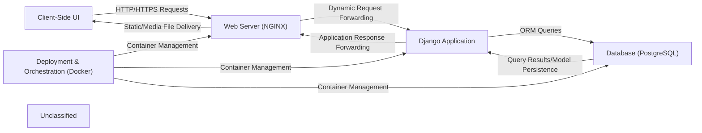

## Details

The Foodgram project is structured as a multi-component web application, leveraging Docker for deployment and orchestration. User interactions originate from the Client-Side UI, which sends HTTP/HTTPS requests to the Web Server (NGINX). NGINX acts as a reverse proxy, efficiently serving static and media files directly to the client, and forwarding dynamic requests to the Django Application. The Django Application, the core of the system, processes these requests, interacts with the Database (PostgreSQL) via its ORM for data persistence and retrieval, and then generates responses. These responses are routed back through NGINX to the Client-Side UI. The entire application stack, including NGINX, the Django Application, and PostgreSQL, is containerized and managed by the Deployment & Orchestration (Docker) component, ensuring consistent and scalable deployment.

### Client-Side UI
The user-facing presentation layer, responsible for rendering web pages, capturing user input, and displaying application content. It includes HTML templates, CSS stylesheets, and JavaScript for interactive elements.

**Related Classes/Methods**:

- `foodgram/templates/`
- `foodgram/static/css/`:1-10

### Web Server (NGINX)
An external web server that acts as a reverse proxy for dynamic requests to the Django application and efficiently serves static assets and user-uploaded media files.

**Related Classes/Methods**:

- <a href="https://github.com/plaunezkiy/foodgram-project/blob/masternginx/nginx.conf" target="_blank" rel="noopener noreferrer">`infra/nginx.conf`</a>

### Django Application [[Expand]](./Django_Application.md)
The central Python application logic, built on the Django framework. It orchestrates request handling, dispatches to specific modules (User, Recipe, Shopping List), manages data flow, and renders responses.

**Related Classes/Methods**:

- <a href="https://github.com/plaunezkiy/foodgram-project/blob/masterfoodgram/settings.py" target="_blank" rel="noopener noreferrer">`foodgram.foodgram.settings`</a>
- `foodgram.foodgram.urls`
- <a href="https://github.com/plaunezkiy/foodgram-project/blob/masterfoodgram/wsgi.py" target="_blank" rel="noopener noreferrer">`foodgram.wsgi`</a>
- `foodgram.users.views`
- <a href="https://github.com/plaunezkiy/foodgram-project/blob/masterusers/models.py" target="_blank" rel="noopener noreferrer">`foodgram.users.models`</a>
- <a href="https://github.com/plaunezkiy/foodgram-project/blob/masterrecipes/views.py#L1-L268" target="_blank" rel="noopener noreferrer">`foodgram.recipes.views`:1-268</a>
- <a href="https://github.com/plaunezkiy/foodgram-project/blob/masterrecipes/models.py" target="_blank" rel="noopener noreferrer">`foodgram.recipes.models`</a>
- `foodgram.shopping_list.views`
- `foodgram.shopping_list.models`

### Database (PostgreSQL) [[Expand]](./Database_PostgreSQL_.md)
The persistent data store for the entire application. It holds all structured data, including user accounts, recipe details, ingredients, tags, and shopping list items.

**Related Classes/Methods**:

### Deployment & Orchestration (Docker) [[Expand]](./Deployment_Orchestration_Docker_.md)
The infrastructure layer responsible for containerizing the application's services (web, database, NGINX) and managing their deployment, networking, and scaling using Docker and Docker Compose.

**Related Classes/Methods**:

- <a href="https://github.com/plaunezkiy/foodgram-project/blob/masterDockerfile" target="_blank" rel="noopener noreferrer">`Dockerfile`</a>
- `docker-compose.yml`

### Unclassified
Component for all unclassified files and utility functions (Utility functions/External Libraries/Dependencies)

**Related Classes/Methods**: _None_

### [FAQ](https://github.com/CodeBoarding/GeneratedOnBoardings/tree/main?tab=readme-ov-file#faq)