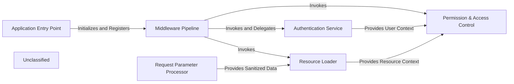

## Details

An analysis of the project's request handling pipeline reveals a layered architecture built on Express.js middleware. The flow begins at the `Application Entry Point`, which initializes the server and registers the core `Middleware Pipeline`. Each incoming request is first processed by the `Request Parameter Processor` to sanitize and extract URL parameters. Subsequently, the `Authentication Service` validates the user's identity by decoding JWT tokens. Once authenticated, the `Permission & Access Control` component checks if the user has the necessary rights to access the requested resource. The `Resource Loader` then fetches the relevant data, such as forms or submissions, from the database. This structured, sequential processing ensures that security, authorization, and data retrieval are handled consistently before any business logic is executed.

### Application Entry Point
Initializes the Express.js application, establishes the database connection, and configures the primary router. It acts as the central orchestrator for the entire application startup process.

**Related Classes/Methods**:

- <a href="https://github.com/formio/formio/blob/main/server.js#L17-L131" target="_blank" rel="noopener noreferrer">`module.exports`:17-131</a>

### Middleware Pipeline
A central aggregator that organizes and sequences the execution of all cross-cutting middleware. It defines the step-by-step process that each request goes through before reaching its target resource handler.

**Related Classes/Methods**:

- <a href="https://github.com/formio/formio/blob/main/src/middleware/middleware.js" target="_blank" rel="noopener noreferrer">`module.exports`</a>

### Authentication Service
Responsible for verifying user identity. It inspects request headers for authentication tokens (e.g., JWT), validates them, and attaches the authenticated user's context to the request object for downstream use.

**Related Classes/Methods**:

- <a href="https://github.com/formio/formio/blob/main/src/middleware/tokenHandler.js" target="_blank" rel="noopener noreferrer">`module.exports`</a>
- <a href="https://github.com/formio/formio/blob/main/src/authentication/index.js" target="_blank" rel="noopener noreferrer">`module.exports`</a>

### Permission & Access Control
Enforces authorization rules. After a user is authenticated, this component checks if they have the necessary permissions to perform the requested action on a specific resource.

**Related Classes/Methods**:

- <a href="https://github.com/formio/formio/blob/main/src/middleware/permissionHandler.js" target="_blank" rel="noopener noreferrer">`module.exports`</a>
- <a href="https://github.com/formio/formio/blob/main/src/middleware/storageAccessHandler.js#L6-L43" target="_blank" rel="noopener noreferrer">`accessHandler`:6-43</a>

### Resource Loader
A specialized middleware that fetches core data entities (like forms or submissions) from the database based on request parameters. It pre-loads this data and attaches it to the request object, making it available to subsequent middleware and handlers.

**Related Classes/Methods**:

- <a href="https://github.com/formio/formio/blob/main/src/middleware/formLoader.js#L14-L43" target="_blank" rel="noopener noreferrer">`formLoader`:14-43</a>

### Request Parameter Processor
Parses, sanitizes, and prepares incoming request parameters from the URL and request body. This ensures that data is in a consistent and usable format before being used by other components like the Resource Loader.

**Related Classes/Methods**:

- <a href="https://github.com/formio/formio/blob/main/src/middleware/params.js" target="_blank" rel="noopener noreferrer">`module.exports`</a>

### Unclassified
Component for all unclassified files and utility functions (Utility functions/External Libraries/Dependencies)

**Related Classes/Methods**: _None_

### [FAQ](https://github.com/CodeBoarding/GeneratedOnBoardings/tree/main?tab=readme-ov-file#faq)