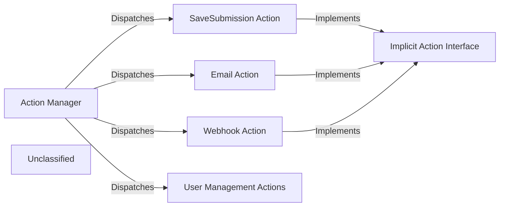

## Details

An analysis of the `formio` actions subsystem reveals a modular, event-driven architecture for processing form submissions. The central component is the `Action Manager`, which dynamically discovers and executes various `Actions` based on form settings. Each `Action` is a self-contained class responsible for a specific task, such as saving data, sending emails, or integrating with external systems. These actions adhere to an implicit interface, ensuring consistent interaction with the `Action Manager`. This design allows for high extensibility, as new actions can be added with minimal changes to the core system, enabling developers to easily create custom workflows for form submissions.

### Action Manager
The orchestrator of the subsystem. It is responsible for discovering, registering, and executing all available actions. It acts as a factory, instantiating and invoking the appropriate action class based on event triggers and configuration.

**Related Classes/Methods**:

- <a href="https://github.com/formio/formio/blob/main/src/actions/actions.js" target="_blank" rel="noopener noreferrer">`src.actions.actions.Action`</a>

### SaveSubmission Action
The most critical action, responsible for the primary function of any form: persisting the submitted data. It interacts directly with the data persistence layer to save submission records to the database.

**Related Classes/Methods**:

- <a href="https://github.com/formio/formio/blob/main/src/actions/SaveSubmission.js" target="_blank" rel="noopener noreferrer">`src.actions.SaveSubmission.SaveSubmissionAction`</a>

### Email Action
Handles all email-related operations. This component constructs and sends emails using submission data, which is essential for notifications, confirmations, and other communication workflows.

**Related Classes/Methods**:

- <a href="https://github.com/formio/formio/blob/main/src/actions/EmailAction.js#L19-L301" target="_blank" rel="noopener noreferrer">`src.actions.EmailAction.EmailAction`:19-301</a>

### Webhook Action
Facilitates integration with external systems. It sends HTTP requests to configured URLs, pushing submission data to other services. This is a key feature for a PaaS, enabling interoperability and extensibility.

**Related Classes/Methods**:

- <a href="https://github.com/formio/formio/blob/main/src/actions/WebhookAction.js#L20-L265" target="_blank" rel="noopener noreferrer">`src.actions.WebhookAction.WebhookAction`:20-265</a>

### User Management Actions
A group of actions focused on user-related operations within the platform. This includes authenticating users against submission data (LoginAction) and assigning them to specific roles (RoleAction), integrating the form system with the platform's identity and access management.

**Related Classes/Methods**:

- <a href="https://github.com/formio/formio/blob/main/src/actions/LoginAction.js#L20-L315" target="_blank" rel="noopener noreferrer">`src.actions.LoginAction.LoginAction`:20-315</a>
- <a href="https://github.com/formio/formio/blob/main/src/actions/RoleAction.js#L27-L399" target="_blank" rel="noopener noreferrer">`src.actions.RoleAction.RoleAction`:27-399</a>

### Implicit Action Interface
A common, implicit interface that all concrete actions implement. This contract includes methods for initialization, defining configuration settings, and execution, ensuring consistent behavior and allowing the Action Manager to interact with them polymorphically.

**Related Classes/Methods**:

- <a href="https://github.com/formio/formio/blob/main/src/actions/SaveSubmission.js" target="_blank" rel="noopener noreferrer">`src.actions.SaveSubmission.SaveSubmissionAction`</a>
- <a href="https://github.com/formio/formio/blob/main/src/actions/EmailAction.js#L19-L301" target="_blank" rel="noopener noreferrer">`src.actions.EmailAction.EmailAction`:19-301</a>
- <a href="https://github.com/formio/formio/blob/main/src/actions/WebhookAction.js#L20-L265" target="_blank" rel="noopener noreferrer">`src.actions.WebhookAction.WebhookAction`:20-265</a>

### Unclassified
Component for all unclassified files and utility functions (Utility functions/External Libraries/Dependencies)

**Related Classes/Methods**: _None_

### [FAQ](https://github.com/CodeBoarding/GeneratedOnBoardings/tree/main?tab=readme-ov-file#faq)