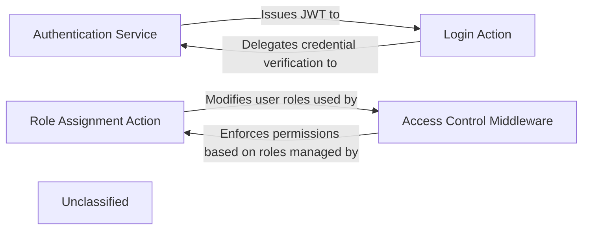

## Details

An analysis of the project's authentication and authorization subsystem reveals a modular architecture driven by distinct, high-level components. The `Login Action` serves as the primary entry point for user authentication, orchestrating the login workflow and implementing security measures like brute-force protection. It delegates the core task of credential validation to the `Authentication Service`, which is responsible for verifying user details against the database and issuing JSON Web Tokens (JWTs) upon success. Authorization is managed through a role-based access control (RBAC) system. The `Role Assignment Action` provides the mechanism for administrators to assign or revoke user roles. These roles are then enforced by the `Access Control Middleware`, which intercepts incoming API requests, inspects the user's JWT, and determines if the user has the required permissions to access the requested resource, thereby securing the application's endpoints.

### Authentication Service
A core, low-level service responsible for the fundamental mechanics of authentication. It validates user credentials against the data source and generates signed JSON Web Tokens (JWTs) upon successful verification.

**Related Classes/Methods**:

- <a href="https://github.com/formio/formio/blob/main/src/authentication/index.js" target="_blank" rel="noopener noreferrer">`src.authentication`</a>

### Login Action
A high-level, configurable workflow that orchestrates the entire user login process. It manages user-facing logic, including brute-force protection, and delegates credential verification to the Authentication Service.

**Related Classes/Methods**:

- <a href="https://github.com/formio/formio/blob/main/src/actions/LoginAction.js#L20-L315" target="_blank" rel="noopener noreferrer">`src.actions.LoginAction.LoginAction`:20-315</a>

### Role Assignment Action
A high-level workflow that manages the dynamic assignment and removal of roles from user profiles. It provides the administrative capability to modify a user's permissions, forming the core of the RBAC management system.

**Related Classes/Methods**:

- <a href="https://github.com/formio/formio/blob/main/src/actions/RoleAction.js#L27-L399" target="_blank" rel="noopener noreferrer">`src.actions.RoleAction.RoleAction`:27-399</a>

### Access Control Middleware
The primary enforcement point for authorization. This middleware intercepts incoming API requests, inspects the user's JWT to identify their roles, and determines whether they have the necessary permissions to access the requested resource.

**Related Classes/Methods**:

- <a href="https://github.com/formio/formio/blob/main/src/middleware/accessHandler.js" target="_blank" rel="noopener noreferrer">`src.middleware.accessHandler`</a>

### Unclassified
Component for all unclassified files and utility functions (Utility functions/External Libraries/Dependencies)

**Related Classes/Methods**: _None_

### [FAQ](https://github.com/CodeBoarding/GeneratedOnBoardings/tree/main?tab=readme-ov-file#faq)