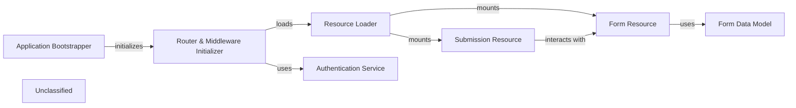

## Details

The system's entry point is the `Application Bootstrapper` in `index.js`, which initializes an Express router. This `Router & Middleware Initializer` configures the application by attaching essential services, including the `Authentication Service` for security and the `Resource Loader` for defining API endpoints. The `Resource Loader` dynamically mounts specific handlers like the `Form Resource` and `Submission Resource`, which are responsible for CRUD operations on their respective data entities. These resources interact with the MongoDB database through their corresponding data models, such as the `Form Data Model`, to process and persist data, forming a robust, API-driven backend for a form management system.

### Application Bootstrapper
The application's main entry point. It configures and initializes the Express.js server, database connections, and core application settings.

**Related Classes/Methods**:

- <a href="https://github.com/formio/formio/blob/main/index.js" target="_blank" rel="noopener noreferrer">`module.exports`</a>

### Router & Middleware Initializer
Initializes and configures the Express router with essential middleware for handling CORS, authentication tokens, permissions, and request parameters. It orchestrates the entire request-response lifecycle.

**Related Classes/Methods**:

- <a href="https://github.com/formio/formio/blob/main/index.js" target="_blank" rel="noopener noreferrer">`router.init`</a>

### Resource Loader
A central module that dynamically loads and mounts all API resource endpoints (like Forms and Submissions) onto the Express router, making them available for client interaction.

**Related Classes/Methods**:

- <a href="https://github.com/formio/formio/blob/main/src/resources/resources.js" target="_blank" rel="noopener noreferrer">`module.exports`</a>

### Authentication Service
Manages user authentication and authorization. It provides middleware and handlers for user login, session management (tokens), and access control for protected API endpoints.

**Related Classes/Methods**:

- <a href="https://github.com/formio/formio/blob/main/src/authentication/index.js" target="_blank" rel="noopener noreferrer">`module.exports`</a>

### Form Resource
Provides the API endpoints for all form-related operations. It handles creating, reading, updating, and deleting form definitions and relies on the Form Data Model for database interaction.

**Related Classes/Methods**:

- <a href="https://github.com/formio/formio/blob/main/src/resources/FormResource.js" target="_blank" rel="noopener noreferrer">`module.exports`</a>

### Submission Resource
Provides the API endpoints for managing form submission data. It is responsible for handling the creation, retrieval, and deletion of submission records for a given form.

**Related Classes/Methods**:

- <a href="https://github.com/formio/formio/blob/main/src/resources/SubmissionResource.js" target="_blank" rel="noopener noreferrer">`module.exports`</a>

### Form Data Model
Defines the database schema for a form. It is the underlying data structure that the Form Resource uses to store and retrieve form designs and their properties from MongoDB.

**Related Classes/Methods**:

- <a href="https://github.com/formio/formio/blob/main/src/models/Form.js" target="_blank" rel="noopener noreferrer">`module.exports`</a>

### Unclassified
Component for all unclassified files and utility functions (Utility functions/External Libraries/Dependencies)

**Related Classes/Methods**: _None_

### [FAQ](https://github.com/CodeBoarding/GeneratedOnBoardings/tree/main?tab=readme-ov-file#faq)