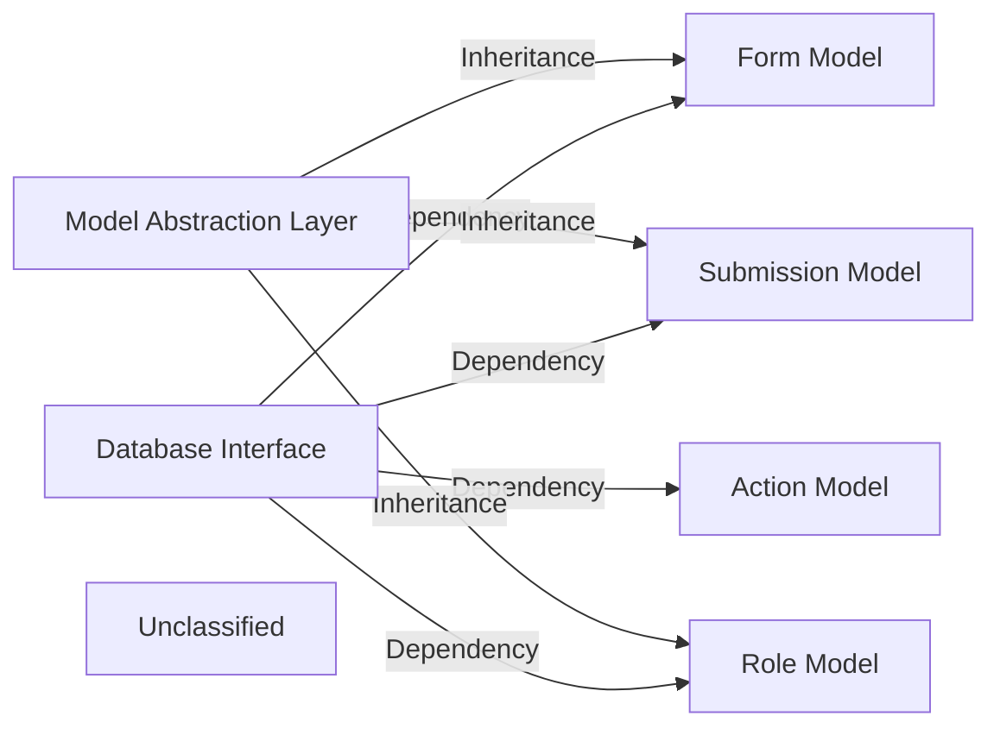

## Details

An analysis of the project's data modeling subsystem reveals a layered architecture centered around a core database interface and a set of specialized data models. The Database Interface serves as the foundation, managing the MongoDB connection lifecycle. Built upon this is a Model Abstraction Layer, which provides common functionality and schema enhancements through a BaseModel wrapper, ensuring consistency across different data entities.

### Database Interface
Manages the connection lifecycle to the MongoDB database. It provides a centralized point for configuring and obtaining a database connection, which is then used by the various data models to perform CRUD operations.

**Related Classes/Methods**:

- <a href="https://github.com/formio/formio/blob/main/src/db/index.js" target="_blank" rel="noopener noreferrer">`src/db/index.js`</a>

### Model Abstraction Layer
Provides the foundational framework for data models. It consists of a BaseModel that other models inherit from, enforcing consistency and providing shared functionality like timestamps.

**Related Classes/Methods**:

- <a href="https://github.com/formio/formio/blob/main/src/models/BaseModel.js" target="_blank" rel="noopener noreferrer">`src/models/BaseModel.js`</a>
- <a href="https://github.com/formio/formio/blob/main/src/models/Schema.js" target="_blank" rel="noopener noreferrer">`src/models/Schema.js`</a>

### Form Model
Defines the schema and business logic for "Forms." This is a core entity representing the structure of a form, including its fields, layout, and properties. It is central to the form-building capabilities of the platform.

**Related Classes/Methods**:

- <a href="https://github.com/formio/formio/blob/main/src/models/Form.js" target="_blank" rel="noopener noreferrer">`src/models/Form.js`</a>

### Submission Model
Defines the schema for data submitted to a "Form." Each submission is a distinct record containing user-provided data, linked to a specific form definition. This component is critical for data capture and storage.

**Related Classes/Methods**:

- <a href="https://github.com/formio/formio/blob/main/src/models/Submission.js" target="_blank" rel="noopener noreferrer">`src/models/Submission.js`</a>

### Role Model
Defines the schema for user roles and permissions. In a PaaS context, this component is crucial for managing access control, defining what actions different users or tenants can perform on forms and submissions.

**Related Classes/Methods**:

- <a href="https://github.com/formio/formio/blob/main/src/models/Role.js" target="_blank" rel="noopener noreferrer">`src/models/Role.js`</a>

### Action Model
Defines the schema for "Actions," which are operations that can be triggered by form events (e.g., on submission). This component enables the platform's workflow and integration capabilities.

**Related Classes/Methods**:

- <a href="https://github.com/formio/formio/blob/main/src/models/Action.js" target="_blank" rel="noopener noreferrer">`src/models/Action.js`</a>

### Unclassified
Component for all unclassified files and utility functions (Utility functions/External Libraries/Dependencies)

**Related Classes/Methods**: _None_

### [FAQ](https://github.com/CodeBoarding/GeneratedOnBoardings/tree/main?tab=readme-ov-file#faq)