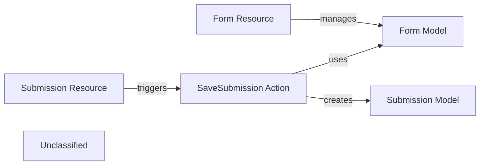

## Details

An analysis of the project's core components reveals a modular, resource-oriented architecture for managing forms and their submissions. The system is centered around two primary resources: `FormResource` and `SubmissionResource`, which handle the API interactions for form management and data submission, respectively. Data persistence is managed by Mongoose models, `Form` and `Submission`, which define the database schemas and interactions. The business logic for processing submissions is encapsulated within the `SaveSubmission` action, which orchestrates the validation and storage of submission data, decoupling the resource layer from the data and business logic layers.

### Form Resource
Exposes RESTful API endpoints for managing form definitions. It handles incoming HTTP requests for creating, reading, updating, and deleting form schemas.

**Related Classes/Methods**:

- <a href="https://github.com/formio/formio/blob/main/src/resources/FormResource.js#L6-L95" target="_blank" rel="noopener noreferrer">`module.exports`:6-95</a>

### Submission Resource
Provides RESTful API endpoints for handling form submissions. It serves as the primary entry point for incoming submission data.

**Related Classes/Methods**:

- <a href="https://github.com/formio/formio/blob/main/src/resources/SubmissionResource.js" target="_blank" rel="noopener noreferrer">`SubmissionResource`</a>

### Form Model
Defines the data schema and serves as the Data Access Object (DAO) for a form. It manages all interactions with the `forms` database collection.

**Related Classes/Methods**:

- <a href="https://github.com/formio/formio/blob/main/src/models/Form.js#L7-L263" target="_blank" rel="noopener noreferrer">`module.exports`:7-263</a>

### Submission Model
Defines the schema for submission data and acts as the DAO for the `submissions` collection, handling data persistence.

**Related Classes/Methods**:

- <a href="https://github.com/formio/formio/blob/main/src/models/Submission.js#L6-L108" target="_blank" rel="noopener noreferrer">`module.exports`:6-108</a>

### SaveSubmission Action
Encapsulates the core business logic for processing a new form submission. It orchestrates validation, transformation, and persistence of submitted data.

**Related Classes/Methods**:

- <a href="https://github.com/formio/formio/blob/main/src/actions/SaveSubmission.js#L19-L305" target="_blank" rel="noopener noreferrer">`SaveSubmission`:19-305</a>

### Unclassified
Component for all unclassified files and utility functions (Utility functions/External Libraries/Dependencies)

**Related Classes/Methods**: _None_

### [FAQ](https://github.com/CodeBoarding/GeneratedOnBoardings/tree/main?tab=readme-ov-file#faq)