```mermaid
graph LR
    API_Gateway_Core_Router["API Gateway & Core Router"]
    Authentication_Authorization_Service["Authentication & Authorization Service"]
    Form_Submission_Management_Service["Form & Submission Management Service"]
    Action_Event_Processing_Engine["Action & Event Processing Engine"]
    Data_Persistence_Layer["Data Persistence Layer"]
    Plugin_Extension_Manager["Plugin & Extension Manager"]
    Client_Side_Applications_External_["Client-Side Applications (External)"]
    Unclassified["Unclassified"]
    Client_Side_Applications_External_ -- "Initiates API requests" --> API_Gateway_Core_Router
    API_Gateway_Core_Router -- "Routes authentication requests and validates tokens" --> Authentication_Authorization_Service
    API_Gateway_Core_Router -- "Routes requests for form definitions and submissions" --> Form_Submission_Management_Service
    API_Gateway_Core_Router -- "Integrates custom plugin routes and middleware" --> Plugin_Extension_Manager
    Authentication_Authorization_Service -- "Stores and retrieves user and role data" --> Data_Persistence_Layer
    Form_Submission_Management_Service -- "Stores and retrieves form definitions and submission data" --> Data_Persistence_Layer
    Form_Submission_Management_Service -- "Triggers actions based on form submission events" --> Action_Event_Processing_Engine
    Action_Event_Processing_Engine -- "Accesses and potentially modifies data as part of action execution" --> Data_Persistence_Layer
    Plugin_Extension_Manager -- "Registers new routes and middleware for extended functionality" --> API_Gateway_Core_Router
    Plugin_Extension_Manager -- "Extends form and submission processing logic" --> Form_Submission_Management_Service
    Plugin_Extension_Manager -- "Adds custom actions to the event processing pipeline" --> Action_Event_Processing_Engine
```

## Details

The Form.io platform operates as a modular, API-driven system designed for dynamic form and data management. Client-side applications interact with the system through a central API Gateway & Core Router, which directs requests to specialized backend services. Authentication and authorization are handled by a dedicated service, ensuring secure access. Form definitions and submission data are managed by the Form & Submission Management Service, which leverages a Data Persistence Layer for storage. Critical business logic and automated tasks are executed by the Action & Event Processing Engine, triggered by events like form submissions. The system's extensibility is facilitated by a Plugin & Extension Manager, allowing for custom functionalities to be integrated across various components. This architecture promotes clear separation of concerns, scalability, and maintainability, making it suitable for complex, data-intensive applications requiring flexible form capabilities.

### API Gateway & Core Router
The central entry point for all client requests, handling API routing, global middleware, and orchestrating the flow to specific backend services.

**Related Classes/Methods**:

- `src.index`
- <a href="https://github.com/formio/formio/blob/main/src/middleware" target="_blank" rel="noopener noreferrer">`src.middleware`</a>

### Authentication & Authorization Service
Manages user identity, authentication processes (login, registration, password reset), and role-based access control (RBAC), ensuring secure access to API resources.

**Related Classes/Methods**:

- <a href="https://github.com/formio/formio/blob/main/src/authentication" target="_blank" rel="noopener noreferrer">`src.authentication`</a>
- <a href="https://github.com/formio/formio/blob/main/src/actions/LoginAction.js" target="_blank" rel="noopener noreferrer">`src.actions.LoginAction`</a>
- <a href="https://github.com/formio/formio/blob/main/src/actions/ResetPassword.js" target="_blank" rel="noopener noreferrer">`src.actions.ResetPassword`</a>
- <a href="https://github.com/formio/formio/blob/main/src/actions/RoleAction.js" target="_blank" rel="noopener noreferrer">`src.actions.RoleAction`</a>

### Form & Submission Management Service
Dedicated to the lifecycle management of form schemas (creation, retrieval, update, deletion) and the intake, validation, transformation, and storage of data submitted through forms.

**Related Classes/Methods**:

- `src.resources.form`:1-10
- <a href="https://github.com/formio/formio/blob/main/src/models/Form.js" target="_blank" rel="noopener noreferrer">`src.models.Form`</a>
- `src.resources.submission`:1-10
- <a href="https://github.com/formio/formio/blob/main/src/models/Submission.js" target="_blank" rel="noopener noreferrer">`src.models.Submission`</a>
- <a href="https://github.com/formio/formio/blob/main/src/actions/SaveSubmission.js" target="_blank" rel="noopener noreferrer">`src.actions.SaveSubmission`</a>

### Action & Event Processing Engine
Executes predefined or custom actions in response to system events, primarily form submissions, including sending emails, invoking webhooks, or custom server-side logic.

**Related Classes/Methods**:

- <a href="https://github.com/formio/formio/blob/main/src/actions" target="_blank" rel="noopener noreferrer">`src.actions`</a>
- <a href="https://github.com/formio/formio/blob/main/src/actions/EmailAction.js" target="_blank" rel="noopener noreferrer">`src.actions.EmailAction`</a>
- <a href="https://github.com/formio/formio/blob/main/src/actions/WebhookAction.js" target="_blank" rel="noopener noreferrer">`src.actions.WebhookAction`</a>

### Data Persistence Layer
Defines data structures (schemas) for all persistent entities (Forms, Submissions, Users, Roles) and provides a standardized interface for interacting with the underlying MongoDB database, abstracting away database-specific operations.

**Related Classes/Methods**:

- <a href="https://github.com/formio/formio/blob/main/src/models" target="_blank" rel="noopener noreferrer">`src.models`</a>
- <a href="https://github.com/formio/formio/blob/main/src/db" target="_blank" rel="noopener noreferrer">`src.db`</a>

### Plugin & Extension Manager
Provides a mechanism for extending the core functionality of the Form.io platform through custom plugins, managing plugin loading, registration, and integration points.

**Related Classes/Methods**:

- <a href="https://github.com/formio/formio/blob/main/src/plugins" target="_blank" rel="noopener noreferrer">`src.plugins`</a>

### Client-Side Applications (External)
Represents external frontend applications (e.g., the Form.io portal, custom web applications) that consume the backend API for user interaction and presentation.

**Related Classes/Methods**:

- <a href="https://github.com/formio/formio/blob/main/portal/src" target="_blank" rel="noopener noreferrer">`portal.src`</a>

### Unclassified
Component for all unclassified files and utility functions (Utility functions/External Libraries/Dependencies)

**Related Classes/Methods**: _None_

### [FAQ](https://github.com/CodeBoarding/GeneratedOnBoardings/tree/main?tab=readme-ov-file#faq)