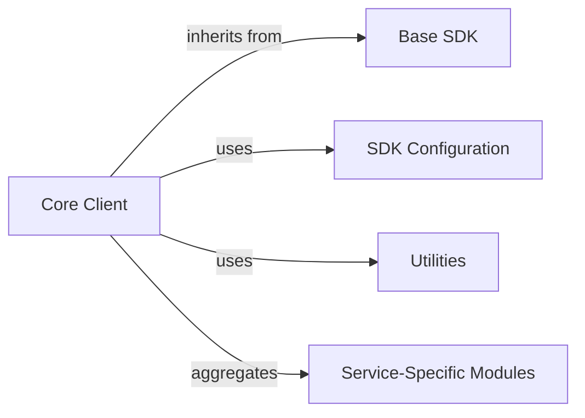

## Details

Final component overview for the `friendli-python` SDK.

### Core Client [[Expand]](./Core_Client.md)
The central component serving as the primary entry point for all API interactions. It manages global configurations, authentication, shared HTTP client instances, retry logic, and provides the foundational logic for both synchronous and asynchronous operations, acting as the main facade for the SDK.

**Related Classes/Methods**:

- <a href="https://github.com/friendliai/friendli-python/blob/main/src/friendli/friendli.py#L23-L77" target="_blank" rel="noopener noreferrer">`friendli.friendli:SyncFriendli` (23:77)</a>
- <a href="https://github.com/friendliai/friendli-python/blob/main/src/friendli/friendli.py#L80-L134" target="_blank" rel="noopener noreferrer">`friendli.friendli:AsyncFriendli` (80:134)</a>
- <a href="https://github.com/friendliai/friendli-python/blob/main/src/friendli_core/sdk.py#L139-L161" target="_blank" rel="noopener noreferrer">`friendli_core.sdk:SyncFriendliCore` (139:161)</a>
- <a href="https://github.com/friendliai/friendli-python/blob/main/src/friendli_core/sdk.py#L164-L186" target="_blank" rel="noopener noreferrer">`friendli_core.sdk:AsyncFriendliCore` (164:186)</a>

### Base SDK
Provides the fundamental abstract layer for common SDK functionalities, including core request/response processing, HTTP client management, and potentially error handling integration. It serves as the base for the `Core Client`.

**Related Classes/Methods**:

- <a href="https://github.com/friendliai/friendli-python/blob/main/src/friendli_core/basesdk.py#L19-L106" target="_blank" rel="noopener noreferrer">`friendli_core.basesdk:BaseSDK` (19:106)</a>
- <a href="https://github.com/friendliai/friendli-python/blob/main/src/friendli_core/basesdk.py#L109-L213" target="_blank" rel="noopener noreferrer">`friendli_core.basesdk:SyncSDK` (109:213)</a>
- <a href="https://github.com/friendliai/friendli-python/blob/main/src/friendli_core/basesdk.py#L216-L322" target="_blank" rel="noopener noreferrer">`friendli_core.basesdk:AsyncSDK` (216:322)</a>

### SDK Configuration
Manages all configurable parameters for the SDK, such as API keys, base URLs, timeouts, and retry policies. It centralizes these settings for easy management and application across the SDK.

**Related Classes/Methods**:

- <a href="https://github.com/friendliai/friendli-python/blob/main/src/friendli_core/sdkconfiguration.py#L26-L49" target="_blank" rel="noopener noreferrer">`friendli_core.sdkconfiguration:SDKConfiguration` (26:49)</a>

### Utilities
Encapsulates common helper functionalities, specifically implementing robust retry mechanisms for API calls. This enhances the SDK's reliability and resilience against transient network issues or API rate limits.

**Related Classes/Methods**:

- <a href="https://github.com/friendliai/friendli-python/blob/main/src/friendli_core/utils/retries.py#L29-L39" target="_blank" rel="noopener noreferrer">`friendli_core.utils.retries:RetryConfig` (29:39)</a>
- <a href="https://github.com/friendliai/friendli-python/blob/main/src/friendli_core/utils/retries.py#L42-L48" target="_blank" rel="noopener noreferrer">`friendli_core.utils.retries:Retries` (42:48)</a>

### Service-Specific Modules
Provides more granular API clients or modules, each dedicated to a specific service area (e.g., Chat, Completions, Image) within the Friendli API. Each module exposes related API endpoints and handles their specific request/response logic.

**Related Classes/Methods**:

- `friendli.chat`
- `friendli.completions`
- `friendli.image`

### [FAQ](https://github.com/CodeBoarding/GeneratedOnBoardings/tree/main?tab=readme-ov-file#faq)