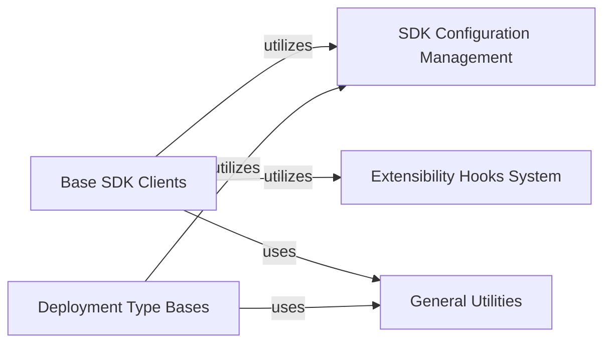

## Details

The `SDK Infrastructure & Extensibility` subsystem forms the bedrock of the `friendli-python` SDK, providing the core architectural patterns and mechanisms for its operation and future expansion. It encapsulates the fundamental building blocks that other SDK components, including the `Core Client` and `Service-specific modules`, inherit from or utilize. This overarching component provides the foundational mechanisms for the SDK's operation. It includes base classes for synchronous and asynchronous SDK clients, configuration management, base classes tailored for different deployment environments (container, dedicated, serverless), and a robust system for extending or intercepting SDK behavior through hooks. It also centralizes general utilities essential for the SDK's internal workings, excluding specific retry logic which is handled elsewhere.

### Base SDK Clients
Defines the abstract and concrete base classes for the SDK's synchronous and asynchronous client operations. These classes establish the fundamental structure and shared functionalities that all specific SDK clients (like `SyncFriendli` or `AsyncFriendli`) will inherit and build upon.

**Related Classes/Methods**:

- <a href="https://github.com/friendliai/friendli-python/blob/main/src/friendli_core/basesdk.py#L19-L106" target="_blank" rel="noopener noreferrer">`friendli_core.basesdk.BaseSDK` (19:106)</a>
- <a href="https://github.com/friendliai/friendli-python/blob/main/src/friendli_core/basesdk.py#L216-L322" target="_blank" rel="noopener noreferrer">`friendli_core.basesdk.AsyncSDK` (216:322)</a>
- <a href="https://github.com/friendliai/friendli-python/blob/main/src/friendli_core/basesdk.py#L109-L213" target="_blank" rel="noopener noreferrer">`friendli_core.basesdk.SyncSDK` (109:213)</a>
- <a href="https://github.com/friendliai/friendli-python/blob/main/src/friendli_core/sdk.py#L27-L136" target="_blank" rel="noopener noreferrer">`friendli_core.sdk.BaseFriendliCore` (27:136)</a>
- <a href="https://github.com/friendliai/friendli-python/blob/main/src/friendli_core/sdk.py#L164-L186" target="_blank" rel="noopener noreferrer">`friendli_core.sdk.AsyncFriendliCore` (164:186)</a>
- <a href="https://github.com/friendliai/friendli-python/blob/main/src/friendli_core/sdk.py#L139-L161" target="_blank" rel="noopener noreferrer">`friendli_core.sdk.SyncFriendliCore` (139:161)</a>

### SDK Configuration Management
Manages the global configuration settings for the entire SDK, including API keys, base URLs, and other operational parameters. It ensures consistent access to configuration across different SDK components.

**Related Classes/Methods**:

- <a href="https://github.com/friendliai/friendli-python/blob/main/src/friendli_core/sdkconfiguration.py#L26-L49" target="_blank" rel="noopener noreferrer">`friendli_core.sdkconfiguration.SDKConfiguration` (26:49)</a>

### Deployment Type Bases
Provides abstract base classes that define the common interfaces and functionalities for interacting with different deployment environments (e.g., containerized, dedicated, serverless). This allows for environment-specific logic to be encapsulated while maintaining a consistent SDK interface.

**Related Classes/Methods**:

- <a href="https://github.com/friendliai/friendli-python/blob/main/src/friendli_core/container.py#L13-L21" target="_blank" rel="noopener noreferrer">`friendli_core.container.BaseContainer` (13:21)</a>
- <a href="https://github.com/friendliai/friendli-python/blob/main/src/friendli_core/dedicated.py#L24-L32" target="_blank" rel="noopener noreferrer">`friendli_core.dedicated.BaseDedicated` (24:32)</a>
- <a href="https://github.com/friendliai/friendli-python/blob/main/src/friendli_core/serverless.py#L24-L32" target="_blank" rel="noopener noreferrer">`friendli_core.serverless.BaseServerless` (24:32)</a>

### Extensibility Hooks System
Implements a flexible callback and interception mechanism, allowing developers to inject custom logic at various points within the SDK's execution flow (e.g., before/after API calls, on error). This enhances the SDK's extensibility without modifying its core code.

**Related Classes/Methods**:

- <a href="https://github.com/friendliai/friendli-python/blob/main/src/friendli_core/_hooks/sdkhooks.py#L21-L78" target="_blank" rel="noopener noreferrer">`friendli_core._hooks.sdkhooks.SDKHooks` (21:78)</a>
- <a href="https://github.com/friendliai/friendli-python/blob/main/src/friendli_core/_hooks/types.py#L99-L114" target="_blank" rel="noopener noreferrer">`friendli_core._hooks.types.Hooks` (99:114)</a>
- <a href="https://github.com/friendliai/friendli-python/blob/main/src/friendli_core/_hooks/types.py#L11-L30" target="_blank" rel="noopener noreferrer">`friendli_core._hooks.types.HookContext` (11:30)</a>

### General Utilities
Contains common helper functions and utilities that support various internal operations across the SDK, such as metadata handling and logging. These are general-purpose tools used by multiple components.

**Related Classes/Methods**:

- `friendli_core.utils.metadata`
- <a href="https://github.com/friendliai/friendli-python/blob/main/src/friendli_core/utils/logger.py#L9-L11" target="_blank" rel="noopener noreferrer">`friendli_core.utils.logger.Logger` (9:11)</a>

### [FAQ](https://github.com/CodeBoarding/GeneratedOnBoardings/tree/main?tab=readme-ov-file#faq)