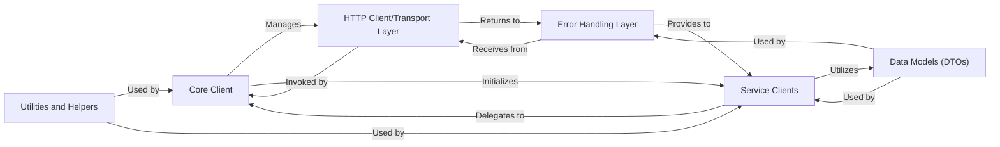

## Details

Abstract Components Overview

### Core Client [[Expand]](./Core_Client.md)
The primary entry point for the SDK, responsible for managing global configurations (e.g., API keys, base URLs), authentication, and shared HTTP client instances. It orchestrates the overall interaction flow and initializes service-specific clients.

**Related Classes/Methods**:

- <a href="https://github.com/friendliai/friendli-python/blob/main/src/friendli/friendli.py#L23-L77" target="_blank" rel="noopener noreferrer">`friendli.core.SyncFriendli` (23:77)</a>
- <a href="https://github.com/friendliai/friendli-python/blob/main/src/friendli/friendli.py#L80-L134" target="_blank" rel="noopener noreferrer">`friendli.core.AsyncFriendli` (80:134)</a>

### Service Clients [[Expand]](./Service_Clients.md)
A collection of dedicated modules, each providing a high-level, simplified interface for interacting with specific Friendli API service areas (e.g., Chat, Completions, Dataset). They encapsulate service-specific request/response logic.

**Related Classes/Methods**:

- `friendli.container.SyncContainer`
- `friendli.container.AsyncContainer`
- `friendli.dataset.SyncDataset`
- `friendli.dataset.AsyncDataset`
- `friendli.dedicated.SyncDedicated`
- `friendli.dedicated.AsyncDedicated`
- `friendli.file.SyncFile`
- `friendli.file.AsyncFile`
- `friendli.serverless.SyncServerless`
- `friendli.serverless.AsyncServerless`

### Data Models (DTOs)
Defines explicit data transfer objects (DTOs) for all API request and response payloads. These models are typically type-hinted, enabling strong typing and facilitating seamless serialization to/from JSON.

**Related Classes/Methods**:

- <a href="https://github.com/friendliai/friendli-python/blob/main/src/friendli_core/types/basemodel.py#L9-L12" target="_blank" rel="noopener noreferrer">`friendli_core.types.basemodel.BaseModel` (9:12)</a>

### Error Handling Layer
Implements a consistent and user-friendly mechanism for handling API errors. It maps various raw API error responses to specific, descriptive Python exceptions, allowing developers to gracefully manage different failure scenarios.

**Related Classes/Methods**:

- <a href="https://github.com/friendliai/friendli-python/blob/main/src/friendli_core/models/friendlicoreerror.py#L7-L26" target="_blank" rel="noopener noreferrer">`friendli_core.models.friendlicoreerror.FriendliCoreError` (7:26)</a>
- <a href="https://github.com/friendliai/friendli-python/blob/main/src/friendli_core/models/httpvalidationerror.py#L18-L29" target="_blank" rel="noopener noreferrer">`friendli_core.models.httpvalidationerror.HTTPValidationError` (18:29)</a>
- <a href="https://github.com/friendliai/friendli-python/blob/main/src/friendli_core/models/responsevalidationerror.py#L9-L25" target="_blank" rel="noopener noreferrer">`friendli_core.models.responsevalidationerror.ResponseValidationError` (9:25)</a>
- <a href="https://github.com/friendliai/friendli-python/blob/main/src/friendli_core/models/sdkerror.py#L11-L38" target="_blank" rel="noopener noreferrer">`friendli_core.models.sdkerror.SDKError` (11:38)</a>

### HTTP Client/Transport Layer
The underlying component responsible for making actual HTTP requests to the Friendli API. It handles low-level network communication, connection management, and potentially features like retries or timeouts.

**Related Classes/Methods**:

- <a href="https://github.com/friendliai/friendli-python/blob/main/src/friendli_core/sdkconfiguration.py#L26-L49" target="_blank" rel="noopener noreferrer">`friendli_core.sdkconfiguration.SDKConfiguration` (26:49)</a>

### Utilities and Helpers
A collection of common functionalities that support various parts of the SDK, such as retry mechanisms, custom HTTP client configurations, logging setup, and potentially data validation or transformation helpers.

**Related Classes/Methods**:

- <a href="https://github.com/friendliai/friendli-python/blob/main/src/friendli_core/utils/logger.py#L9-L11" target="_blank" rel="noopener noreferrer">`friendli_core.utils.logger.Logger` (9:11)</a>

### [FAQ](https://github.com/CodeBoarding/GeneratedOnBoardings/tree/main?tab=readme-ov-file#faq)