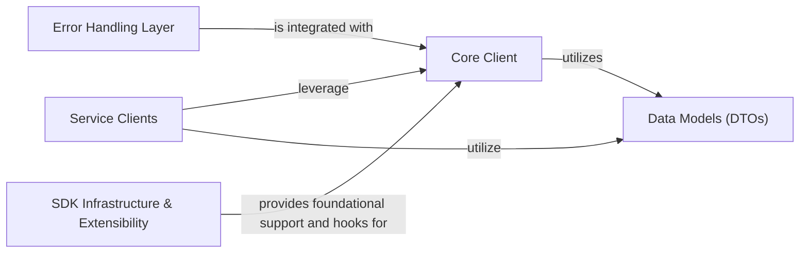

## Details

This project outlines the architecture of an SDK for interacting with the Friendli API, detailing its core components, their functionalities, and their interdependencies.

### Core Client [[Expand]](./Core_Client.md)
The central component serving as the primary entry point for all API interactions. It manages global configurations, authentication, shared HTTP client instances, retry logic, and provides the foundational logic for both synchronous and asynchronous operations.

**Related Classes/Methods**:

- <a href="https://github.com/friendliai/friendli-python/blob/main/src/friendli/friendli.py#L23-L77" target="_blank" rel="noopener noreferrer">`friendli.friendli.SyncFriendli` (23:77)</a>
- <a href="https://github.com/friendliai/friendli-python/blob/main/src/friendli/friendli.py#L80-L134" target="_blank" rel="noopener noreferrer">`friendli.friendli.AsyncFriendli` (80:134)</a>

### Service Clients [[Expand]](./Service_Clients.md)
A collection of dedicated modules, each providing a high-level interface for interacting with specific Friendli API service areas (e.g., Chat, Completions, Dataset, Image, Token). They encapsulate service-specific request and response logic.

**Related Classes/Methods**:

- `friendli.container.SyncContainer`
- `friendli.container.AsyncContainer`
- `friendli.dataset.SyncDataset`
- `friendli.dataset.AsyncDataset`
- `friendli.dedicated.SyncDedicated`
- `friendli.dedicated.AsyncDedicated`
- `friendli.file.SyncFile`
- `friendli.file.AsyncFile`
- `friendli.serverless.SyncServerless`
- `friendli.serverless.AsyncServerless`

### Data Models (DTOs)
Defines explicit, type-hinted data transfer objects (DTOs) for all API request and response payloads. These models ensure strong typing and facilitate the serialization and deserialization of data exchanged with the Friendli API.

**Related Classes/Methods**:

- `friendli.types`
- `friendli.models`

### Error Handling Layer
Implements a consistent and user-friendly mechanism for handling API errors. It maps various API error responses to specific, descriptive Python exceptions, allowing developers to gracefully manage different failure scenarios.

**Related Classes/Methods**:

- `friendli_core.exceptions`

### SDK Infrastructure & Extensibility [[Expand]](./SDK_Infrastructure_Extensibility.md)
Encompasses the underlying mechanisms that support the SDK's operation, including base classes for different deployment types (container, dedicated, serverless) and a flexible system for extending or intercepting SDK behavior through hooks.

**Related Classes/Methods**:

- `friendli.config`
- `friendli.utils`
- `friendli_core.sdk`
- `friendli_core.httpclient`
- `friendli_core.utils.retries`

### [FAQ](https://github.com/CodeBoarding/GeneratedOnBoardings/tree/main?tab=readme-ov-file#faq)