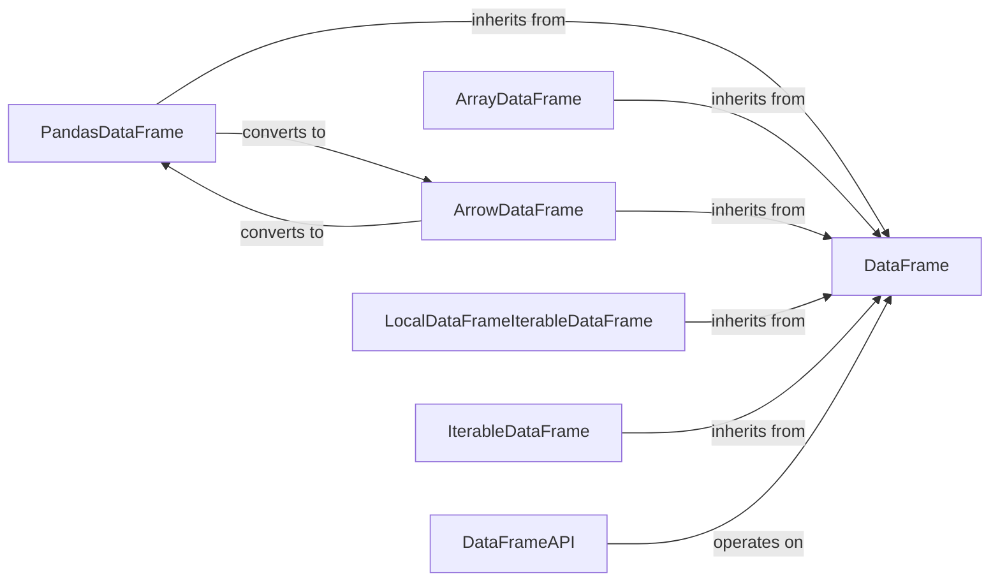

## Details

The Data Abstraction Layer subsystem in Fugue provides a standardized DataFrame API, enabling consistent interaction with diverse in-memory and distributed data structures.

### DataFrame
The foundational abstract interface for all Fugue DataFrame implementations. It defines the core contract for data manipulation, including schema management and fundamental operations like `peek_array`, `_drop_cols`, `count`, `as_array`, `as_arrow`, `as_pandas`, and `as_iterable`. It acts as the unifying interface for all data structures within Fugue.

**Related Classes/Methods**:

- <a href="https://github.com/fugue-project/fugue/blob/master/fugue/dataframe/dataframe.py" target="_blank" rel="noopener noreferrer">`fugue/dataframe/dataframe.py:DataFrame`</a>
- <a href="https://github.com/fugue-project/fugue/blob/master/fugue/dataframe/dataframe.py" target="_blank" rel="noopener noreferrer">`fugue/dataframe/dataframe.py:DataFrame.peek_array`</a>
- <a href="https://github.com/fugue-project/fugue/blob/master/fugue/dataframe/dataframe.py" target="_blank" rel="noopener noreferrer">`fugue/dataframe/dataframe.py:DataFrame._drop_cols`</a>
- <a href="https://github.com/fugue-project/fugue/blob/master/fugue/dataframe/dataframe.py" target="_blank" rel="noopener noreferrer">`fugue/dataframe/dataframe.py:DataFrame.count`</a>
- <a href="https://github.com/fugue-project/fugue/blob/master/fugue/dataframe/dataframe.py" target="_blank" rel="noopener noreferrer">`fugue/dataframe/dataframe.py:DataFrame.as_array`</a>
- <a href="https://github.com/fugue-project/fugue/blob/master/fugue/dataframe/dataframe.py" target="_blank" rel="noopener noreferrer">`fugue/dataframe/dataframe.py:DataFrame.as_arrow`</a>
- <a href="https://github.com/fugue-project/fugue/blob/master/fugue/dataframe/dataframe.py" target="_blank" rel="noopener noreferrer">`fugue/dataframe/dataframe.py:DataFrame.as_pandas`</a>
- <a href="https://github.com/fugue-project/fugue/blob/master/fugue/dataframe/dataframe.py" target="_blank" rel="noopener noreferrer">`fugue/dataframe/dataframe.py:DataFrame.as_iterable`</a>

### DataFrameAPI
Provides a consistent, high-level API for common DataFrame operations. It offers a set of utility functions (e.g., `alter_columns`, `drop_columns`, `select_columns`, `rename`) that act as a facade over the `DataFrame` interface. This simplifies interactions and ensures consistent behavior across different underlying DataFrame types.

**Related Classes/Methods**:

- <a href="https://github.com/fugue-project/fugue/blob/master/fugue/dataframe/api.py" target="_blank" rel="noopener noreferrer">`fugue/dataframe/api.py:DataFrameAPI`</a>
- <a href="https://github.com/fugue-project/fugue/blob/master/fugue/dataframe/api.py" target="_blank" rel="noopener noreferrer">`fugue/dataframe/api.py:DataFrameAPI.alter_columns`</a>
- <a href="https://github.com/fugue-project/fugue/blob/master/fugue/dataframe/api.py" target="_blank" rel="noopener noreferrer">`fugue/dataframe/api.py:DataFrameAPI.drop_columns`</a>
- <a href="https://github.com/fugue-project/fugue/blob/master/fugue/dataframe/api.py" target="_blank" rel="noopener noreferrer">`fugue/dataframe/api.py:DataFrameAPI.select_columns`</a>
- <a href="https://github.com/fugue-project/fugue/blob/master/fugue/dataframe/api.py" target="_blank" rel="noopener noreferrer">`fugue/dataframe/api.py:DataFrameAPI.rename`</a>

### PandasDataFrame
Adapts the `DataFrame` interface for Pandas DataFrames. It provides a concrete implementation of the `DataFrame` interface specifically for Pandas DataFrames, translating Fugue's abstract operations into equivalent Pandas operations.

**Related Classes/Methods**:

- <a href="https://github.com/fugue-project/fugue/blob/master/fugue/dataframe/pandas_dataframe.py" target="_blank" rel="noopener noreferrer">`fugue/dataframe/pandas_dataframe.py:PandasDataFrame`</a>

### ArrayDataFrame
Adapts the `DataFrame` interface for in-memory array-like data. It implements the `DataFrame` interface for in-memory array-like data structures (lists of lists), offering a lightweight DataFrame representation for smaller datasets.

**Related Classes/Methods**:

- <a href="https://github.com/fugue-project/fugue/blob/master/fugue/dataframe/array_dataframe.py" target="_blank" rel="noopener noreferrer">`fugue/dataframe/array_dataframe.py:ArrayDataFrame`</a>

### ArrowDataFrame
Adapts the `DataFrame` interface for Apache Arrow tables. It implements the `DataFrame` interface using Apache Arrow tables, enabling efficient columnar data processing and interoperability with other Arrow-compatible systems.

**Related Classes/Methods**:

- <a href="https://github.com/fugue-project/fugue/blob/master/fugue/dataframe/arrow_dataframe.py" target="_blank" rel="noopener noreferrer">`fugue/dataframe/arrow_dataframe.py:ArrowDataFrame`</a>

### LocalDataFrameIterableDataFrame
Handles DataFrames composed of iterables of other DataFrames. It represents a DataFrame that is an iterable of other DataFrames, useful for handling partitioned data or results from operations that produce multiple DataFrames.

**Related Classes/Methods**:

- <a href="https://github.com/fugue-project/fugue/blob/master/fugue/dataframe/dataframe_iterable_dataframe.py" target="_blank" rel="noopener noreferrer">`fugue/dataframe/dataframe_iterable_dataframe.py:LocalDataFrameIterableDataFrame`</a>

### IterableDataFrame
Provides a generic iterable-based DataFrame representation. It represents a DataFrame as a generic iterable of rows, providing a flexible base for various iterable-based data sources when a more specific DataFrame type is not applicable.

**Related Classes/Methods**:

- <a href="https://github.com/fugue-project/fugue/blob/master/fugue/dataframe/iterable_dataframe.py" target="_blank" rel="noopener noreferrer">`fugue/dataframe/iterable_dataframe.py:IterableDataFrame`</a>

### [FAQ](https://github.com/CodeBoarding/GeneratedOnBoardings/tree/main?tab=readme-ov-file#faq)