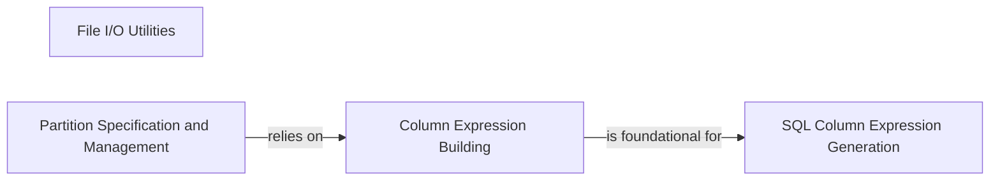

## Details

The `Data I/O & Schema Management` subsystem in Fugue is responsible for handling external data interactions and defining the structure and transformations of data within the framework. It acts as a foundational layer for ensuring data consistency and optimizing processing through schema definition and partitioning.

### File I/O Utilities
Provides fundamental utilities for reading and writing data to and from various file formats (e.g., Parquet, CSV, JSON) and managing file paths, including glob patterns and local/remote file system interactions. This component directly addresses the "Data I/O" aspect of the subsystem.

**Related Classes/Methods**:

- <a href="https://github.com/fugue-project/fugue/blob/master/fugue/_utils/io.py" target="_blank" rel="noopener noreferrer">`fugue._utils.io`</a>

### Partition Specification and Management
Defines and manages how data is partitioned and sorted for processing, encapsulating partition keys, presort specifications, and the number of partitions. This is a critical aspect for optimizing data processing in a data framework and falls under "Schema Management" as it dictates data organization.

**Related Classes/Methods**:

- <a href="https://github.com/fugue-project/fugue/blob/master/fugue/collections/partition.py" target="_blank" rel="noopener noreferrer">`fugue.collections.partition`</a>

### Column Expression Building
Offers an abstract, programmatic interface for building column-level expressions, including literals, named columns, function calls, and various arithmetic and boolean operations. This forms the basis for defining schema transformations and computations, making it a core part of the "Schema Management" system.

**Related Classes/Methods**:

- <a href="https://github.com/fugue-project/fugue/blob/master/fugue/column/expressions.py" target="_blank" rel="noopener noreferrer">`fugue.column.expressions`</a>

### SQL Column Expression Generation
Translates the abstract column expressions defined in `fugue.column.expressions` into SQL-compatible strings, handling SQL-specific constructs such as aggregation functions and clauses. This is a specialized part of the "Schema Management" system focused on SQL integration.

**Related Classes/Methods**:

- <a href="https://github.com/fugue-project/fugue/blob/master/fugue/column/sql.py" target="_blank" rel="noopener noreferrer">`fugue.column.sql`</a>

### [FAQ](https://github.com/CodeBoarding/GeneratedOnBoardings/tree/main?tab=readme-ov-file#faq)