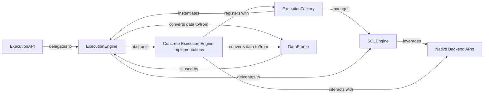

## Details

The Fugue execution subsystem is designed around a core abstraction, the ExecutionEngine, which provides a unified interface for diverse data operations, decoupling the logic from specific backend technologies. The ExecutionFactory serves as a central registry, managing the lifecycle and retrieval of these engines and their SQL counterparts (SQLEngine). Users interact with this system primarily through the ExecutionAPI, a high-level interface that simplifies common data manipulations. All data within Fugue is represented by the abstract DataFrame, ensuring consistency across different underlying data structures. Concrete ExecutionEngine implementations, such as those for Dask, Spark, or DuckDB, provide the actual operational logic by interacting with their respective Native Backend APIs. This modular design allows Fugue to seamlessly integrate with various data processing frameworks while maintaining a consistent and user-friendly experience.

### ExecutionEngine
Defines the abstract contract for all data operations (e.g., to_df, select, join, map_dataframe), providing a unified, engine-agnostic interface. It is the cornerstone of Fugue's engine abstraction.

**Related Classes/Methods**:

- <a href="https://github.com/fugue-project/fugue/blob/master/fugue/execution/execution_engine.py" target="_blank" rel="noopener noreferrer">`fugue/execution/execution_engine.py`</a>

### ExecutionFactory
Manages the registration, creation, and retrieval of ExecutionEngine and SQLEngine instances, acting as a central registry for available backends.

**Related Classes/Methods**:

- <a href="https://github.com/fugue-project/fugue/blob/master/fugue/execution/factory.py" target="_blank" rel="noopener noreferrer">`fugue/execution/factory.py`</a>

### ExecutionAPI
Offers a high-level, user-friendly interface for common data operations (e.g., repartition, broadcast, join), simplifying user interaction with the underlying execution layer.

**Related Classes/Methods**:

- <a href="https://github.com/fugue-project/fugue/blob/master/fugue/execution/api.py" target="_blank" rel="noopener noreferrer">`fugue/execution/api.py`</a>

### DataFrame
The abstract base class for all Fugue DataFrame implementations, providing a consistent interface for data manipulation regardless of the underlying engine's native data structure.

**Related Classes/Methods**:

- <a href="https://github.com/fugue-project/fugue/blob/master/fugue/dataframe/dataframe.py" target="_blank" rel="noopener noreferrer">`fugue/dataframe/dataframe.py`</a>

### SQLEngine
Handles SQL-based operations, delegating query execution to the underlying engine's SQL capabilities.

**Related Classes/Methods**:

- <a href="https://github.com/fugue-project/fugue/blob/master/fugue/execution/execution_engine.py" target="_blank" rel="noopener noreferrer">`fugue/execution/execution_engine.py`</a>

### Concrete Execution Engine Implementations
These are concrete implementations of the ExecutionEngine abstract class, providing the actual logic to execute data operations using specific backend technologies like Dask, Spark, DuckDB, Ibis, or Ray.

**Related Classes/Methods**:

- <a href="https://github.com/fugue-project/fugue/blob/master/fugue_dask/execution_engine.py" target="_blank" rel="noopener noreferrer">`fugue_dask/execution_engine.py`</a>
- <a href="https://github.com/fugue-project/fugue/blob/master/fugue_duckdb/execution_engine.py" target="_blank" rel="noopener noreferrer">`fugue_duckdb/execution_engine.py`</a>
- <a href="https://github.com/fugue-project/fugue/blob/master/fugue_ibis/execution_engine.py" target="_blank" rel="noopener noreferrer">`fugue_ibis/execution_engine.py`</a>
- <a href="https://github.com/fugue-project/fugue/blob/master/fugue_ray/execution_engine.py" target="_blank" rel="noopener noreferrer">`fugue_ray/execution_engine.py`</a>
- <a href="https://github.com/fugue-project/fugue/blob/master/fugue_spark/execution_engine.py" target="_blank" rel="noopener noreferrer">`fugue_spark/execution_engine.py`</a>

### Native Backend APIs
The underlying data processing frameworks (e.g., Dask API, Spark API, DuckDB, Ibis, Ray) that the concrete ExecutionEngine implementations interact with to perform actual data computations. The source code references point to the Fugue components that directly interact with these external APIs.

**Related Classes/Methods**:

- <a href="https://github.com/fugue-project/fugue/blob/master/fugue_dask/execution_engine.py" target="_blank" rel="noopener noreferrer">`fugue_dask/execution_engine.py`</a>
- <a href="https://github.com/fugue-project/fugue/blob/master/fugue_duckdb/execution_engine.py" target="_blank" rel="noopener noreferrer">`fugue_duckdb/execution_engine.py`</a>
- <a href="https://github.com/fugue-project/fugue/blob/master/fugue_ibis/execution_engine.py" target="_blank" rel="noopener noreferrer">`fugue_ibis/execution_engine.py`</a>
- <a href="https://github.com/fugue-project/fugue/blob/master/fugue_ray/execution_engine.py" target="_blank" rel="noopener noreferrer">`fugue_ray/execution_engine.py`</a>
- <a href="https://github.com/fugue-project/fugue/blob/master/fugue_spark/execution_engine.py" target="_blank" rel="noopener noreferrer">`fugue_spark/execution_engine.py`</a>

### [FAQ](https://github.com/CodeBoarding/GeneratedOnBoardings/tree/main?tab=readme-ov-file#faq)