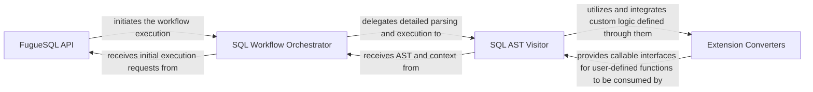

## Details

The FugueSQL & Extensions subsystem operates as a pipeline where the FugueSQL API acts as the initial facade. It passes the SQL statement to the SQL Workflow Orchestrator, which sets up the execution context. The SQL Workflow Orchestrator then hands off the core interpretation task to the SQL AST Visitor. During its traversal, the SQL AST Visitor dynamically integrates custom logic provided by users through the Extension Converters, allowing for a highly extensible and powerful declarative data transformation framework. This flow demonstrates a clear separation of concerns, from user interaction to workflow management, and finally to the core interpretation and extension integration.

### FugueSQL API
Serves as the primary user-facing interface for initiating FugueSQL execution. It takes raw FugueSQL statements and orchestrates their initial processing, acting as the entry point for declarative data transformations. This component aligns with the "Abstraction Layer/Facade" pattern, providing a simplified interface to complex underlying logic.

**Related Classes/Methods**:

- <a href="https://github.com/fugue-project/fugue/blob/master/fugue/sql/api.py#L1-L1000" target="_blank" rel="noopener noreferrer">`fugue.sql.api`:1-1000</a>

### SQL Workflow Orchestrator
Manages the high-level flow and execution context of a FugueSQL script. It acts as an intermediary between the SQL API and the detailed SQL parsing/workflow building logic, ensuring proper sequencing and context management for SQL operations. This component embodies aspects of a "Workflow Orchestration Tool" by managing the overall execution flow.

**Related Classes/Methods**:

- <a href="https://github.com/fugue-project/fugue/blob/master/fugue/sql/workflow.py#L1-L1000" target="_blank" rel="noopener noreferrer">`fugue.sql.workflow`:1-1000</a>

### SQL AST Visitor
This is the core interpreter and translation engine for FugueSQL. It traverses the Abstract Syntax Tree (AST) of a FugueSQL statement, translating each SQL operation (e.g., CREATE, TRANSFORM, OUTPUT) into corresponding calls to the underlying Fugue workflow engine. It also handles variable management and scope within the SQL context. This component is central to the "Interpreter" pattern, translating a high-level language into executable operations.

**Related Classes/Methods**:

- <a href="https://github.com/fugue-project/fugue/blob/master/fugue/sql/_visitors.py#L1-L1000" target="_blank" rel="noopener noreferrer">`fugue.sql._visitors`:1-1000</a>

### Extension Converters
These components provide the necessary decorators and functions to convert standard Python functions into Fugue-specific extensions (Creator, Outputter, Processor, Transformer). They enable users to define custom logic (UDFs) that can be seamlessly integrated and invoked within FugueSQL statements, extending Fugue's core capabilities. This component is a clear example of the "Plugin/Extension" pattern, allowing the system to be extended without modifying its core.

**Related Classes/Methods**:

- <a href="https://github.com/fugue-project/fugue/blob/master/fugue/extensions/creator/convert.py#L1-L1000" target="_blank" rel="noopener noreferrer">`fugue.extensions.creator.convert`:1-1000</a>
- <a href="https://github.com/fugue-project/fugue/blob/master/fugue/extensions/outputter/convert.py#L1-L1000" target="_blank" rel="noopener noreferrer">`fugue.extensions.outputter.convert`:1-1000</a>
- <a href="https://github.com/fugue-project/fugue/blob/master/fugue/extensions/processor/convert.py#L1-L1000" target="_blank" rel="noopener noreferrer">`fugue.extensions.processor.convert`:1-1000</a>
- <a href="https://github.com/fugue-project/fugue/blob/master/fugue/extensions/transformer/convert.py#L1-L1000" target="_blank" rel="noopener noreferrer">`fugue.extensions.transformer.convert`:1-1000</a>

### [FAQ](https://github.com/CodeBoarding/GeneratedOnBoardings/tree/main?tab=readme-ov-file#faq)