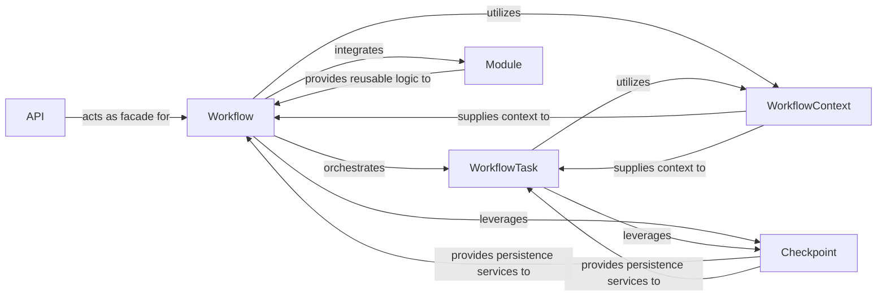

## Details

The `fugue.workflow` subsystem forms the core of Fugue's data processing capabilities, centered around the **Workflow** component, which defines and executes dataflow Directed Acyclic Graphs (DAGs). The **API** component serves as a user-friendly facade, simplifying interactions with the underlying **Workflow**. Each step in a data pipeline is represented by a **WorkflowTask**, an executable unit of work managed by the **Workflow**. Both the **Workflow** and **WorkflowTask**s operate within a **WorkflowContext**, which provides essential runtime configurations and access to the execution environment. For fault tolerance and optimization, the **Workflow** leverages the **Checkpoint** component to persist intermediate data. Additionally, the **Module** component promotes reusability by allowing users to encapsulate and integrate common data processing patterns into their workflows.

### Workflow
The central control plane and the heart of the Fugue workflow. It is responsible for defining, building, and executing the Directed Acyclic Graph (DAG) of data processing tasks. It manages the overall workflow execution flow, handles data dependencies between tasks, and provides high-level methods for data manipulation, output, and persistence. This component embodies the "Pipeline/Workflow" architectural pattern.

**Related Classes/Methods**:

- <a href="https://github.com/fugue-project/fugue/blob/master/fugue/workflow/workflow.py#L1498-L2250" target="_blank" rel="noopener noreferrer">`FugueWorkflow`:1498-2250</a>

### WorkflowTask
Represents a single, executable unit of work within the workflow DAG. Each `WorkflowTask` encapsulates the logic for a specific data operation (e.g., a transform, a join, an output) and manages its execution and result handling. This component is fundamental to the "Pipeline/Workflow" pattern, breaking down complex operations into manageable steps.

**Related Classes/Methods**:

- <a href="https://github.com/fugue-project/fugue/blob/master/fugue/workflow/_tasks.py#L32-L211" target="_blank" rel="noopener noreferrer">`FugueTask`:32-211</a>

### API
Provides a simplified, high-level Application Programming Interface for common workflow operations. It acts as a facade over the more detailed functionalities of the `Workflow` component, offering a user-friendly entry point for defining and running data workflows. This aligns with the "Abstraction Layer/Facade" architectural pattern.

**Related Classes/Methods**:

- <a href="https://github.com/fugue-project/fugue/blob/master/fugue/workflow/api.py" target="_blank" rel="noopener noreferrer">`API`</a>

### WorkflowContext
Provides the runtime context for workflow execution. This includes access to the active `ExecutionEngine` (which executes the actual data operations) and various configuration settings relevant to the workflow's execution environment. It is crucial for providing the necessary environment for tasks.

**Related Classes/Methods**:

- <a href="https://github.com/fugue-project/fugue/blob/master/fugue/workflow/_workflow_context.py#L19-L78" target="_blank" rel="noopener noreferrer">`FugueWorkflowContext`:19-78</a>

### Checkpoint
Manages the persistence and retrieval of intermediate dataframes within a workflow. This is crucial for fault tolerance, allowing workflows to resume from a specific point, and for optimizing complex workflows by avoiding re-computation of intermediate results.

**Related Classes/Methods**:

- <a href="https://github.com/fugue-project/fugue/blob/master/fugue/workflow/_checkpoint.py#L38-L108" target="_blank" rel="noopener noreferrer">`StrongCheckpoint`:38-108</a>
- <a href="https://github.com/fugue-project/fugue/blob/master/fugue/workflow/_checkpoint.py#L111-L128" target="_blank" rel="noopener noreferrer">`WeakCheckpoint`:111-128</a>

### Module
Facilitates the creation and management of reusable workflow modules. This allows users to encapsulate and share common data processing patterns or sub-workflows, promoting code reusability and modularity within larger data pipelines.

**Related Classes/Methods**:

- <a href="https://github.com/fugue-project/fugue/blob/master/fugue/workflow/module.py#L19-L36" target="_blank" rel="noopener noreferrer">`Module`:19-36</a>

### [FAQ](https://github.com/CodeBoarding/GeneratedOnBoardings/tree/main?tab=readme-ov-file#faq)