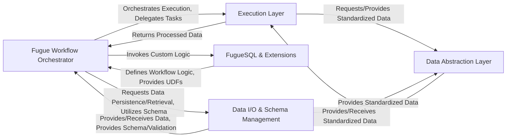

## Details

Fugue operates as a robust data processing framework, centralizing workflow orchestration within its Fugue Workflow Orchestrator. This orchestrator serves as the core, translating high-level data transformation logic, often expressed via FugueSQL & Extensions, into an executable DAG. It then delegates the actual data operations to the Execution Layer, which provides a unified interface to various underlying engines (e.g., Pandas, Spark, Dask). All data interactions within Fugue are standardized through the Data Abstraction Layer, ensuring seamless compatibility across different data structures and execution environments. External data ingress and egress, along with critical schema and partitioning management, are handled by the Data I/O & Schema Management component. This architecture promotes strong interoperability, extensibility, and a clear, modular data flow, making Fugue highly adaptable for diverse data science and engineering workflows.

### Fugue Workflow Orchestrator [[Expand]](./Fugue_Workflow_Orchestrator.md)
The central control plane, responsible for defining, building, and executing the Directed Acyclic Graph (DAG) of data processing tasks. It coordinates the overall workflow execution.

**Related Classes/Methods**:

- <a href="https://github.com/fugue-project/fugue/blob/master/fugue/workflow/workflow.py#L1-L1000" target="_blank" rel="noopener noreferrer">`fugue/workflow/workflow.py`:1-1000</a>
- <a href="https://github.com/fugue-project/fugue/blob/master/fugue/workflow/_tasks.py#L1-L1000" target="_blank" rel="noopener noreferrer">`fugue/workflow/_tasks.py`:1-1000</a>
- <a href="https://github.com/fugue-project/fugue/blob/master/fugue/workflow/api.py#L1-L1000" target="_blank" rel="noopener noreferrer">`fugue/workflow/api.py`:1-1000</a>

### Execution Layer [[Expand]](./Execution_Layer.md)
Provides a unified, engine-agnostic interface for executing data operations, abstracting complexities of different underlying engines (e.g., Pandas, Spark, Dask). It includes specific adapters for various backends.

**Related Classes/Methods**:

- <a href="https://github.com/fugue-project/fugue/blob/master/fugue/execution/execution_engine.py#L1-L1000" target="_blank" rel="noopener noreferrer">`fugue/execution/execution_engine.py`:1-1000</a>
- <a href="https://github.com/fugue-project/fugue/blob/master/fugue/execution/factory.py#L1-L1000" target="_blank" rel="noopener noreferrer">`fugue/execution/factory.py`:1-1000</a>
- <a href="https://github.com/fugue-project/fugue/blob/master/fugue/execution/api.py#L1-L1000" target="_blank" rel="noopener noreferrer">`fugue/execution/api.py`:1-1000</a>
- <a href="https://github.com/fugue-project/fugue/blob/master/fugue_dask/execution_engine.py#L1-L1000" target="_blank" rel="noopener noreferrer">`fugue_dask/execution_engine.py`:1-1000</a>
- <a href="https://github.com/fugue-project/fugue/blob/master/fugue_duckdb/execution_engine.py#L1-L1000" target="_blank" rel="noopener noreferrer">`fugue_duckdb/execution_engine.py`:1-1000</a>
- <a href="https://github.com/fugue-project/fugue/blob/master/fugue_ibis/execution_engine.py#L1-L1000" target="_blank" rel="noopener noreferrer">`fugue_ibis/execution_engine.py`:1-1000</a>
- <a href="https://github.com/fugue-project/fugue/blob/master/fugue_polars/polars_dataframe.py#L1-L1000" target="_blank" rel="noopener noreferrer">`fugue_polars/polars_dataframe.py`:1-1000</a>
- <a href="https://github.com/fugue-project/fugue/blob/master/fugue_ray/execution_engine.py#L1-L1000" target="_blank" rel="noopener noreferrer">`fugue_ray/execution_engine.py`:1-1000</a>
- <a href="https://github.com/fugue-project/fugue/blob/master/fugue_spark/execution_engine.py#L1-L1000" target="_blank" rel="noopener noreferrer">`fugue_spark/execution_engine.py`:1-1000</a>

### Data Abstraction Layer [[Expand]](./Data_Abstraction_Layer.md)
Offers a standardized DataFrame API that enables Fugue to work consistently with diverse in-memory and distributed data structures, providing a common interface for data manipulation.

**Related Classes/Methods**:

- <a href="https://github.com/fugue-project/fugue/blob/master/fugue/dataframe/dataframe.py#L1-L1000" target="_blank" rel="noopener noreferrer">`fugue/dataframe/dataframe.py`:1-1000</a>
- <a href="https://github.com/fugue-project/fugue/blob/master/fugue/dataframe/api.py#L1-L1000" target="_blank" rel="noopener noreferrer">`fugue/dataframe/api.py`:1-1000</a>
- <a href="https://github.com/fugue-project/fugue/blob/master/fugue/dataframe/pandas_dataframe.py#L1-L1000" target="_blank" rel="noopener noreferrer">`fugue/dataframe/pandas_dataframe.py`:1-1000</a>
- <a href="https://github.com/fugue-project/fugue/blob/master/fugue/dataframe/array_dataframe.py#L1-L1000" target="_blank" rel="noopener noreferrer">`fugue/dataframe/array_dataframe.py`:1-1000</a>

### FugueSQL & Extensions [[Expand]](./FugueSQL_Extensions.md)
Interprets declarative FugueSQL statements and integrates custom user-defined functions (UDFs) and other extensions, providing high-level interfaces for defining data transformations and extending Fugue's capabilities.

**Related Classes/Methods**:

- <a href="https://github.com/fugue-project/fugue/blob/master/fugue/sql/api.py#L1-L1000" target="_blank" rel="noopener noreferrer">`fugue/sql/api.py`:1-1000</a>
- <a href="https://github.com/fugue-project/fugue/blob/master/fugue/sql/workflow.py#L1-L1000" target="_blank" rel="noopener noreferrer">`fugue/sql/workflow.py`:1-1000</a>
- <a href="https://github.com/fugue-project/fugue/blob/master/fugue/sql/_visitors.py#L1-L1000" target="_blank" rel="noopener noreferrer">`fugue/sql/_visitors.py`:1-1000</a>
- <a href="https://github.com/fugue-project/fugue/blob/master/fugue/extensions/__init__.py#L1-L1000" target="_blank" rel="noopener noreferrer">`fugue/extensions/__init__.py`:1-1000</a>
- <a href="https://github.com/fugue-project/fugue/blob/master/fugue/extensions/creator/convert.py#L1-L1000" target="_blank" rel="noopener noreferrer">`fugue/extensions/creator/convert.py`:1-1000</a>
- <a href="https://github.com/fugue-project/fugue/blob/master/fugue/extensions/outputter/convert.py#L1-L1000" target="_blank" rel="noopener noreferrer">`fugue/extensions/outputter/convert.py`:1-1000</a>
- <a href="https://github.com/fugue-project/fugue/blob/master/fugue/extensions/processor/convert.py#L1-L1000" target="_blank" rel="noopener noreferrer">`fugue/extensions/processor/convert.py`:1-1000</a>
- <a href="https://github.com/fugue-project/fugue/blob/master/fugue/extensions/transformer/convert.py#L1-L1000" target="_blank" rel="noopener noreferrer">`fugue/extensions/transformer/convert.py`:1-1000</a>

### Data I/O & Schema Management [[Expand]](./Data_I_O_Schema_Management.md)
Manages the reading and writing of data from/to external sources and file formats, and defines/manages data schemas and partitioning specifications to ensure data consistency and optimize processing.

**Related Classes/Methods**:

- <a href="https://github.com/fugue-project/fugue/blob/master/fugue/_utils/io.py#L1-L1000" target="_blank" rel="noopener noreferrer">`fugue/_utils/io.py`:1-1000</a>
- <a href="https://github.com/fugue-project/fugue/blob/master/fugue/collections/partition.py#L1-L1000" target="_blank" rel="noopener noreferrer">`fugue/collections/partition.py`:1-1000</a>
- <a href="https://github.com/fugue-project/fugue/blob/master/fugue/column/expressions.py#L1-L1000" target="_blank" rel="noopener noreferrer">`fugue/column/expressions.py`:1-1000</a>
- <a href="https://github.com/fugue-project/fugue/blob/master/fugue/column/sql.py#L1-L1000" target="_blank" rel="noopener noreferrer">`fugue/column/sql.py`:1-1000</a>

### [FAQ](https://github.com/CodeBoarding/GeneratedOnBoardings/tree/main?tab=readme-ov-file#faq)