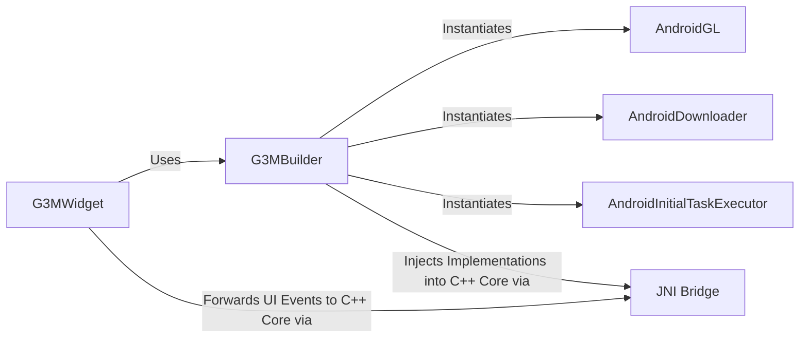

## Details

One paragraph explaining the functionality which is represented by this graph. What the main flow is and what is its purpose.

### G3MWidget
The G3MWidget is the primary entry point for an Android developer. It is a custom View that hosts the OpenGL rendering surface (GLSurfaceView) for the globe and forwards user input, like touch events, to the C++ core.

**Related Classes/Methods**:

- `org.glob3.mobile.specific.G3MWidget_Android`

### G3MBuilder
This component follows the Builder pattern to configure and initialize the G3M engine. It creates instances of all the necessary platform-specific components and injects them into the C++ core during the initialization phase.

**Related Classes/Methods**:

- `org.glob3.mobile.specific.G3MBuilder_Android`

### JNI Bridge
A passive communication and data-type translation layer. It consists of Java classes with native methods that allow the C++ core to invoke methods on Java objects and vice-versa. It does not initiate actions but serves as a conduit.

**Related Classes/Methods**:

- `org.glob3.mobile.specific.Native`

### AndroidGL
A concrete implementation of the abstract `GL` interface required by the C++ core. This class adapts Android's GLES20 API calls into an object-oriented interface for the core engine's rendering pipeline.

**Related Classes/Methods**:

- `org.glob3.mobile.specific.GL_Android`

### AndroidDownloader
A concrete implementation of the `IDownloader` interface required by the C++ core. It is responsible for asynchronously fetching remote data, such as map tiles or 3D models, using Android's native networking libraries.

**Related Classes/Methods**:

- `org.glob3.mobile.specific.Downloader_Android`

### AndroidInitialTaskExecutor
A concrete implementation of a task execution interface from the C++ core. It uses Android's threading model to run initialization and other background tasks off the main UI thread.

**Related Classes/Methods**:

- `org.glob3.mobile.specific.InitialTaskExecutor_Android`

### [FAQ](https://github.com/CodeBoarding/GeneratedOnBoardings/tree/main?tab=readme-ov-file#faq)