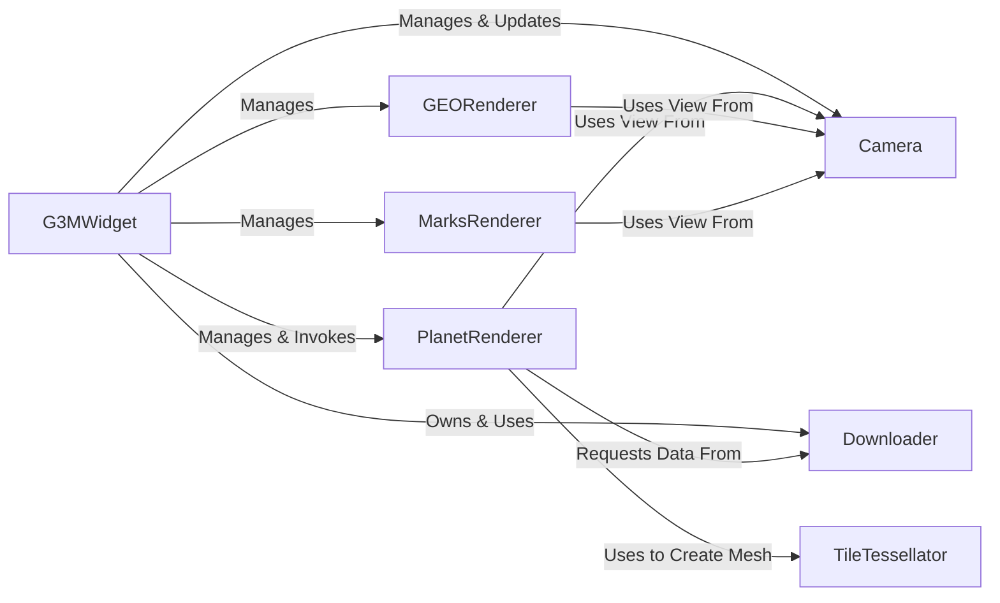

## Details

Synthesized overview of the G3M Core Engine's architecture.

### G3MWidget
The primary entry point and orchestrator. It initializes the rendering context, manages the main render loop, and dispatches user interaction events to the appropriate components like the Camera. It holds references to the main renderers.

**Related Classes/Methods**:

- `G3MWidget.hpp`
- `G3MWidget.cpp`

### PlanetRenderer
The core renderer for the 3D globe. It manages the tile pyramid, determines the appropriate Level of Detail (LOD), and orchestrates the rendering of terrain meshes. It requests tile data from the Downloader and uses the TileTessellator to generate geometry.

**Related Classes/Methods**:

- `PlanetRenderer.hpp`
- `PlanetRenderer.cpp`

### Camera
Manages the virtual camera's state (position, orientation, field of view) and projection matrix. It contains all logic for user navigation, such as pan, zoom, and orbit, and provides its view information to all renderers.

**Related Classes/Methods**:

- `Camera.hpp`
- `Camera.cpp`

### Downloader
Manages a queue of asynchronous requests for remote resources. It is primarily used by PlanetRenderer to fetch map tiles and elevation data from servers without blocking the rendering thread.

**Related Classes/Methods**:

- `Downloader.hpp`
- `Downloader.cpp`

### TileTessellator
A specialized utility responsible for creating the 3D mesh for a map tile. It takes raw tile data (imagery, elevation) and generates the vertices, indices, and texture coordinates needed for rendering by the PlanetRenderer.

**Related Classes/Methods**:

- `TileTessellator.hpp`
- `TileTessellator.cpp`

### GEORenderer
A dedicated renderer for vector data. It processes collections of geographic shapes (points, lines, polygons) and transforms them into renderable geometry. It operates within the context provided by the G3MWidget and uses the Camera for perspective.

**Related Classes/Methods**:

- `GEORenderer.hpp`
- `GEORenderer.cpp`

### MarksRenderer
A specialized renderer for displaying placemarks, icons, or labels on the globe's surface. It handles tasks like billboarding (ensuring marks always face the camera) and clustering to manage visual density.

**Related Classes/Methods**:

- `MarksRenderer.hpp`
- `MarksRenderer.cpp`

### [FAQ](https://github.com/CodeBoarding/GeneratedOnBoardings/tree/main?tab=readme-ov-file#faq)