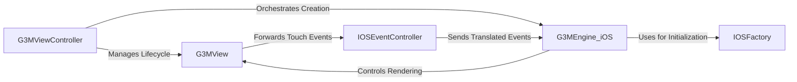

## Details

One paragraph explaining the functionality which is represented by this graph. What the main flow is and what is its purpose.

### G3MViewController
The primary `UIViewController` subclass that hosts the G3M rendering environment. It orchestrates the creation and lifecycle of the G3M engine and view, binding them to the standard iOS view controller lifecycle events (`viewDidLoad`, `viewWillDisappear`).

**Related Classes/Methods**:

- `G3MViewController.h`
- `G3MViewController.mm`

### G3MView
An Objective-C `UIView` subclass that serves as the rendering surface for the G3M engine. It is responsible for setting up the `CAEAGLLayer` required for OpenGL rendering and is the initial point for capturing raw user touch events.

**Related Classes/Methods**:

- `G3MView.h`
- `G3MView.mm`

### G3MEngine_iOS
The main Objective-C++ wrapper class that encapsulates the C++ core engine. It exposes a simplified, high-level API to the iOS application for managing the globe, adding data layers, and controlling the camera, while hiding the underlying C++ complexity.

**Related Classes/Methods**:

- `G3MEngine_iOS.h`
- `G3MEngine_iOS.mm`

### IOSEventController
An Objective-C++ class that acts as the input translator. It receives native iOS touch events from `G3MView` and converts them into platform-agnostic `TouchEvent` objects that the C++ core engine can understand and process.

**Related Classes/Methods**:

- `IOSEventController.h`
- `IOSEventController.mm`

### IOSFactory
An Objective-C++ implementation of the C++ `IFactory` interface. It follows the Dependency Inversion Principle by creating instances of platform-specific services (e.g., HTTP clients, timers, loggers) that the C++ core requires to function, thus keeping the core completely decoupled from iOS.

**Related Classes/Methods**:

- `IOSFactory.h`
- `IOSFactory.mm`

### [FAQ](https://github.com/CodeBoarding/GeneratedOnBoardings/tree/main?tab=readme-ov-file#faq)