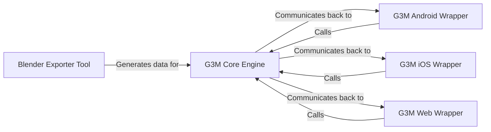

## Details

One paragraph explaining the functionality which is represented by this graph. What the main flow is and what is its purpose.

### G3M Core Engine [[Expand]](./G3M_Core_Engine.md)
The heart of the framework, this high-performance, cross-platform C++ library is responsible for all core geospatial visualization logic. It manages the 3D scene, rendering pipeline (via OpenGL/WebGL), camera, data fetching, and geometric computations, remaining independent of any specific UI or OS.

**Related Classes/Methods**:

- `G3M Core Engine`

### G3M Android Wrapper [[Expand]](./G3M_Android_Wrapper.md)
A Java-based wrapper that acts as a bridge between the C++ core and the Android SDK. It exposes the G3M Core Engine to Android applications, handling touch events, UI integration, and lifecycle management, allowing the globe to be embedded as a standard Android View.

**Related Classes/Methods**:

- `G3M Android Wrapper`

### G3M iOS Wrapper [[Expand]](./G3M_iOS_Wrapper.md)
An Objective-C/C++ wrapper that integrates the G3M Core Engine into native iOS applications. It connects the C++ core with the Cocoa Touch framework, managing the view controller lifecycle and translating user interactions from the iOS UI into the G3M engine.

**Related Classes/Methods**:

- `G3M iOS Wrapper`

### G3M Web Wrapper
A JavaScript wrapper, generated from the C++ core using Emscripten, that compiles the core logic into WebAssembly/asm.js. It exposes a JavaScript API to control the 3D globe in a web browser, using WebGL for rendering.

**Related Classes/Methods**:

- `G3M Web Wrapper`

### Blender Exporter Tool
A Python script that functions as a plugin for the Blender 3D modeling software. It exports 3D models and scenes into a specific JSON-based format (.scenejs) that the G3M Core Engine can load and render.

**Related Classes/Methods**:

- `Blender Exporter Tool`

### [FAQ](https://github.com/CodeBoarding/GeneratedOnBoardings/tree/main?tab=readme-ov-file#faq)