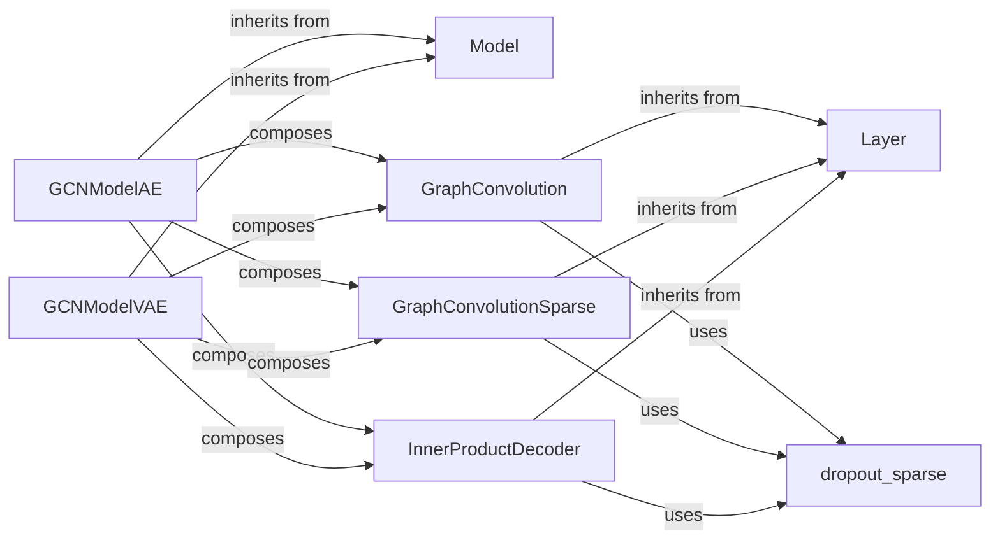

## Details

The `gae` project implements Graph Autoencoders (GAE) and Graph Variational Autoencoders (GVAE) for graph-structured data. The core architecture revolves around a `Model` abstraction, which is concretely implemented by `GCNModelAE` and `GCNModelVAE`. These models compose various `Layer` implementations, specifically `GraphConvolution`, `GraphConvolutionSparse`, and `InnerProductDecoder`, to perform encoding and decoding operations. A key utility, `dropout_sparse`, is employed by these layers to handle dropout for sparse tensors, ensuring robust model training. This modular design allows for flexible construction and extension of graph neural network models.

### Model
Establishes a common interface and abstract base for all models within the `gae` framework, ensuring a consistent structure for model definition and execution. It provides foundational properties and methods for model initialization and management.

**Related Classes/Methods**:

- <a href="https://github.com/tkipf/gae/blob/master/gae/optimizer.py" target="_blank" rel="noopener noreferrer">`gae.optimizer.Model`</a>

### GCNModelAE
The concrete implementation of the Graph Autoencoder (GAE). It orchestrates the GAE architecture by composing specific graph neural network layers to define the encoder-decoder flow for graph reconstruction.

**Related Classes/Methods**:

- <a href="https://github.com/tkipf/gae/blob/master/gae/model.py#L43-L74" target="_blank" rel="noopener noreferrer">`gae.model.GCNModelAE`:43-74</a>

### GCNModelVAE
The concrete implementation of the Graph Variational Autoencoder (GVAE). Similar to `GCNModelAE`, it orchestrates the GVAE architecture, but includes additional components for variational inference, defining the encoder-decoder flow with a probabilistic latent space.

**Related Classes/Methods**:

- <a href="https://github.com/tkipf/gae/blob/master/gae/model.py#L77-L116" target="_blank" rel="noopener noreferrer">`gae.model.GCNModelVAE`:77-116</a>

### Layer
Provides a foundational abstract base for all neural network layers used in the models. It handles common layer properties, weight initialization, and defines the basic `_call` (forward pass) mechanism that concrete layers must implement.

**Related Classes/Methods**:

- <a href="https://github.com/tkipf/gae/blob/master/gae/layers.py" target="_blank" rel="noopener noreferrer">`gae.layers.Layer`</a>

### GraphConvolution
Implements the core graph convolutional operations for dense input features. This layer forms a crucial part of the encoder in both GAE and GVAE models, transforming node features based on graph connectivity. It utilizes `dropout_sparse` for regularization.

**Related Classes/Methods**:

- <a href="https://github.com/tkipf/gae/blob/master/gae/layers.py#L67-L83" target="_blank" rel="noopener noreferrer">`gae.layers.GraphConvolution`:67-83</a>

### GraphConvolutionSparse
Implements an optimized graph convolutional layer specifically designed for sparse input features. It serves the same purpose as `GraphConvolution` but is tailored for efficiency with sparse graph data in the encoder. It also relies on `dropout_sparse` for regularization.

**Related Classes/Methods**:

- <a href="https://github.com/tkipf/gae/blob/master/gae/layers.py#L86-L104" target="_blank" rel="noopener noreferrer">`gae.layers.GraphConvolutionSparse`:86-104</a>

### InnerProductDecoder
Reconstructs the graph's adjacency matrix from the latent space embeddings generated by the encoder. This component forms the decoder part of both GAE and GVAE models, predicting graph links. It applies `dropout_sparse` to its inputs.

**Related Classes/Methods**:

- <a href="https://github.com/tkipf/gae/blob/master/gae/layers.py#L107-L120" target="_blank" rel="noopener noreferrer">`gae.layers.InnerProductDecoder`:107-120</a>

### dropout_sparse
A critical utility function for applying dropout specifically to sparse tensors, ensuring efficient regularization within graph neural network layers.

**Related Classes/Methods**:

- <a href="https://github.com/tkipf/gae/blob/master/gae/layers.py#L22-L30" target="_blank" rel="noopener noreferrer">`gae.layers.dropout_sparse`:22-30</a>

### [FAQ](https://github.com/CodeBoarding/GeneratedOnBoardings/tree/main?tab=readme-ov-file#faq)