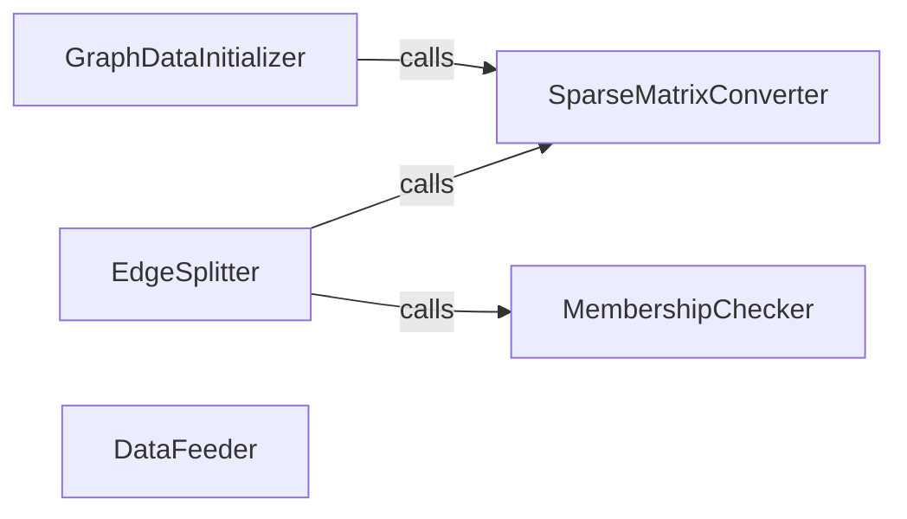

## Details

The `gae.preprocessing` subsystem is central to preparing graph data for the Graph Autoencoder (GAE) model. It orchestrates the transformation of raw graph structures into a format suitable for TensorFlow, handles the crucial task of splitting graph edges for training and evaluation, and ensures data integrity through membership checks. This subsystem acts as the data pipeline's initial stage, feeding processed and validated data to the subsequent model training phases.

### GraphDataInitializer
Responsible for the initial ingestion and normalization of raw graph data. It converts raw graph structures (e.g., adjacency matrices, feature matrices) into a standardized format, aligning with the "Data Ingestion and Preprocessing" stage of an ML pipeline.

**Related Classes/Methods**:

- <a href="https://github.com/tkipf/gae/blob/master/gae/preprocessing.py#L14-L20" target="_blank" rel="noopener noreferrer">`gae.preprocessing.preprocess_graph`:14-20</a>

### SparseMatrixConverter
A utility component that provides a standardized and efficient method for converting sparse matrix data into a tuple format (coordinates, values, shape). This format is crucial for optimizing memory usage and computation in deep learning frameworks like TensorFlow when dealing with large, sparse graph structures.

**Related Classes/Methods**:

- <a href="https://github.com/tkipf/gae/blob/master/gae/preprocessing.py#L5-L11" target="_blank" rel="noopener noreferrer">`gae.preprocessing.sparse_to_tuple`:5-11</a>

### EdgeSplitter
A critical component for preparing graph data for supervised learning tasks, particularly link prediction. It meticulously splits the graph's edges into distinct training, validation, and test sets, ensuring no data leakage and enabling robust model evaluation. It also handles the generation of negative samples, which is essential for link prediction.

**Related Classes/Methods**:

- <a href="https://github.com/tkipf/gae/blob/master/gae/preprocessing.py#L32-L111" target="_blank" rel="noopener noreferrer">`gae.preprocessing.mask_test_edges`:32-111</a>

### DataFeeder
This component acts as the interface between the preprocessed data and the TensorFlow model. Its responsibility is to construct the `feed_dict` required by TensorFlow sessions, mapping the prepared input data (e.g., adjacency matrices, feature matrices, labels) to their corresponding placeholder tensors in the computational graph.

**Related Classes/Methods**:

- <a href="https://github.com/tkipf/gae/blob/master/gae/preprocessing.py#L23-L29" target="_blank" rel="noopener noreferrer">`gae.preprocessing.construct_feed_dict`:23-29</a>

### MembershipChecker
A foundational utility component that efficiently determines if elements are present within a collection. Its role is vital for the `EdgeSplitter` to accurately manage and partition edges, preventing duplicates and ensuring the integrity of the training, validation, and test sets.

**Related Classes/Methods**:

- <a href="https://github.com/tkipf/gae/blob/master/gae/preprocessing.py" target="_blank" rel="noopener noreferrer">`gae.preprocessing.mask_test_edges.ismember`</a>

### [FAQ](https://github.com/CodeBoarding/GeneratedOnBoardings/tree/main?tab=readme-ov-file#faq)