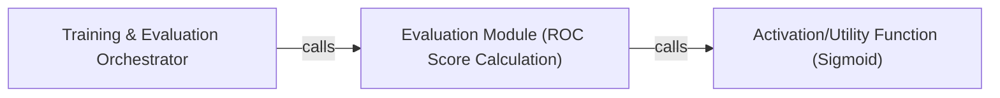

## Details

This section details the core components of the `gae` project's `Training & Evaluation Orchestrator` subsystem, focusing on their responsibilities, interactions, and architectural significance within a Machine Learning Library/Model Implementation context. The `Training & Evaluation Orchestrator` subsystem is primarily encapsulated within the `gae/train.py` file, serving as the central hub for managing the machine learning pipeline's execution, from iterative training to performance evaluation.

### Training & Evaluation Orchestrator [[Expand]](./Training_Evaluation_Orchestrator.md)
This component, embodied by the `main_training_loop` function, acts as the central control unit for the entire machine learning pipeline. It manages the TensorFlow session, coordinates data flow, executes the iterative training loop across epochs, computes the loss, and orchestrates model parameter updates. It also triggers the evaluation process.

**Related Classes/Methods**:

- <a href="https://github.com/tkipf/gae/blob/master/gae/train.py" target="_blank" rel="noopener noreferrer">`main_training_loop`</a>

### Evaluation Module (ROC Score Calculation)
Represented by the `get_roc_score` function, this component is dedicated to assessing the model's performance. It specifically calculates the Receiver Operating Characteristic (ROC) score, a crucial metric for evaluating the link prediction capabilities of the Graph Autoencoder (GAE) model.

**Related Classes/Methods**:

- <a href="https://github.com/tkipf/gae/blob/master/gae/train.py#L104-L131" target="_blank" rel="noopener noreferrer">`get_roc_score`:104-131</a>

### Activation/Utility Function (Sigmoid)
This component, the `sigmoid` function, provides a fundamental mathematical operation, likely used for activation within the model's output layer or during the calculation of probabilities in the evaluation phase.

**Related Classes/Methods**:

- <a href="https://github.com/tkipf/gae/blob/master/gae/train.py#L109-L110" target="_blank" rel="noopener noreferrer">`sigmoid`:109-110</a>

### [FAQ](https://github.com/CodeBoarding/GeneratedOnBoardings/tree/main?tab=readme-ov-file#faq)