```mermaid
graph LR
    Data_Loader["Data Loader"]
    Graph_Preprocessor["Graph Preprocessor"]
    GAE_GVAE_Model_Core["GAE/GVAE Model Core"]
    Optimizer_Loss_Functions["Optimizer & Loss Functions"]
    Training_Evaluation_Orchestrator["Training & Evaluation Orchestrator"]
    Data_Loader -- "Provides raw graph data and features" --> Graph_Preprocessor
    Graph_Preprocessor -- "Feeds preprocessed data and TensorFlow placeholders" --> Training_Evaluation_Orchestrator
    Training_Evaluation_Orchestrator -- "Instantiates the model with placeholders and feeds data for training/inference" --> GAE_GVAE_Model_Core
    GAE_GVAE_Model_Core -- "Provides model outputs (predictions, embeddings) for loss calculation" --> Optimizer_Loss_Functions
    Optimizer_Loss_Functions -- "Returns loss values and optimization operations" --> Training_Evaluation_Orchestrator
    Training_Evaluation_Orchestrator -- "Fetches model embeddings for evaluation" --> GAE_GVAE_Model_Core
    click Graph_Preprocessor href "https://github.com/CodeBoarding/GeneratedOnBoardings/blob/main/gae/Graph_Preprocessor.md" "Details"
    click GAE_GVAE_Model_Core href "https://github.com/CodeBoarding/GeneratedOnBoardings/blob/main/gae/GAE_GVAE_Model_Core.md" "Details"
    click Training_Evaluation_Orchestrator href "https://github.com/CodeBoarding/GeneratedOnBoardings/blob/main/gae/Training_Evaluation_Orchestrator.md" "Details"
```

## Details

The `gae` project is structured as a robust machine learning pipeline for Graph Autoencoders, emphasizing a clear flow from data ingestion to model training and evaluation. At its core, the architecture separates concerns into distinct components: the **Data Loader** for initial data handling, the **Graph Preprocessor** for data transformation and splitting, the **GAE/GVAE Model Core** defining the neural network architecture, the **Optimizer & Loss Functions** for model training, and the **Training & Evaluation Orchestrator** managing the entire lifecycle. This modular design facilitates understanding the data's journey through the system, from raw graph input to processed embeddings and performance assessment, making it ideal for visual representation as a data flow diagram.

### Data Loader
Responsible for ingesting raw graph data and associated node features from various data sources, handling file parsing and initial data structuring.

**Related Classes/Methods**:

- <a href="https://github.com/tkipf/gae/blob/master/gae/input_data.py#L15-L41" target="_blank" rel="noopener noreferrer">`load_data`:15-41</a>
- <a href="https://github.com/tkipf/gae/blob/master/gae/input_data.py#L8-L12" target="_blank" rel="noopener noreferrer">`parse_index_file`:8-12</a>

### Graph Preprocessor [[Expand]](./Graph_Preprocessor.md)
Transforms raw graph data into a normalized and structured format suitable for Graph Neural Network models, including splitting graph edges into training, validation, and test sets.

**Related Classes/Methods**:

- <a href="https://github.com/tkipf/gae/blob/master/gae/preprocessing.py#L14-L20" target="_blank" rel="noopener noreferrer">`preprocess_graph`:14-20</a>
- <a href="https://github.com/tkipf/gae/blob/master/gae/preprocessing.py#L5-L11" target="_blank" rel="noopener noreferrer">`sparse_to_tuple`:5-11</a>
- <a href="https://github.com/tkipf/gae/blob/master/gae/preprocessing.py#L32-L111" target="_blank" rel="noopener noreferrer">`mask_test_edges`:32-111</a>
- <a href="https://github.com/tkipf/gae/blob/master/gae/preprocessing.py#L23-L29" target="_blank" rel="noopener noreferrer">`construct_feed_dict`:23-29</a>

### GAE/GVAE Model Core [[Expand]](./GAE_GVAE_Model_Core.md)
Defines the high-level architecture of the Graph Autoencoder (GAE) and Graph Variational Autoencoder (GVAE) models, orchestrating the assembly of various graph neural network layers (e.g., GraphConvolution, InnerProductDecoder) to form the complete encoder-decoder structure.

**Related Classes/Methods**:

- <a href="https://github.com/tkipf/gae/blob/master/gae/optimizer.py" target="_blank" rel="noopener noreferrer">`Model`</a>
- <a href="https://github.com/tkipf/gae/blob/master/gae/model.py#L43-L74" target="_blank" rel="noopener noreferrer">`GCNModelAE`:43-74</a>
- <a href="https://github.com/tkipf/gae/blob/master/gae/model.py#L77-L116" target="_blank" rel="noopener noreferrer">`GCNModelVAE`:77-116</a>
- <a href="https://github.com/tkipf/gae/blob/master/gae/layers.py" target="_blank" rel="noopener noreferrer">`Layer`</a>
- <a href="https://github.com/tkipf/gae/blob/master/gae/layers.py#L67-L83" target="_blank" rel="noopener noreferrer">`GraphConvolution`:67-83</a>
- <a href="https://github.com/tkipf/gae/blob/master/gae/layers.py#L86-L104" target="_blank" rel="noopener noreferrer">`GraphConvolutionSparse`:86-104</a>
- <a href="https://github.com/tkipf/gae/blob/master/gae/layers.py#L107-L120" target="_blank" rel="noopener noreferrer">`InnerProductDecoder`:107-120</a>
- <a href="https://github.com/tkipf/gae/blob/master/gae/layers.py#L22-L30" target="_blank" rel="noopener noreferrer">`dropout_sparse`:22-30</a>

### Optimizer & Loss Functions
Defines the optimization strategy for the GNN models, including loss functions (e.g., reconstruction loss, KL divergence for VAEs) and mechanisms for applying gradients to update model parameters during training.

**Related Classes/Methods**:

- <a href="https://github.com/tkipf/gae/blob/master/gae/optimizer.py#L7-L20" target="_blank" rel="noopener noreferrer">`OptimizerAE`:7-20</a>
- <a href="https://github.com/tkipf/gae/blob/master/gae/optimizer.py#L23-L42" target="_blank" rel="noopener noreferrer">`OptimizerVAE`:23-42</a>

### Training & Evaluation Orchestrator [[Expand]](./Training_Evaluation_Orchestrator.md)
Acts as the central control unit for the entire machine learning pipeline, managing the TensorFlow session, coordinating data flow, executing the iterative training loop, and performing model evaluation using defined metrics.

**Related Classes/Methods**:

- <a href="https://github.com/tkipf/gae/blob/master/gae/train.py" target="_blank" rel="noopener noreferrer">`main_training_loop`</a>
- <a href="https://github.com/tkipf/gae/blob/master/gae/train.py#L104-L131" target="_blank" rel="noopener noreferrer">`get_roc_score`:104-131</a>

### [FAQ](https://github.com/CodeBoarding/GeneratedOnBoardings/tree/main?tab=readme-ov-file#faq)