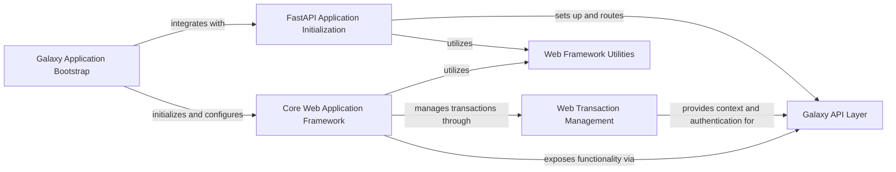

## Component Details

The API & Web Interface subsystem in Galaxy provides the external interaction points for users and programmatic access. It encompasses the initial application bootstrap, the core web application framework handling request routing and UI/API controller management, and dedicated components for FastAPI-based API initialization and robust web transaction management, including authentication, session handling, and CORS. This layered architecture ensures a flexible and secure interface for all user interactions.

### Galaxy Application Bootstrap
This component is responsible for the initial setup and configuration of the Galaxy web application. It loads application properties, initializes the core `UniverseApplication`, sets up the web application (both UI and API routes), and applies necessary middleware for the WSGI server.

**Related Classes/Methods**:

- <a href="https://github.com/galaxyproject/galaxy/blob/master/lib/galaxy/webapps/galaxy/buildapp.py#L46-L50" target="_blank" rel="noopener noreferrer">`galaxy.webapps.galaxy.buildapp.app_factory` (46:50)</a>
- `galaxy.util.properties.load_app_properties` (full file reference)
- <a href="https://github.com/galaxyproject/galaxy/blob/master/packages/app/galaxy/app.py#L713-L913" target="_blank" rel="noopener noreferrer">`galaxy.app.UniverseApplication` (713:913)</a>
- `galaxy.webapps.galaxy.buildapp.GalaxyWebApplication` (full file reference)
- <a href="https://github.com/galaxyproject/galaxy/blob/master/lib/galaxy/webapps/base/webapp.py#L229-L242" target="_blank" rel="noopener noreferrer">`galaxy.webapps.base.webapp.WebApplication.add_ui_controllers` (229:242)</a>
- `galaxy.web.framework.base.WebApplication.add_route` (full file reference)
- `galaxy.webapps.galaxy.buildapp.populate_api_routes` (full file reference)
- `galaxy.web.framework.base.WebApplication.add_client_route` (full file reference)
- <a href="https://github.com/galaxyproject/galaxy/blob/master/lib/galaxy/webapps/base/webapp.py#L128-L182" target="_blank" rel="noopener noreferrer">`galaxy.webapps.base.webapp.WebApplication.build_apispec` (128:182)</a>
- `galaxy.webapps.galaxy.buildapp.wrap_in_middleware` (full file reference)
- `galaxy.util.asbool` (full file reference)
- <a href="https://github.com/galaxyproject/galaxy/blob/master/lib/galaxy/webapps/util.py#L53-L76" target="_blank" rel="noopener noreferrer">`galaxy.webapps.util.wrap_if_allowed` (53:76)</a>

### FastAPI Application Initialization
This component handles the specific setup for the FastAPI-based API. It obtains the FastAPI instance, registers global exception handlers, adds Galaxy-specific middleware, and includes all package routers to expose the API endpoints. It also manages the inclusion of legacy OpenAPI specifications.

**Related Classes/Methods**:

- <a href="https://github.com/galaxyproject/galaxy/blob/master/lib/galaxy/webapps/galaxy/fast_app.py#L169-L187" target="_blank" rel="noopener noreferrer">`galaxy.webapps.galaxy.fast_app.initialize_fast_app` (169:187)</a>
- `galaxy.webapps.galaxy.fast_app.get_fastapi_instance` (full file reference)
- <a href="https://github.com/galaxyproject/galaxy/blob/master/lib/galaxy/webapps/base/api.py#L204-L217" target="_blank" rel="noopener noreferrer">`galaxy.webapps.base.api.add_exception_handler` (204:217)</a>
- `galaxy.webapps.galaxy.fast_app.add_galaxy_middleware` (full file reference)
- <a href="https://github.com/galaxyproject/galaxy/blob/master/lib/galaxy/webapps/base/api.py#L239-L242" target="_blank" rel="noopener noreferrer">`galaxy.webapps.base.api.add_raw_context_middlewares` (239:242)</a>
- <a href="https://github.com/galaxyproject/galaxy/blob/master/lib/galaxy/webapps/base/api.py#L245-L246" target="_blank" rel="noopener noreferrer">`galaxy.webapps.base.api.add_request_id_middleware` (245:246)</a>
- <a href="https://github.com/galaxyproject/galaxy/blob/master/lib/galaxy/webapps/base/api.py#L249-L273" target="_blank" rel="noopener noreferrer">`galaxy.webapps.base.api.include_all_package_routers` (249:273)</a>
- `galaxy.webapps.galaxy.fast_app.include_legacy_openapi` (full file reference)

### Core Web Application Framework
This component provides the fundamental building blocks for the web application. It defines the base `WebApplication` class, managing transaction factories, Mako template lookups, controller instantiation, and the addition of UI and API controllers. It also includes utilities for handling URL generation.

**Related Classes/Methods**:

- <a href="https://github.com/galaxyproject/galaxy/blob/master/lib/galaxy/webapps/base/webapp.py#L97-L275" target="_blank" rel="noopener noreferrer">`galaxy.webapps.base.webapp.WebApplication` (97:275)</a>
- `galaxy.web.framework.base.WebApplication.__init__` (full file reference)
- `galaxy.web.framework.base.WebApplication.set_transaction_factory` (full file reference)
- <a href="https://github.com/galaxyproject/galaxy/blob/master/lib/galaxy/webapps/base/webapp.py#L226-L227" target="_blank" rel="noopener noreferrer">`galaxy.webapps.base.webapp.WebApplication.transaction_chooser` (226:227)</a>
- <a href="https://github.com/galaxyproject/galaxy/blob/master/lib/galaxy/webapps/base/webapp.py#L184-L201" target="_blank" rel="noopener noreferrer">`galaxy.webapps.base.webapp.WebApplication.create_mako_template_lookup` (184:201)</a>
- `galaxy.exceptions.RequestParameterMissingException` (full file reference)
- `galaxy.util.sanitize_html.sanitize_html` (full file reference)
- `galaxy.web.framework.base.WebApplication.make_body_iterable` (full file reference)
- `galaxy.web.framework.base.walk_controller_modules` (full file reference)
- <a href="https://github.com/galaxyproject/galaxy/blob/master/lib/galaxy/webapps/base/webapp.py#L261-L275" target="_blank" rel="noopener noreferrer">`galaxy.webapps.base.webapp.WebApplication._instantiate_controller` (261:275)</a>
- `galaxy.web.framework.base.WebApplication.add_ui_controller` (full file reference)
- `galaxy.web.framework.base.WebApplication.add_api_controller` (full file reference)
- <a href="https://github.com/galaxyproject/galaxy/blob/master/lib/galaxy/webapps/base/webapp.py#L278-L298" target="_blank" rel="noopener noreferrer">`galaxy.webapps.base.webapp.config_allows_origin` (278:298)</a>
- `galaxy.web.framework.handle_url_for` (full file reference)
- `galaxy.web.framework` (full file reference)

### Web Transaction Management
This component is responsible for managing the lifecycle of individual web requests within the Galaxy application. It handles authentication, session management, CORS headers, user-related operations (login, logout, user history), and the rendering of templates.

**Related Classes/Methods**:

- <a href="https://github.com/galaxyproject/galaxy/blob/master/lib/galaxy/webapps/base/webapp.py#L307-L1104" target="_blank" rel="noopener noreferrer">`galaxy.webapps.base.webapp.GalaxyWebTransaction` (307:1104)</a>
- `galaxy.web.framework.base.DefaultWebTransaction.__init__` (full file reference)
- `galaxy.util.asbool` (full file reference)
- <a href="https://github.com/galaxyproject/galaxy/blob/master/lib/galaxy/webapps/base/webapp.py#L436-L461" target="_blank" rel="noopener noreferrer">`galaxy.webapps.base.webapp.GalaxyWebTransaction.set_cors_headers` (436:461)</a>
- <a href="https://github.com/galaxyproject/galaxy/blob/master/lib/galaxy/webapps/base/webapp.py#L539-L581" target="_blank" rel="noopener noreferrer">`galaxy.webapps.base.webapp.GalaxyWebTransaction._authenticate_api` (539:581)</a>
- <a href="https://github.com/galaxyproject/galaxy/blob/master/lib/galaxy/webapps/base/webapp.py#L583-L685" target="_blank" rel="noopener noreferrer">`galaxy.webapps.base.webapp.GalaxyWebTransaction._ensure_valid_session` (583:685)</a>
- `galaxy.web.framework.base.Response.send_redirect` (full file reference)
- `galaxy.web.framework.handle_url_for` (full file reference)
- <a href="https://github.com/galaxyproject/galaxy/blob/master/lib/galaxy/webapps/base/webapp.py#L687-L746" target="_blank" rel="noopener noreferrer">`galaxy.webapps.base.webapp.GalaxyWebTransaction._ensure_logged_in_user` (687:746)</a>
- <a href="https://github.com/galaxyproject/galaxy/blob/master/lib/galaxy/webapps/base/webapp.py#L861-L888" target="_blank" rel="noopener noreferrer">`galaxy.webapps.base.webapp.GalaxyWebTransaction.handle_user_logout` (861:888)</a>
- <a href="https://github.com/galaxyproject/galaxy/blob/master/lib/galaxy/webapps/base/webapp.py#L413-L426" target="_blank" rel="noopener noreferrer">`galaxy.webapps.base.webapp.GalaxyWebTransaction.set_cors_allow` (413:426)</a>
- <a href="https://github.com/galaxyproject/galaxy/blob/master/lib/galaxy/webapps/base/webapp.py#L278-L298" target="_blank" rel="noopener noreferrer">`galaxy.webapps.base.webapp.config_allows_origin` (278:298)</a>
- <a href="https://github.com/galaxyproject/galaxy/blob/master/lib/galaxy/webapps/base/webapp.py#L428-L434" target="_blank" rel="noopener noreferrer">`galaxy.webapps.base.webapp.GalaxyWebTransaction.set_cors_origin` (428:434)</a>
- <a href="https://github.com/galaxyproject/galaxy/blob/master/lib/galaxy/webapps/base/webapp.py#L482-L497" target="_blank" rel="noopener noreferrer">`galaxy.webapps.base.webapp.GalaxyWebTransaction.get_cookie` (482:497)</a>
- <a href="https://github.com/galaxyproject/galaxy/blob/master/lib/galaxy/webapps/base/webapp.py#L471-L478" target="_blank" rel="noopener noreferrer">`galaxy.webapps.base.webapp.GalaxyWebTransaction.set_user` (471:478)</a>
- <a href="https://github.com/galaxyproject/galaxy/blob/master/lib/galaxy/webapps/base/webapp.py#L517-L537" target="_blank" rel="noopener noreferrer">`galaxy.webapps.base.webapp.GalaxyWebTransaction._set_cookie` (517:537)</a>
- `galaxy.util.unicodify` (full file reference)
- <a href="https://github.com/galaxyproject/galaxy/blob/master/lib/galaxy/webapps/base/webapp.py#L1107-L1130" target="_blank" rel="noopener noreferrer">`galaxy.webapps.base.webapp.create_new_session` (1107:1130)</a>
- <a href="https://github.com/galaxyproject/galaxy/blob/master/lib/galaxy/webapps/base/webapp.py#L926-L955" target="_blank" rel="noopener noreferrer">`galaxy.webapps.base.webapp.GalaxyWebTransaction.get_or_create_default_history` (926:955)</a>
- <a href="https://github.com/galaxyproject/galaxy/blob/master/lib/galaxy/webapps/base/webapp.py#L771-L777" target="_blank" rel="noopener noreferrer">`galaxy.webapps.base.webapp.GalaxyWebTransaction.check_user_library_import_dir` (771:777)</a>
- `galaxy.util.path.safe_makedirs` (full file reference)
- `galaxy.managers.context.ProvidesAppContext.log_event` (full file reference)
- <a href="https://github.com/galaxyproject/galaxy/blob/master/lib/galaxy/webapps/base/webapp.py#L974-L997" target="_blank" rel="noopener noreferrer">`galaxy.webapps.base.webapp.GalaxyWebTransaction.new_history` (974:997)</a>
- <a href="https://github.com/galaxyproject/galaxy/blob/master/lib/galaxy/webapps/base/webapp.py#L779-L783" target="_blank" rel="noopener noreferrer">`galaxy.webapps.base.webapp.GalaxyWebTransaction.user_checks` (779:783)</a>
- <a href="https://github.com/galaxyproject/galaxy/blob/master/lib/galaxy/webapps/base/webapp.py#L957-L972" target="_blank" rel="noopener noreferrer">`galaxy.webapps.base.webapp.GalaxyWebTransaction.get_most_recent_history` (957:972)</a>
- `galaxy.util.string_as_bool` (full file reference)
- <a href="https://github.com/galaxyproject/galaxy/blob/master/lib/galaxy/webapps/base/webapp.py#L916-L920" target="_blank" rel="noopener noreferrer">`galaxy.webapps.base.webapp.GalaxyWebTransaction.set_history` (916:920)</a>
- `galaxy.model.History` (full file reference)
- <a href="https://github.com/galaxyproject/galaxy/blob/master/lib/galaxy/webapps/base/webapp.py#L1075-L1083" target="_blank" rel="noopener noreferrer">`galaxy.webapps.base.webapp.GalaxyWebTransaction.fill_template` (1075:1083)</a>

### Galaxy API Layer
This comprehensive component defines and manages all API endpoints for the Galaxy application. It includes routing mechanisms (FrameworkRouter), handles various API operations related to jobs, libraries, histories, users, and tools, and integrates with data schemas for request and response validation. It also incorporates security and authentication logic for API access.

**Related Classes/Methods**:

- `galaxy.webapps.galaxy.api` (full file reference)
- `galaxy.webapps.base.controller.BaseController.decode_id` (full file reference)
- `galaxy.webapps.base.controller.UsesStoredWorkflowMixin.get_stored_workflow` (full file reference)
- `galaxy.webapps.galaxy.api.FrameworkRouter.post` (full file reference)
- `galaxy.webapps.galaxy.api.FrameworkRouter.get` (full file reference)
- <a href="https://github.com/galaxyproject/galaxy/blob/master/lib/galaxy/webapps/galaxy/api/job_tokens.py#L53-L68" target="_blank" rel="noopener noreferrer">`galaxy.webapps.galaxy.api.job_tokens.FastAPIJobTokens.__authorize_job_access` (53:68)</a>
- <a href="https://github.com/galaxyproject/galaxy/blob/master/lib/galaxy/authnz/util.py#L4-L10" target="_blank" rel="noopener noreferrer">`galaxy.authnz.util.provider_name_to_backend` (4:10)</a>
- `galaxy.util.safe_str_cmp` (full file reference)
- `galaxy.exceptions.AuthenticationFailed` (full file reference)
- `galaxy.exceptions.ItemAccessibilityException` (full file reference)
- `galaxy.webapps.galaxy.api.FrameworkRouter.put` (full file reference)
- <a href="https://github.com/galaxyproject/galaxy/blob/master/lib/galaxy/schema/schema.py#L3228-L3234" target="_blank" rel="noopener noreferrer">`galaxy.schema.schema.LibraryFolderContentsIndexQueryPayload` (3228:3234)</a>
- <a href="https://github.com/galaxyproject/galaxy/blob/master/lib/galaxy/schema/jobs.py#L31-L41" target="_blank" rel="noopener noreferrer">`galaxy.schema.jobs.JobInputSummary` (31:41)</a>
- `galaxy.exceptions.ObjectNotFound` (full file reference)
- `galaxy.exceptions.RequestParameterInvalidException` (full file reference)
- <a href="https://github.com/galaxyproject/galaxy/blob/master/lib/galaxy/schema/jobs.py#L75-L80" target="_blank" rel="noopener noreferrer">`galaxy.schema.jobs.JobOutputAssociation` (75:80)</a>
- <a href="https://github.com/galaxyproject/galaxy/blob/master/lib/galaxy/schema/jobs.py#L45-L51" target="_blank" rel="noopener noreferrer">`galaxy.schema.jobs.JobErrorSummary` (45:51)</a>
- <a href="https://github.com/galaxyproject/galaxy/blob/master/lib/galaxy/schema/jobs.py#L67-L72" target="_blank" rel="noopener noreferrer">`galaxy.schema.jobs.JobInputAssociation` (67:72)</a>
- <a href="https://github.com/galaxyproject/galaxy/blob/master/lib/galaxy/schema/jobs.py#L214-L217" target="_blank" rel="noopener noreferrer">`galaxy.schema.jobs.JobConsoleOutput` (214:217)</a>
- <a href="https://github.com/galaxyproject/galaxy/blob/master/lib/galaxy/managers/jobs.py#L1671-L1823" target="_blank" rel="noopener noreferrer">`galaxy.managers.jobs.summarize_job_parameters` (1671:1823)</a>
- <a href="https://github.com/galaxyproject/galaxy/blob/master/lib/galaxy/schema/schema.py#L2194-L2230" target="_blank" rel="noopener noreferrer">`galaxy.schema.schema.JobMetric` (2194:2230)</a>
- <a href="https://github.com/galaxyproject/galaxy/blob/master/lib/galaxy/managers/jobs.py#L1627-L1633" target="_blank" rel="noopener noreferrer">`galaxy.managers.jobs.summarize_job_metrics` (1627:1633)</a>
- <a href="https://github.com/galaxyproject/galaxy/blob/master/lib/galaxy/schema/jobs.py#L195-L206" target="_blank" rel="noopener noreferrer">`galaxy.schema.jobs.JobDestinationParams` (195:206)</a>
- <a href="https://github.com/galaxyproject/galaxy/blob/master/lib/galaxy/managers/jobs.py#L1654-L1668" target="_blank" rel="noopener noreferrer">`galaxy.managers.jobs.summarize_destination_params` (1654:1668)</a>
- <a href="https://github.com/galaxyproject/galaxy/blob/master/lib/galaxy/work/context.py#L175-L191" target="_blank" rel="noopener noreferrer">`galaxy.work.context.proxy_work_context_for_history` (175:191)</a>
- <a href="https://github.com/galaxyproject/galaxy/blob/master/lib/galaxy/schema/jobs.py#L158-L192" target="_blank" rel="noopener noreferrer">`galaxy.schema.jobs.EncodedJobDetails` (158:192)</a>
- `galaxy.webapps.galaxy.api.jobs.ShowFullJobResponse` (full file reference)
- `galaxy.webapps.galaxy.api.FrameworkRouter.delete` (full file reference)
- `galaxy.webapps.base.controller.UsesVisualizationMixin.get_hda_or_ldda` (full file reference)
- `galaxy.webapps.galaxy.api.BaseGalaxyAPIController.__init__` (full file reference)
- `galaxy.tool_util.deps.views.DependencyResolversView` (full file reference)
- `galaxy.tool_util.deps.views.DependencyResolversView.index` (full file reference)
- `galaxy.tool_util.deps.views.DependencyResolversView.show` (full file reference)
- `galaxy.tool_util.deps.views.DependencyResolversView.reload` (full file reference)
- `galaxy.tool_util.deps.views.DependencyResolversView.resolver_dependency` (full file reference)
- `galaxy.tool_util.deps.views.DependencyResolversView.install_dependency` (full file reference)
- `galaxy.tool_util.deps.views.DependencyResolversView.manager_dependency` (full file reference)
- `galaxy.tool_util.deps.views.DependencyResolversView.resolver_requirements` (full file reference)
- `galaxy.tool_util.deps.views.DependencyResolversView.manager_requirements` (full file reference)
- `galaxy.tool_util.deps.views.DependencyResolversView.clean` (full file reference)
- `galaxy.tool_util.deps.views.DependencyResolversView.summarize_requirements` (full file reference)
- `galaxy.tool_util.deps.views.DependencyResolversView.summarize_tools` (full file reference)
- `galaxy.tool_util.deps.views.DependencyResolversView.uninstall_dependencies` (full file reference)
- `galaxy.tool_util.deps.views.DependencyResolversView.remove_unused_dependency_paths` (full file reference)
- `galaxy.webapps.galaxy.api.cbv._cbv` (full file reference)
- `galaxy.webapps.galaxy.api.cbv._init_cbv` (full file reference)
- `galaxy.webapps.galaxy.api.cbv._update_cbv_route_endpoint_signature` (full file reference)
- `galaxy.exceptions.AuthenticationRequired` (full file reference)
- <a href="https://github.com/galaxyproject/galaxy/blob/master/lib/galaxy/schema/schema.py#L3610-L3615" target="_blank" rel="noopener noreferrer">`galaxy.schema.schema.UserBeaconSetting` (3610:3615)</a>
- <a href="https://github.com/galaxyproject/galaxy/blob/master/lib/galaxy/schema/schema.py#L424-L427" target="_blank" rel="noopener noreferrer">`galaxy.schema.schema.DeletedCustomBuild` (424:427)</a>
- `galaxy.model.HistoryDatasetAssociation` (full file reference)
- `galaxy.exceptions.InternalServerError` (full file reference)
- `galaxy.model.DatasetInstance.get_file_name` (full file reference)
- `galaxy.exceptions.ToolExecutionError` (full file reference)
- `galaxy.exceptions.ConfigDoesNotAllowException` (full file reference)
- `galaxy.security.validate_user_input.validate_email` (full file reference)
- `galaxy.security.validate_user_input.validate_password` (full file reference)
- `galaxy.security.validate_user_input.validate_publicname` (full file reference)
- `galaxy.exceptions.NotImplemented` (full file reference)
- `galaxy.exceptions.InsufficientPermissionsException` (full file reference)
- `galaxy.exceptions.MessageException` (full file reference)
- `galaxy.exceptions.ConfigurationError` (full file reference)
- `galaxy.webapps.galaxy.api.chat.ChatAPI._get_system_prompt` (full file reference)
- `galaxy.util.path.safe_makedirs` (full file reference)
- <a href="https://github.com/galaxyproject/galaxy/blob/master/lib/galaxy/workflow/trs_proxy.py#L40-L58" target="_blank" rel="noopener noreferrer">`galaxy.workflow.trs_proxy.parse_search_kwds` (40:58)</a>
- `galaxy.schema.drs.Organization` (full file reference)
- `galaxy.schema.drs.ServiceType` (full file reference)
- `galaxy.schema.drs.Service` (full file reference)
- <a href="https://github.com/galaxyproject/galaxy/blob/master/lib/galaxy/webapps/base/api.py#L75-L171" target="_blank" rel="noopener noreferrer">`galaxy.webapps.base.api.GalaxyFileResponse` (75:171)</a>
- `galaxy.schema.drs.Checksum` (full file reference)
- <a href="https://github.com/galaxyproject/galaxy/blob/master/lib/galaxy/schema/tasks.py#L113-L117" target="_blank" rel="noopener noreferrer">`galaxy.schema.tasks.ComputeDatasetHashTaskRequest` (113:117)</a>
- `galaxy.exceptions.AcceptedRetryLater` (full file reference)
- `galaxy.schema.drs.AccessMethod` (full file reference)
- `galaxy.schema.drs.AccessURL` (full file reference)
- `galaxy.schema.drs.DrsObject` (full file reference)
- <a href="https://github.com/galaxyproject/galaxy/blob/master/lib/galaxy/webapps/galaxy/api/common.py#L225-L242" target="_blank" rel="noopener noreferrer">`galaxy.webapps.galaxy.api.common.normalize_permission_payload` (225:242)</a>
- `galaxy.schema.schema.JobAssociation` (full file reference)
- <a href="https://github.com/galaxyproject/galaxy/blob/master/lib/galaxy/schema/schema.py#L3128-L3163" target="_blank" rel="noopener noreferrer">`galaxy.schema.schema.LibraryFolderDetails` (3128:3163)</a>
- <a href="https://github.com/galaxyproject/galaxy/blob/master/lib/galaxy/schema/schema.py#L2728-L2731" target="_blank" rel="noopener noreferrer">`galaxy.schema.schema.BasicRoleModel` (2728:2731)</a>
- <a href="https://github.com/galaxyproject/galaxy/blob/master/lib/galaxy/schema/schema.py#L3184-L3204" target="_blank" rel="noopener noreferrer">`galaxy.schema.schema.LibraryAvailablePermissions` (3184:3204)</a>
- <a href="https://github.com/galaxyproject/galaxy/blob/master/lib/galaxy/schema/schema.py#L3207-L3222" target="_blank" rel="noopener noreferrer">`galaxy.schema.schema.LibraryFolderCurrentPermissions` (3207:3222)</a>
- `galaxy.schema.schema.QuotaSummaryList` (full file reference)
- `galaxy.web.framework.handle_url_for` (full file reference)
- `galaxy.schema.quota.QuotaDetails` (full file reference)
- `galaxy.schema.quota.CreateQuotaResult` (full file reference)
- `galaxy.schema.quota.UpdateQuotaParams` (full file reference)
- <a href="https://github.com/galaxyproject/galaxy/blob/master/lib/galaxy/schema/schema.py#L2774-L2777" target="_blank" rel="noopener noreferrer">`galaxy.schema.schema.GroupUserResponse` (2774:2777)</a>
- <a href="https://github.com/galaxyproject/galaxy/blob/master/lib/galaxy/security/idencoding.py#L37-L48" target="_blank" rel="noopener noreferrer">`galaxy.security.idencoding.IdEncodingHelper.encode_id` (37:48)</a>
- <a href="https://github.com/galaxyproject/galaxy/blob/master/lib/galaxy/schema/schema.py#L2780-L2781" target="_blank" rel="noopener noreferrer">`galaxy.schema.schema.GroupUserListResponse` (2780:2781)</a>
- <a href="https://github.com/galaxyproject/galaxy/blob/master/lib/galaxy/schema/schema.py#L3281-L3283" target="_blank" rel="noopener noreferrer">`galaxy.schema.schema.LibraryFolderContentsIndexResult` (3281:3283)</a>
- <a href="https://github.com/galaxyproject/galaxy/blob/master/lib/galaxy/schema/schema.py#L3253-L3265" target="_blank" rel="noopener noreferrer">`galaxy.schema.schema.FileLibraryFolderItem` (3253:3265)</a>
- `galaxy.util.nice_size` (full file reference)
- <a href="https://github.com/galaxyproject/galaxy/blob/master/lib/galaxy/schema/schema.py#L3246-L3250" target="_blank" rel="noopener noreferrer">`galaxy.schema.schema.FolderLibraryFolderItem` (3246:3250)</a>
- <a href="https://github.com/galaxyproject/galaxy/blob/master/lib/galaxy/schema/schema.py#L3271-L3278" target="_blank" rel="noopener noreferrer">`galaxy.schema.schema.LibraryFolderMetadata` (3271:3278)</a>
- <a href="https://github.com/galaxyproject/galaxy/blob/master/lib/galaxy/schema/library_contents.py#L270-L297" target="_blank" rel="noopener noreferrer">`galaxy.schema.library_contents.LibraryContentsCreateDatasetResponse` (270:297)</a>
- <a href="https://github.com/galaxyproject/galaxy/blob/master/lib/galaxy/schema/library_contents.py#L300-L301" target="_blank" rel="noopener noreferrer">`galaxy.schema.library_contents.LibraryContentsCreateDatasetCollectionResponse` (300:301)</a>
- <a href="https://github.com/galaxyproject/galaxy/blob/master/lib/galaxy/schema/library_contents.py#L266-L267" target="_blank" rel="noopener noreferrer">`galaxy.schema.library_contents.LibraryContentsCreateFileListResponse` (266:267)</a>
- <a href="https://github.com/galaxyproject/galaxy/blob/master/lib/galaxy/schema/library_contents.py#L262-L263" target="_blank" rel="noopener noreferrer">`galaxy.schema.library_contents.LibraryContentsCreateFolderListResponse` (262:263)</a>
- <a href="https://github.com/galaxyproject/galaxy/blob/master/lib/galaxy/schema/library_contents.py#L196-L197" target="_blank" rel="noopener noreferrer">`galaxy.schema.library_contents.LibraryContentsIndexFolderResponse` (196:197)</a>
- <a href="https://github.com/galaxyproject/galaxy/blob/master/lib/galaxy/schema/library_contents.py#L200-L201" target="_blank" rel="noopener noreferrer">`galaxy.schema.library_contents.LibraryContentsIndexDatasetResponse` (200:201)</a>
- <a href="https://github.com/galaxyproject/galaxy/blob/master/lib/galaxy/schema/library_contents.py#L204-L205" target="_blank" rel="noopener noreferrer">`galaxy.schema.library_contents.LibraryContentsIndexListResponse` (204:205)</a>
- <a href="https://github.com/galaxyproject/galaxy/blob/master/lib/galaxy/schema/library_contents.py#L215-L222" target="_blank" rel="noopener noreferrer">`galaxy.schema.library_contents.LibraryContentsShowFolderResponse` (215:222)</a>
- <a href="https://github.com/galaxyproject/galaxy/blob/master/lib/galaxy/schema/library_contents.py#L225-L246" target="_blank" rel="noopener noreferrer">`galaxy.schema.library_contents.LibraryContentsShowDatasetResponse` (225:246)</a>
- <a href="https://github.com/galaxyproject/galaxy/blob/master/lib/galaxy/schema/library_contents.py#L304-L306" target="_blank" rel="noopener noreferrer">`galaxy.schema.library_contents.LibraryContentsDeleteResponse` (304:306)</a>
- <a href="https://github.com/galaxyproject/galaxy/blob/master/lib/galaxy/schema/schema.py#L2734-L2737" target="_blank" rel="noopener noreferrer">`galaxy.schema.schema.RoleModelResponse` (2734:2737)</a>
- `galaxy.schema.schema.DatasetTextContentDetails` (full file reference)
- `galaxy.schema.schema.DatasetInheritanceChainEntry` (full file reference)
- `galaxy.schema.schema.DatasetInheritanceChain` (full file reference)
- <a href="https://github.com/galaxyproject/galaxy/blob/master/lib/galaxy/schema/schema.py#L3954-L3958" target="_blank" rel="noopener noreferrer">`galaxy.schema.schema.ToolReportForDataset` (3954:3958)</a>
- <a href="https://github.com/galaxyproject/galaxy/blob/master/lib/galaxy/schema/schema.py#L2146-L2147" target="_blank" rel="noopener noreferrer">`galaxy.schema.schema.EncodedDatasetSourceId` (2146:2147)</a>
- `galaxy.schema.item_tags.ItemTagsCreatePayload` (full file reference)
- <a href="https://github.com/galaxyproject/galaxy/blob/master/lib/galaxy/schema/notifications.py#L357-L369" target="_blank" rel="noopener noreferrer">`galaxy.schema.notifications.UserNotificationUpdateRequest` (357:369)</a>
- <a href="https://github.com/galaxyproject/galaxy/blob/master/lib/galaxy/schema/notifications.py#L338-L348" target="_blank" rel="noopener noreferrer">`galaxy.schema.notifications.NotificationCreatedResponse` (338:348)</a>
- <a href="https://github.com/galaxyproject/galaxy/blob/master/lib/galaxy/schema/notifications.py#L245-L256" target="_blank" rel="noopener noreferrer">`galaxy.schema.notifications.NotificationStatusSummary` (245:256)</a>
- <a href="https://github.com/galaxyproject/galaxy/blob/master/lib/galaxy/schema/notifications.py#L233-L236" target="_blank" rel="noopener noreferrer">`galaxy.schema.notifications.UserNotificationListResponse` (233:236)</a>
- <a href="https://github.com/galaxyproject/galaxy/blob/master/lib/galaxy/schema/notifications.py#L239-L242" target="_blank" rel="noopener noreferrer">`galaxy.schema.notifications.BroadcastNotificationListResponse` (239:242)</a>
- <a href="https://github.com/galaxyproject/galaxy/blob/master/lib/galaxy/schema/notifications.py#L420-L427" target="_blank" rel="noopener noreferrer">`galaxy.schema.notifications.NotificationsBatchUpdateResponse` (420:427)</a>
- `galaxy.schema.help.HelpForumSearchResponse` (full file reference)
- <a href="https://github.com/galaxyproject/galaxy/blob/master/lib/galaxy/schema/invocation.py#L696-L699" target="_blank" rel="noopener noreferrer">`galaxy.schema.invocation.CreateInvocationFromStore` (696:699)</a>
- <a href="https://github.com/galaxyproject/galaxy/blob/master/lib/galaxy/schema/invocation.py#L707-L732" target="_blank" rel="noopener noreferrer">`galaxy.schema.invocation.InvocationSerializationParams` (707:732)</a>
- `galaxy.schema.invocation.InvocationIndexPayload` (full file reference)
- <a href="https://github.com/galaxyproject/galaxy/blob/master/lib/galaxy/schema/invocation.py#L610-L613" target="_blank" rel="noopener noreferrer">`galaxy.schema.invocation.WorkflowInvocationResponse` (610:613)</a>
- <a href="https://github.com/galaxyproject/galaxy/blob/master/lib/galaxy/schema/invocation.py#L670-L671" target="_blank" rel="noopener noreferrer">`galaxy.schema.invocation.InvocationJobsResponse` (670:671)</a>
- <a href="https://github.com/galaxyproject/galaxy/blob/master/lib/galaxy/schema/invocation.py#L674-L675" target="_blank" rel="noopener noreferrer">`galaxy.schema.invocation.InvocationStepJobsResponseStepModel` (674:675)</a>
- <a href="https://github.com/galaxyproject/galaxy/blob/master/lib/galaxy/schema/invocation.py#L678-L684" target="_blank" rel="noopener noreferrer">`galaxy.schema.invocation.InvocationStepJobsResponseJobModel` (678:684)</a>
- <a href="https://github.com/galaxyproject/galaxy/blob/master/lib/galaxy/schema/invocation.py#L687-L693" target="_blank" rel="noopener noreferrer">`galaxy.schema.invocation.InvocationStepJobsResponseCollectionJobsModel` (687:693)</a>
- <a href="https://github.com/galaxyproject/galaxy/blob/master/lib/galaxy/schema/invocation.py#L616-L655" target="_blank" rel="noopener noreferrer">`galaxy.schema.invocation.WorkflowInvocationRequestModel` (616:655)</a>
- <a href="https://github.com/galaxyproject/galaxy/blob/master/lib/galaxy/schema/schema.py#L3827-L3845" target="_blank" rel="noopener noreferrer">`galaxy.schema.schema.AsyncTaskResultSummary` (3827:3845)</a>
- <a href="https://github.com/galaxyproject/galaxy/blob/master/lib/galaxy/schema/schema.py#L3864-L3866" target="_blank" rel="noopener noreferrer">`galaxy.schema.schema.AsyncFile` (3864:3866)</a>
- <a href="https://github.com/galaxyproject/galaxy/blob/master/lib/galaxy/schema/schema.py#L3499-L3509" target="_blank" rel="noopener noreferrer">`galaxy.schema.schema.HistoryContentsArchiveDryRunResult` (3499:3509)</a>
- <a href="https://github.com/galaxyproject/galaxy/blob/master/lib/galaxy/util/zipstream.py#L20-L82" target="_blank" rel="noopener noreferrer">`galaxy.util.zipstream.ZipstreamWrapper` (20:82)</a>
- <a href="https://github.com/galaxyproject/galaxy/blob/master/lib/galaxy/util/zipstream.py#L71-L82" target="_blank" rel="noopener noreferrer">`galaxy.util.zipstream.ZipstreamWrapper.write` (71:82)</a>
- <a href="https://github.com/galaxyproject/galaxy/blob/master/lib/galaxy/util/zipstream.py#L41-L49" target="_blank" rel="noopener noreferrer">`galaxy.util.zipstream.ZipstreamWrapper.get_headers` (41:49)</a>
- <a href="https://github.com/galaxyproject/galaxy/blob/master/lib/galaxy/util/zipstream.py#L34-L39" target="_blank" rel="noopener noreferrer">`galaxy.util.zipstream.ZipstreamWrapper.response` (34:39)</a>
- <a href="https://github.com/galaxyproject/galaxy/blob/master/lib/galaxy/schema/schema.py#L3520-L3525" target="_blank" rel="noopener noreferrer">`galaxy.schema.schema.HistoryContentsResult` (3520:3525)</a>
- <a href="https://github.com/galaxyproject/galaxy/blob/master/lib/galaxy/schema/schema.py#L3528-L3545" target="_blank" rel="noopener noreferrer">`galaxy.schema.schema.HistoryContentsWithStatsResult` (3528:3545)</a>
- <a href="https://github.com/galaxyproject/galaxy/blob/master/lib/galaxy/schema/schema.py#L3459-L3474" target="_blank" rel="noopener noreferrer">`galaxy.schema.schema.DeleteHistoryContentPayload` (3459:3474)</a>
- <a href="https://github.com/galaxyproject/galaxy/blob/master/lib/galaxy/schema/schema.py#L1928-L1930" target="_blank" rel="noopener noreferrer">`galaxy.schema.schema.ExportTaskListResponse` (1928:1930)</a>
- <a href="https://github.com/galaxyproject/galaxy/blob/master/lib/galaxy/schema/schema.py#L1924-L1925" target="_blank" rel="noopener noreferrer">`galaxy.schema.schema.JobExportHistoryArchiveListResponse` (1924:1925)</a>
- <a href="https://github.com/galaxyproject/galaxy/blob/master/lib/galaxy/schema/schema.py#L1493-L1526" target="_blank" rel="noopener noreferrer">`galaxy.schema.schema.ExportHistoryArchivePayload` (1493:1526)</a>
- <a href="https://github.com/galaxyproject/galaxy/blob/master/lib/galaxy/schema/schema.py#L2026-L2029" target="_blank" rel="noopener noreferrer">`galaxy.schema.schema.JobIdResponse` (2026:2029)</a>
- <a href="https://github.com/galaxyproject/galaxy/blob/master/lib/galaxy/schema/schema.py#L1835-L1855" target="_blank" rel="noopener noreferrer">`galaxy.schema.schema.JobExportHistoryArchiveModel` (1835:1855)</a>
- <a href="https://github.com/galaxyproject/galaxy/blob/master/lib/galaxy/schema/schema.py#L2009-L2023" target="_blank" rel="noopener noreferrer">`galaxy.schema.schema.CustomBuildsMetadataResponse` (2009:2023)</a>
- <a href="https://github.com/galaxyproject/galaxy/blob/master/lib/galaxy/schema/schema.py#L1994-L2006" target="_blank" rel="noopener noreferrer">`galaxy.schema.schema.LabelValuePair` (1994:2006)</a>
- <a href="https://github.com/galaxyproject/galaxy/blob/master/lib/galaxy/schema/schema.py#L1949-L1954" target="_blank" rel="noopener noreferrer">`galaxy.schema.schema.ExportRecordData` (1949:1954)</a>
- <a href="https://github.com/galaxyproject/galaxy/blob/master/lib/galaxy/schema/schema.py#L2920-L2946" target="_blank" rel="noopener noreferrer">`galaxy.schema.schema.LibrarySummary` (2920:2946)</a>
- <a href="https://github.com/galaxyproject/galaxy/blob/master/lib/galaxy/schema/schema.py#L2949-L2953" target="_blank" rel="noopener noreferrer">`galaxy.schema.schema.LibrarySummaryList` (2949:2953)</a>
- <a href="https://github.com/galaxyproject/galaxy/blob/master/lib/galaxy/schema/schema.py#L2881-L2917" target="_blank" rel="noopener noreferrer">`galaxy.schema.schema.LibraryLegacySummary` (2881:2917)</a>
- <a href="https://github.com/galaxyproject/galaxy/blob/master/lib/galaxy/schema/library_contents.py#L183-L187" target="_blank" rel="noopener noreferrer">`galaxy.schema.library_contents.LibraryContentsDeletePayload` (183:187)</a>
- `galaxy.webapps.galaxy.services` (full file reference)

### Web Framework Utilities
This component provides core utilities and middleware for the web framework, including decorators, base classes for web applications, and various middleware for logging, error handling, and static file serving.

**Related Classes/Methods**:

- `galaxy.web.framework` (full file reference)
- `galaxy.web_stack` (full file reference)

### [FAQ](https://github.com/CodeBoarding/GeneratedOnBoardings/tree/main?tab=readme-ov-file#faq)