```mermaid
graph LR
    Object_Store_Abstraction["Object Store Abstraction"]
    File_Source_Management["File Source Management"]
    Dataset_Management["Dataset Management"]
    History_Management["History Management"]
    History_Dataset_Association_HDA_Management["History Dataset Association (HDA) Management"]
    History_Dataset_Collection_Association_HDCA_Management["History Dataset Collection Association (HDCA) Management"]
    Dataset_Collection_Management["Dataset Collection Management"]
    Library_Dataset_Dataset_Association_LDDA_Management["Library Dataset Dataset Association (LDDA) Management"]
    History_Contents_Management["History Contents Management"]
    Datatype_Registry["Datatype Registry"]
    Object_Store_Abstraction -- "manages storage for" --> Dataset_Management
    Dataset_Management -- "uses" --> Object_Store_Abstraction
    History_Management -- "manages" --> History_Dataset_Association_HDA_Management
    History_Management -- "manages" --> History_Dataset_Collection_Association_HDCA_Management
    History_Management -- "manages" --> History_Contents_Management
    History_Dataset_Association_HDA_Management -- "creates and manages" --> Dataset_Management
    History_Dataset_Collection_Association_HDCA_Management -- "creates and manages" --> Dataset_Collection_Management
    Dataset_Collection_Management -- "uses" --> History_Dataset_Association_HDA_Management
    Dataset_Collection_Management -- "uses" --> Library_Dataset_Dataset_Association_LDDA_Management
    History_Contents_Management -- "provides data for" --> History_Dataset_Association_HDA_Management
    History_Contents_Management -- "provides data for" --> History_Dataset_Collection_Association_HDCA_Management
    Datatype_Registry -- "defines and converts data for" --> Dataset_Management
    Dataset_Management -- "uses" --> Datatype_Registry
    Dataset_Collection_Management -- "uses" --> Datatype_Registry
```

## Component Details

The Data & Storage Management subsystem in Galaxy is responsible for abstracting various storage backends, managing file operations, and organizing user data within histories and datasets. It also encompasses the comprehensive datatype system, which defines, registers, and handles different data types, including their sniffing, conversion, and display. This integrated approach ensures efficient and interoperable data handling across the Galaxy platform.

### Object Store Abstraction
Manages the underlying storage mechanisms, abstracts different object store backends, and provides interfaces for managing user-defined storage instances.

**Related Classes/Methods**:

- <a href="https://github.com/galaxyproject/galaxy/blob/master/lib/galaxy/managers/object_store_instances.py#L101-L373" target="_blank" rel="noopener noreferrer">`galaxy.managers.object_store_instances.ObjectStoreInstancesManager` (101:373)</a>

### File Source Management
Handles operations related to file sources, including managing user-defined file source instances and their configurations, and providing mechanisms for file access and browsing.

**Related Classes/Methods**:

- <a href="https://github.com/galaxyproject/galaxy/blob/master/lib/galaxy/managers/file_source_instances.py#L142-L525" target="_blank" rel="noopener noreferrer">`galaxy.managers.file_source_instances.FileSourceInstancesManager` (142:525)</a>

### Dataset Management
Provides core functionalities for manipulating and managing individual datasets (HDAs, LDDAs), including purging, access control, and hash computation. It interacts with the object store for physical data handling.

**Related Classes/Methods**:

- <a href="https://github.com/galaxyproject/galaxy/blob/master/lib/galaxy/managers/datasets.py#L52-L198" target="_blank" rel="noopener noreferrer">`galaxy.managers.datasets.DatasetManager` (52:198)</a>

### History Management
Manages user histories, including their creation, retrieval, sharing, and the organization of contained datasets and collections. It also handles history import and export operations.

**Related Classes/Methods**:

- <a href="https://github.com/galaxyproject/galaxy/blob/master/lib/galaxy/managers/histories.py#L102-L545" target="_blank" rel="noopener noreferrer">`galaxy.managers.histories.HistoryManager` (102:545)</a>

### History Dataset Association (HDA) Management
Manages individual datasets within a user's history (HDAs), including their creation, copying, deletion, and state management. It also handles data conversion status and text data retrieval.

**Related Classes/Methods**:

- <a href="https://github.com/galaxyproject/galaxy/blob/master/lib/galaxy/managers/hdas.py#L97-L350" target="_blank" rel="noopener noreferrer">`galaxy.managers.hdas.HDAManager` (97:350)</a>

### History Dataset Collection Association (HDCA) Management
Manages collections of datasets within a user's history (HDCAs), including their creation, mapping, updating attributes, and deletion. It also handles recursive operations on nested collections.

**Related Classes/Methods**:

- <a href="https://github.com/galaxyproject/galaxy/blob/master/lib/galaxy/managers/hdcas.py#L64-L124" target="_blank" rel="noopener noreferrer">`galaxy.managers.hdcas.HDCAManager` (64:124)</a>

### Dataset Collection Management
Provides a higher-level abstraction for interfacing with dataset collection instances, handling their creation, element identification, and conversion functionalities. It orchestrates the creation of both HDCAs and LDCAs.

**Related Classes/Methods**:

- <a href="https://github.com/galaxyproject/galaxy/blob/master/lib/galaxy/managers/collections.py#L71-L888" target="_blank" rel="noopener noreferrer">`galaxy.managers.collections.DatasetCollectionManager` (71:888)</a>

### Library Dataset Dataset Association (LDDA) Management
Manages datasets within Galaxy libraries (LDDAs), providing basic functionalities for retrieval and ownership checks.

**Related Classes/Methods**:

- <a href="https://github.com/galaxyproject/galaxy/blob/master/lib/galaxy/managers/lddas.py#L17-L47" target="_blank" rel="noopener noreferrer">`galaxy.managers.lddas.LDDAManager` (17:47)</a>

### History Contents Management
Manages the retrieval and organization of all content within a user's history, including both individual datasets (HDAs) and dataset collections (HDCAs). It provides filtering, sorting, and counting capabilities for history contents.

**Related Classes/Methods**:

- <a href="https://github.com/galaxyproject/galaxy/blob/master/lib/galaxy/managers/history_contents.py#L64-L438" target="_blank" rel="noopener noreferrer">`galaxy.managers.history_contents.HistoryContentsManager` (64:438)</a>

### Datatype Registry
Responsible for defining, registering, and managing various data types supported by Galaxy. It handles datatype loading, sniffing, conversion, and display application mappings.

**Related Classes/Methods**:

- <a href="https://github.com/galaxyproject/galaxy/blob/master/lib/galaxy/datatypes/registry.py#L58-L1066" target="_blank" rel="noopener noreferrer">`galaxy.datatypes.registry.Registry` (58:1066)</a>

### [FAQ](https://github.com/CodeBoarding/GeneratedOnBoardings/tree/main?tab=readme-ov-file#faq)