```mermaid
graph LR
    Application_Core["Application Core"]
    Configuration_and_Utilities["Configuration and Utilities"]
    Job_Execution_System["Job Execution System"]
    Data_Management["Data Management"]
    Tool_and_Workflow_Management["Tool and Workflow Management"]
    User_and_Security_Management["User and Security Management"]
    Web_Interface_and_API["Web Interface and API"]
    Datatypes_and_Converters["Datatypes and Converters"]
    Tool_Shed_Integration["Tool Shed Integration"]
    Visualization_and_Display["Visualization and Display"]
    Notification_System["Notification System"]
    Application_Core -- "initializes and configures" --> Data_Management
    Application_Core -- "initializes and configures" --> Job_Execution_System
    Application_Core -- "initializes and configures" --> Tool_and_Workflow_Management
    Application_Core -- "initializes and configures" --> User_and_Security_Management
    Application_Core -- "initializes and configures" --> Web_Interface_and_API
    Application_Core -- "initializes and configures" --> Configuration_and_Utilities
    Application_Core -- "initializes and configures" --> Datatypes_and_Converters
    Application_Core -- "initializes and configures" --> Tool_Shed_Integration
    Application_Core -- "initializes and configures" --> Visualization_and_Display
    Application_Core -- "initializes and configures" --> Notification_System
    Data_Management -- "manages data for" --> Job_Execution_System
    Data_Management -- "manages data for" --> Tool_and_Workflow_Management
    Data_Management -- "manages data for" --> Web_Interface_and_API
    Data_Management -- "manages data for" --> Visualization_and_Display
    Job_Execution_System -- "executes jobs for" --> Tool_and_Workflow_Management
    Job_Execution_System -- "executes jobs for" --> Data_Management
    Job_Execution_System -- "executes jobs for" --> Configuration_and_Utilities
    Tool_and_Workflow_Management -- "provides tools and workflows to" --> Job_Execution_System
    Tool_and_Workflow_Management -- "provides tools and workflows to" --> Web_Interface_and_API
    Tool_and_Workflow_Management -- "interacts with" --> Tool_Shed_Integration
    User_and_Security_Management -- "authenticates and authorizes" --> Web_Interface_and_API
    User_and_Security_Management -- "authenticates and authorizes" --> Data_Management
    User_and_Security_Management -- "authenticates and authorizes" --> Tool_and_Workflow_Management
    Web_Interface_and_API -- "provides API access to" --> Data_Management
    Web_Interface_and_API -- "provides API access to" --> Job_Execution_System
    Web_Interface_and_API -- "provides API access to" --> Tool_and_Workflow_Management
    Web_Interface_and_API -- "provides API access to" --> User_and_Security_Management
    Web_Interface_and_API -- "provides API access to" --> Notification_System
    Web_Interface_and_API -- "provides API access to" --> Configuration_and_Utilities
    Configuration_and_Utilities -- "is used by" --> Application_Core
    Configuration_and_Utilities -- "is used by" --> Job_Execution_System
    Configuration_and_Utilities -- "is used by" --> Tool_and_Workflow_Management
    Configuration_and_Utilities -- "is used by" --> Web_Interface_and_API
    Datatypes_and_Converters -- "defines and converts data for" --> Data_Management
    Datatypes_and_Converters -- "defines and converts data for" --> Tool_and_Workflow_Management
    Tool_Shed_Integration -- "installs and updates" --> Tool_and_Workflow_Management
    Visualization_and_Display -- "displays data from" --> Data_Management
    Notification_System -- "sends notifications for" --> Application_Core
    Notification_System -- "sends notifications for" --> User_and_Security_Management
    Notification_System -- "sends notifications for" --> Web_Interface_and_API
```

## Component Details

The Galaxy Core & System Management subsystem forms the foundational layer of the Galaxy platform. Its primary purpose is to handle application initialization, manage configurations, process background tasks, and provide essential common utilities and shared services across the entire system. This component ensures the smooth operation and core functionality of the Galaxy application by orchestrating startup, managing system-wide settings, and facilitating inter-component communication through a robust queuing and task management system.

### Application Core
The central component responsible for initializing the Galaxy application, managing its lifecycle, and providing fundamental services and context. It orchestrates the setup of other major components.

**Related Classes/Methods**:

- <a href="https://github.com/galaxyproject/galaxy/blob/master/lib/galaxy/app.py#L713-L913" target="_blank" rel="noopener noreferrer">`galaxy.lib.galaxy.app.UniverseApplication` (713:913)</a>
- <a href="https://github.com/galaxyproject/galaxy/blob/master/lib/galaxy/app.py#L262-L564" target="_blank" rel="noopener noreferrer">`galaxy.lib.galaxy.app.MinimalGalaxyApplication` (262:564)</a>
- <a href="https://github.com/galaxyproject/galaxy/blob/master/lib/galaxy/app.py#L567-L710" target="_blank" rel="noopener noreferrer">`galaxy.lib.galaxy.app.GalaxyManagerApplication` (567:710)</a>
- `galaxy.scripts.galaxy_main` (full file reference)
- `galaxy.managers.context.ProvidesAppContext` (full file reference)
- <a href="https://github.com/galaxyproject/galaxy/blob/master/lib/galaxy/managers/citations.py#L25-L46" target="_blank" rel="noopener noreferrer">`galaxy.managers.citations.CitationsManager` (25:46)</a>
- <a href="https://github.com/galaxyproject/galaxy/blob/master/lib/galaxy/managers/licenses.py#L80-L107" target="_blank" rel="noopener noreferrer">`galaxy.managers.licenses.LicensesManager` (80:107)</a>
- <a href="https://github.com/galaxyproject/galaxy/blob/master/lib/galaxy/managers/metrics.py#L61-L140" target="_blank" rel="noopener noreferrer">`galaxy.managers.metrics.MetricsManager` (61:140)</a>
- <a href="https://github.com/galaxyproject/galaxy/blob/master/lib/galaxy/managers/chat.py#L21-L95" target="_blank" rel="noopener noreferrer">`galaxy.managers.chat.ChatManager` (21:95)</a>
- `galaxy.managers.item_tags.ItemTagsManager` (full file reference)
- `galaxy.managers.ratable.RatableManagerMixin` (full file reference)
- `galaxy.managers.deletable.DeletableManagerMixin` (full file reference)
- `galaxy.managers.annotatable.AnnotatableManagerMixin` (full file reference)
- <a href="https://github.com/galaxyproject/galaxy/blob/master/lib/galaxy/config_watchers.py#L14-L150" target="_blank" rel="noopener noreferrer">`galaxy.lib.galaxy.config_watchers.ConfigWatchers` (14:150)</a>

### Configuration and Utilities
Manages the application's configuration, including loading and parsing configuration files, and provides a collection of general-purpose utility functions and helper modules used across different parts of the Galaxy system.

**Related Classes/Methods**:

- `galaxy.lib.galaxy.main_config.WebappConfigResolver` (full file reference)
- `galaxy.config` (full file reference)
- `galaxy.util.properties` (full file reference)
- `galaxy.util` (full file reference)
- `galaxy.di` (full file reference)
- `galaxy.exceptions` (full file reference)

### Job Execution System
Manages the execution of computational jobs and background tasks, including their scheduling, monitoring, and interaction with various job runners. It also handles the collection of job metrics and post-execution actions.

**Related Classes/Methods**:

- `galaxy.jobs.manager` (full file reference)
- `galaxy.jobs.runners` (full file reference)
- `galaxy.job_execution.setup` (full file reference)
- `galaxy.job_execution.output_collect` (full file reference)
- `galaxy.job_metrics.instrumenters` (full file reference)
- `galaxy.celery.tasks` (full file reference)
- <a href="https://github.com/galaxyproject/galaxy/blob/master/lib/galaxy/queue_worker.py#L324-L425" target="_blank" rel="noopener noreferrer">`galaxy.lib.galaxy.queue_worker.GalaxyQueueWorker` (324:425)</a>
- `galaxy.lib.galaxy.queue_worker.send_local_control_task` (full file reference)
- `galaxy.lib.galaxy.queue_worker.send_control_task` (full file reference)
- `galaxy.lib.galaxy.queue_worker.reload_toolbox` (full file reference)
- `galaxy.lib.galaxy.queue_worker.reload_data_managers` (full file reference)
- `galaxy.lib.galaxy.queue_worker.reload_job_rules` (full file reference)
- `galaxy.lib.galaxy.queue_worker.reload_core_config` (full file reference)
- `galaxy.queues` (full file reference)
- <a href="https://github.com/galaxyproject/galaxy/blob/master/lib/galaxy/managers/job_connections.py#L18-L177" target="_blank" rel="noopener noreferrer">`galaxy.managers.job_connections.JobConnectionsManager` (18:177)</a>
- `galaxy.managers.tasks.AsyncTasksManager` (full file reference)

### Data Management
This component is responsible for handling all aspects of data persistence and retrieval within Galaxy. It includes the database models, object store interactions for file storage, and managers for various data-related entities like datasets, histories, and libraries.

**Related Classes/Methods**:

- `galaxy.model.mapping` (full file reference)
- `galaxy.model.store` (full file reference)
- `galaxy.objectstore` (full file reference)
- `galaxy.managers.datasets` (full file reference)
- `galaxy.managers.histories` (full file reference)
- `galaxy.managers.libraries` (full file reference)
- <a href="https://github.com/galaxyproject/galaxy/blob/master/lib/galaxy/managers/library_datasets.py#L31-L294" target="_blank" rel="noopener noreferrer">`galaxy.managers.library_datasets` (31:294)</a>
- `galaxy.managers.object_store_instances` (full file reference)
- `galaxy.managers.file_source_instances` (full file reference)
- `galaxy.files.sources` (full file reference)
- <a href="https://github.com/galaxyproject/galaxy/blob/master/lib/galaxy/managers/remote_files.py#L37-L188" target="_blank" rel="noopener noreferrer">`galaxy.managers.remote_files.RemoteFilesManager` (37:188)</a>
- `galaxy.managers.library_folders.LibraryFoldersService` (full file reference)
- `galaxy.managers.library_contents.LibraryContentsService` (full file reference)
- `galaxy.managers.export_tracker.StoreExportTracker` (full file reference)
- `galaxy.managers.dbkeys.GenomeBuilds` (full file reference)

### Tool and Workflow Management
This component is responsible for loading, parsing, and managing computational tools and workflows. It handles tool dependencies, provides mechanisms for tool execution, and manages the structure and execution of complex workflows.

**Related Classes/Methods**:

- `galaxy.tools` (full file reference)
- `galaxy.tool_util` (full file reference)
- `galaxy.workflow` (full file reference)
- `galaxy.managers.tools` (full file reference)
- `galaxy.managers.workflows` (full file reference)
- `galaxy.tool_shed.galaxy_install.tools.tool_panel_manager` (full file reference)
- <a href="https://github.com/galaxyproject/galaxy/blob/master/lib/galaxy/managers/tool_data.py#L31-L106" target="_blank" rel="noopener noreferrer">`galaxy.managers.tool_data.ToolDataManager` (31:106)</a>
- <a href="https://github.com/galaxyproject/galaxy/blob/master/lib/galaxy/managers/interactivetool.py#L122-L322" target="_blank" rel="noopener noreferrer">`galaxy.managers.interactivetool.InteractiveToolManager` (122:322)</a>

### User and Security Management
Handles user authentication, authorization, and management of user-related entities such as roles, groups, and API keys. It also encompasses security-related utilities like ID encoding and password management.

**Related Classes/Methods**:

- `galaxy.managers.users` (full file reference)
- `galaxy.managers.roles` (full file reference)
- `galaxy.managers.groups` (full file reference)
- `galaxy.managers.api_keys` (full file reference)
- `galaxy.security.idencoding` (full file reference)
- `galaxy.security.passwords` (full file reference)
- `galaxy.auth.providers` (full file reference)
- `galaxy.authnz.managers` (full file reference)
- `galaxy.managers.quotas.QuotaManager` (full file reference)
- `galaxy.managers.secured.AccessibleManagerMixin` (full file reference)
- `galaxy.managers.sharable.SharableModelManager` (full file reference)
- <a href="https://github.com/galaxyproject/galaxy/blob/master/lib/galaxy/managers/session.py#L13-L31" target="_blank" rel="noopener noreferrer">`galaxy.managers.session.GalaxySessionManager` (13:31)</a>

### Web Interface and API
Provides the public-facing web interface and RESTful API for interacting with Galaxy. It includes controllers for various functionalities, API endpoints, and the underlying web framework components.

**Related Classes/Methods**:

- `galaxy.webapps.galaxy.api` (full file reference)
- `galaxy.webapps.galaxy.controllers` (full file reference)
- `galaxy.web.framework` (full file reference)
- `galaxy.webapps.base.api` (full file reference)
- `galaxy.webapps.base.controller` (full file reference)
- `galaxy.managers.pages.PageManager` (full file reference)
- `galaxy.managers.landing.LandingRequestManager` (full file reference)
- <a href="https://github.com/galaxyproject/galaxy/blob/master/lib/galaxy/managers/forms.py#L43-L81" target="_blank" rel="noopener noreferrer">`galaxy.managers.forms.FormManager` (43:81)</a>

### Datatypes and Converters
Manages the various data types supported by Galaxy and provides mechanisms for converting data between different formats. This is crucial for ensuring interoperability and flexibility in data processing.

**Related Classes/Methods**:

- `galaxy.datatypes` (full file reference)
- `galaxy.datatypes.converters` (full file reference)
- `galaxy.datatypes.registry` (full file reference)
- `galaxy.managers.datatypes` (full file reference)

### Tool Shed Integration
Facilitates interaction with the Galaxy Tool Shed, allowing for the installation and management of external tools and repositories. It handles metadata, dependencies, and the installation process for Tool Shed content.

**Related Classes/Methods**:

- `galaxy.tool_shed` (full file reference)
- `galaxy.tool_shed.galaxy_install.client` (full file reference)
- `galaxy.tool_shed.galaxy_install.install_manager` (full file reference)
- `galaxy.tool_shed.galaxy_install.installed_repository_manager` (full file reference)
- `galaxy.tool_shed.util` (full file reference)

### Visualization and Display
Enables the visualization of data within Galaxy, including interactive display applications and track-based visualizations. It provides data providers and a registry for managing different visualization plugins.

**Related Classes/Methods**:

- `galaxy.visualization` (full file reference)
- `galaxy.visualization.data_providers` (full file reference)
- `galaxy.visualization.plugins` (full file reference)
- `galaxy.datatypes.display_applications` (full file reference)
- `galaxy.managers.visualizations.VisualizationManager` (full file reference)
- <a href="https://github.com/galaxyproject/galaxy/blob/master/lib/galaxy/managers/display_applications.py#L32-L88" target="_blank" rel="noopener noreferrer">`galaxy.managers.display_applications.DisplayApplicationsManager` (32:88)</a>

### Notification System
Manages the sending and handling of notifications within the Galaxy platform.

**Related Classes/Methods**:

- <a href="https://github.com/galaxyproject/galaxy/blob/master/lib/galaxy/managers/notification.py#L97-L521" target="_blank" rel="noopener noreferrer">`galaxy.managers.notification.NotificationManager` (97:521)</a>

### [FAQ](https://github.com/CodeBoarding/GeneratedOnBoardings/tree/main?tab=readme-ov-file#faq)