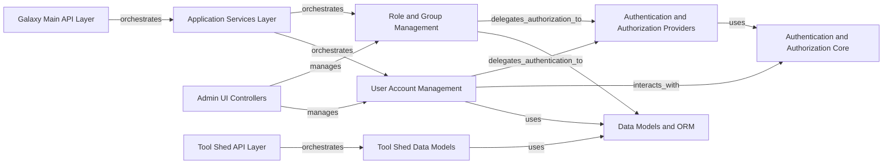

## Component Details

Handles all aspects of user management, including authentication, authorization, user accounts, roles, groups, and permissions to ensure secure access to Galaxy resources.

### User Account Management
Manages the lifecycle of user accounts, including creation, retrieval, updates, password management, and API key handling.

**Related Classes/Methods**:

- `galaxy.managers.users.UserManager` (full file reference)
- `galaxy.managers.api_keys` (full file reference)
- `galaxy.model.User` (full file reference)

### Role and Group Management
Handles the administration of user groups and roles, including their creation, modification, and the assignment of users and roles to groups, forming the basis for access control.

**Related Classes/Methods**:

- `galaxy.managers.roles.RoleManager` (full file reference)
- `galaxy.managers.groups.GroupsManager` (full file reference)
- <a href="https://github.com/galaxyproject/galaxy/blob/master/lib/galaxy/managers/group_users.py#L21-L92" target="_blank" rel="noopener noreferrer">`galaxy.managers.group_users.GroupUsersManager` (21:92)</a>
- <a href="https://github.com/galaxyproject/galaxy/blob/master/lib/galaxy/managers/group_roles.py#L18-L89" target="_blank" rel="noopener noreferrer">`galaxy.managers.group_roles.GroupRolesManager` (18:89)</a>
- `galaxy.model.db.role` (full file reference)

### Authentication and Authorization Core
Provides the foundational security mechanisms, including password hashing, ID encoding, and the core framework for Role-Based Access Control (RBAC).

**Related Classes/Methods**:

- `galaxy.security` (full file reference)
- `galaxy.security.idencoding` (full file reference)
- `galaxy.security.passwords` (full file reference)
- `galaxy.security.validate_user_input` (full file reference)
- `galaxy.security.vault` (full file reference)
- `galaxy.model.security` (full file reference)

### Authentication and Authorization Providers
Implements various authentication methods, including local database and external identity providers (e.g., OIDC, LDAP), and manages authorization policies.

**Related Classes/Methods**:

- `galaxy.auth.AuthManager` (full file reference)
- `galaxy.auth.providers` (full file reference)
- <a href="https://github.com/galaxyproject/galaxy/blob/master/lib/galaxy/authnz/managers.py#L40-L454" target="_blank" rel="noopener noreferrer">`galaxy.authnz.managers.AuthnzManager` (40:454)</a>
- `galaxy.authnz.custos_authnz` (full file reference)
- `galaxy.authnz.psa_authnz` (full file reference)
- `galaxy.authnz.tapis` (full file reference)
- `galaxy.webapps.galaxy.controllers.authnz.OIDC` (full file reference)

### Galaxy Main API Layer
Exposes RESTful API endpoints for various Galaxy functionalities, including user, group, and role management.

**Related Classes/Methods**:

- `galaxy.webapps.galaxy.api.users.FastAPIUsers` (full file reference)
- `galaxy.webapps.galaxy.api.group_users.FastAPIGroupUsers` (full file reference)
- `galaxy.webapps.galaxy.api.group_roles.FastAPIGroupRoles` (full file reference)
- `galaxy.webapps.galaxy.api.groups.FastAPIGroups` (full file reference)
- `galaxy.webapps.galaxy.api.roles.FastAPIRoles` (full file reference)
- `galaxy.webapps.galaxy.api.users.UserAPIController` (full file reference)

### Application Services Layer
Provides high-level services that encapsulate complex business logic, acting as an intermediary between the API layer and the underlying managers and data models.

**Related Classes/Methods**:

- `galaxy.webapps.galaxy.services.users.UsersService` (full file reference)
- <a href="https://github.com/galaxyproject/galaxy/blob/master/lib/galaxy/webapps/galaxy/services/roles.py#L30-L70" target="_blank" rel="noopener noreferrer">`galaxy.webapps.galaxy.services.roles.RolesService` (30:70)</a>
- <a href="https://github.com/galaxyproject/galaxy/blob/master/lib/galaxy/webapps/galaxy/services/quotas.py#L36-L161" target="_blank" rel="noopener noreferrer">`galaxy.webapps.galaxy.services.quotas.QuotasService` (36:161)</a>
- <a href="https://github.com/galaxyproject/galaxy/blob/master/lib/galaxy/webapps/galaxy/services/notifications.py#L45-L265" target="_blank" rel="noopener noreferrer">`galaxy.webapps.galaxy.services.notifications.NotificationService` (45:265)</a>

### Data Models and ORM
Defines the structure of the data stored in the database, including users, groups, roles, and various associations and permissions. It provides the object-relational mapping (ORM) for interacting with the database.

**Related Classes/Methods**:

- `galaxy.model` (full file reference)
- `galaxy.model.User` (full file reference)
- `galaxy.model.db.user` (full file reference)
- `galaxy.model.db.role` (full file reference)
- `galaxy.model.security` (full file reference)
- `galaxy.model.orm.util` (full file reference)

### Admin UI Controllers
Handles requests and renders views for the administrative user interface, allowing administrators to manage users, groups, roles, and quotas through a web browser.

**Related Classes/Methods**:

- <a href="https://github.com/galaxyproject/galaxy/blob/master/lib/galaxy/webapps/galaxy/controllers/admin.py#L42-L159" target="_blank" rel="noopener noreferrer">`galaxy.webapps.galaxy.controllers.admin.UserListGrid` (42:159)</a>
- <a href="https://github.com/galaxyproject/galaxy/blob/master/lib/galaxy/webapps/galaxy/controllers/admin.py#L162-L223" target="_blank" rel="noopener noreferrer">`galaxy.webapps.galaxy.controllers.admin.RoleListGrid` (162:223)</a>
- <a href="https://github.com/galaxyproject/galaxy/blob/master/lib/galaxy/webapps/galaxy/controllers/admin.py#L226-L279" target="_blank" rel="noopener noreferrer">`galaxy.webapps.galaxy.controllers.admin.GroupListGrid` (226:279)</a>
- <a href="https://github.com/galaxyproject/galaxy/blob/master/lib/galaxy/webapps/galaxy/controllers/admin.py#L282-L352" target="_blank" rel="noopener noreferrer">`galaxy.webapps.galaxy.controllers.admin.QuotaListGrid` (282:352)</a>
- <a href="https://github.com/galaxyproject/galaxy/blob/master/lib/galaxy/webapps/galaxy/controllers/admin.py#L363-L999" target="_blank" rel="noopener noreferrer">`galaxy.webapps.galaxy.controllers.admin.AdminGalaxy` (363:999)</a>
- `galaxy.webapps.galaxy.controllers.user.User` (full file reference)

### Tool Shed API Layer
Provides the RESTful API endpoints specifically for the Tool Shed subsystem, allowing external systems to interact with Tool Shed functionalities related to users and groups.

**Related Classes/Methods**:

- `galaxy.tool_shed.webapp.api2.users.FastAPIUsers` (full file reference)
- `galaxy.tool_shed.webapp.api.groups.GroupsController` (full file reference)

### Tool Shed Data Models
Defines the data models for the Tool Shed subsystem, including user and group related entities.

**Related Classes/Methods**:

- `galaxy.tool_shed.webapp.model` (full file reference)
- `galaxy.tool_shed.webapp.model.User` (full file reference)

### [FAQ](https://github.com/CodeBoarding/GeneratedOnBoardings/tree/main?tab=readme-ov-file#faq)