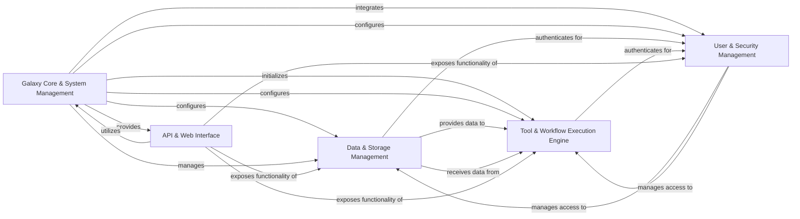

## Component Details

The Galaxy application's architecture is centered around a core system management component that initializes and orchestrates various services. This core interacts with dedicated components for managing data storage and types, executing computational tools and workflows, handling user authentication and authorization, and providing a comprehensive API and web interface. The primary data flow involves the core configuring and managing other components, while the API serves as the main entry point for user interactions, directing requests to the appropriate internal services for data, tool, and user management.

### Galaxy Core & System Management
The foundational layer of Galaxy, responsible for application initialization, configuration management, background task processing, and providing common utilities and shared services across the platform.

**Related Classes/Methods**:

- <a href="https://github.com/galaxyproject/galaxy/blob/master/lib/galaxy/app.py#L713-L913" target="_blank" rel="noopener noreferrer">`galaxy.lib.galaxy.app.UniverseApplication` (713:913)</a>
- <a href="https://github.com/galaxyproject/galaxy/blob/master/lib/galaxy/app.py#L262-L564" target="_blank" rel="noopener noreferrer">`galaxy.lib.galaxy.app.MinimalGalaxyApplication` (262:564)</a>
- <a href="https://github.com/galaxyproject/galaxy/blob/master/lib/galaxy/app.py#L567-L710" target="_blank" rel="noopener noreferrer">`galaxy.lib.galaxy.app.GalaxyManagerApplication` (567:710)</a>
- `galaxy.scripts.galaxy_main` (full file reference)
- `galaxy.lib.galaxy.main_config.WebappConfigResolver` (full file reference)
- <a href="https://github.com/galaxyproject/galaxy/blob/master/lib/galaxy/config_watchers.py#L14-L150" target="_blank" rel="noopener noreferrer">`galaxy.lib.galaxy.config_watchers.ConfigWatchers` (14:150)</a>
- `galaxy.config` (full file reference)
- `galaxy.util.properties` (full file reference)
- <a href="https://github.com/galaxyproject/galaxy/blob/master/lib/galaxy/queue_worker.py#L324-L425" target="_blank" rel="noopener noreferrer">`galaxy.lib.galaxy.queue_worker.GalaxyQueueWorker` (324:425)</a>
- `galaxy.lib.galaxy.queue_worker.send_local_control_task` (full file reference)
- `galaxy.lib.galaxy.queue_worker.send_control_task` (full file reference)
- `galaxy.lib.galaxy.queue_worker.reload_toolbox` (full file reference)
- `galaxy.lib.galaxy.queue_worker.reload_data_managers` (full file reference)
- `galaxy.lib.galaxy.queue_worker.reload_job_rules` (full file reference)
- `galaxy.lib.galaxy.queue_worker.reload_core_config` (full file reference)
- `galaxy.queues` (full file reference)
- `galaxy.util` (full file reference)
- <a href="https://github.com/galaxyproject/galaxy/blob/master/lib/galaxy/managers/citations.py#L25-L46" target="_blank" rel="noopener noreferrer">`galaxy.managers.citations.CitationsManager` (25:46)</a>
- <a href="https://github.com/galaxyproject/galaxy/blob/master/lib/galaxy/managers/licenses.py#L80-L107" target="_blank" rel="noopener noreferrer">`galaxy.managers.licenses.LicensesManager` (80:107)</a>
- <a href="https://github.com/galaxyproject/galaxy/blob/master/lib/galaxy/managers/notification.py#L97-L521" target="_blank" rel="noopener noreferrer">`galaxy.managers.notification.NotificationManager` (97:521)</a>
- <a href="https://github.com/galaxyproject/galaxy/blob/master/lib/galaxy/managers/metrics.py#L61-L140" target="_blank" rel="noopener noreferrer">`galaxy.managers.metrics.MetricsManager` (61:140)</a>
- <a href="https://github.com/galaxyproject/galaxy/blob/master/lib/galaxy/managers/chat.py#L21-L95" target="_blank" rel="noopener noreferrer">`galaxy.managers.chat.ChatManager` (21:95)</a>
- <a href="https://github.com/galaxyproject/galaxy/blob/master/lib/galaxy/managers/remote_files.py#L37-L188" target="_blank" rel="noopener noreferrer">`galaxy.managers.remote_files.RemoteFilesManager` (37:188)</a>
- <a href="https://github.com/galaxyproject/galaxy/blob/master/lib/galaxy/managers/display_applications.py#L32-L88" target="_blank" rel="noopener noreferrer">`galaxy.managers.display_applications.DisplayApplicationsManager` (32:88)</a>
- `galaxy.managers.pages.PageManager` (full file reference)
- `galaxy.managers.visualizations.VisualizationManager` (full file reference)
- `galaxy.managers.quotas.QuotaManager` (full file reference)
- `galaxy.managers.landing.LandingRequestManager` (full file reference)
- <a href="https://github.com/galaxyproject/galaxy/blob/master/lib/galaxy/managers/job_connections.py#L18-L177" target="_blank" rel="noopener noreferrer">`galaxy.managers.job_connections.JobConnectionsManager` (18:177)</a>
- `galaxy.managers.tasks.AsyncTasksManager` (full file reference)
- <a href="https://github.com/galaxyproject/galaxy/blob/master/lib/galaxy/managers/library_datasets.py#L31-L294" target="_blank" rel="noopener noreferrer">`galaxy.managers.library_datasets.LibraryDatasetsManager` (31:294)</a>
- `galaxy.managers.library_folders.LibraryFoldersService` (full file reference)
- `galaxy.managers.library_contents.LibraryContentsService` (full file reference)
- <a href="https://github.com/galaxyproject/galaxy/blob/master/lib/galaxy/managers/tool_data.py#L31-L106" target="_blank" rel="noopener noreferrer">`galaxy.managers.tool_data.ToolDataManager` (31:106)</a>
- `galaxy.managers.export_tracker.StoreExportTracker` (full file reference)
- `galaxy.managers.dbkeys.GenomeBuilds` (full file reference)
- <a href="https://github.com/galaxyproject/galaxy/blob/master/lib/galaxy/managers/interactivetool.py#L122-L322" target="_blank" rel="noopener noreferrer">`galaxy.managers.interactivetool.InteractiveToolManager` (122:322)</a>
- <a href="https://github.com/galaxyproject/galaxy/blob/master/lib/galaxy/managers/forms.py#L43-L81" target="_blank" rel="noopener noreferrer">`galaxy.managers.forms.FormManager` (43:81)</a>
- `galaxy.managers.item_tags.ItemTagsManager` (full file reference)
- `galaxy.managers.ratable.RatableManagerMixin` (full file reference)
- `galaxy.managers.secured.AccessibleManagerMixin` (full file reference)
- `galaxy.managers.deletable.DeletableManagerMixin` (full file reference)
- `galaxy.managers.annotatable.AnnotatableManagerMixin` (full file reference)
- `galaxy.managers.sharable.SharableModelManager` (full file reference)
- `galaxy.managers.context.ProvidesAppContext` (full file reference)
- <a href="https://github.com/galaxyproject/galaxy/blob/master/lib/galaxy/managers/session.py#L13-L31" target="_blank" rel="noopener noreferrer">`galaxy.managers.session.GalaxySessionManager` (13:31)</a>

### Data & Storage Management
Manages all aspects of data within Galaxy, including abstracting storage backends, handling file operations, organizing user histories and datasets, and managing the registration and conversion of various data types.

**Related Classes/Methods**:

- `galaxy.objectstore` (full file reference)
- `galaxy.files` (full file reference)
- `galaxy.managers.object_store_instances.ObjectStoreInstancesManager` (full file reference)
- <a href="https://github.com/galaxyproject/galaxy/blob/master/lib/galaxy/managers/file_source_instances.py#L142-L525" target="_blank" rel="noopener noreferrer">`galaxy.managers.file_source_instances.FileSourceInstancesManager` (142:525)</a>
- `galaxy.managers.histories.HistoryManager` (full file reference)
- `galaxy.managers.hdas.HDAManager` (full file reference)
- <a href="https://github.com/galaxyproject/galaxy/blob/master/lib/galaxy/managers/collections.py#L71-L888" target="_blank" rel="noopener noreferrer">`galaxy.managers.collections.DatasetCollectionManager` (71:888)</a>
- `galaxy.managers.hdcas.HDCAManager` (full file reference)
- `galaxy.managers.datasets.DatasetManager` (full file reference)
- <a href="https://github.com/galaxyproject/galaxy/blob/master/lib/galaxy/managers/lddas.py#L17-L47" target="_blank" rel="noopener noreferrer">`galaxy.managers.lddas.LDDAManager` (17:47)</a>
- `galaxy.managers.history_contents.HistoryContentsManager` (full file reference)
- `galaxy.model.store` (full file reference)
- `galaxy.tools.imp_exp` (full file reference)
- `galaxy.datatypes.registry.Registry` (full file reference)
- `galaxy.datatypes.sniff` (full file reference)
- `galaxy.datatypes.util` (full file reference)
- `galaxy.datatypes.converters` (full file reference)

### Tool & Workflow Execution Engine
The core engine for executing computational tasks, encompassing the management, loading, and execution of tools, orchestration of complex workflows, submission and monitoring of jobs, and integration with the Galaxy Tool Shed for tool discovery and installation.

**Related Classes/Methods**:

- `galaxy.tools.ToolBox` (full file reference)
- `galaxy.tools.search.ToolBoxSearch` (full file reference)
- <a href="https://github.com/galaxyproject/galaxy/blob/master/lib/galaxy/tools/biotools.py#L12-L27" target="_blank" rel="noopener noreferrer">`galaxy.tools.biotools.get_galaxy_biotools_metadata_source` (12:27)</a>
- `galaxy.tool_util.deps.dependencies.AppInfo` (full file reference)
- <a href="https://github.com/galaxyproject/galaxy/blob/master/lib/galaxy/tool_util/deps/containers.py#L64-L264" target="_blank" rel="noopener noreferrer">`galaxy.tool_util.deps.containers.ContainerFinder` (64:264)</a>
- `galaxy.tools.data.ToolDataTableManager` (full file reference)
- <a href="https://github.com/galaxyproject/galaxy/blob/master/lib/galaxy/tools/special_tools.py#L13-L16" target="_blank" rel="noopener noreferrer">`galaxy.tools.special_tools.load_lib_tools` (13:16)</a>
- <a href="https://github.com/galaxyproject/galaxy/blob/master/lib/galaxy/managers/tools.py#L55-L217" target="_blank" rel="noopener noreferrer">`galaxy.managers.tools.DynamicToolManager` (55:217)</a>
- <a href="https://github.com/galaxyproject/galaxy/blob/master/lib/galaxy/tool_shed/galaxy_install/install_manager.py#L79-L864" target="_blank" rel="noopener noreferrer">`galaxy.tool_shed.galaxy_install.install_manager.InstallRepositoryManager` (79:864)</a>
- `galaxy.tool_shed.galaxy_install.installed_repository_manager.InstalledRepositoryManager` (full file reference)
- `galaxy.tool_shed.galaxy_install.update_repository_manager.UpdateRepositoryManager` (full file reference)
- `galaxy.tool_shed.managers` (full file reference)
- <a href="https://github.com/galaxyproject/galaxy/blob/master/lib/galaxy/tool_shed/tools/tool_validator.py#L21-L111" target="_blank" rel="noopener noreferrer">`galaxy.tool_shed.tools.tool_validator.ToolValidator` (21:111)</a>
- <a href="https://github.com/galaxyproject/galaxy/blob/master/lib/galaxy/tool_shed/tools/data_table_manager.py#L60-L207" target="_blank" rel="noopener noreferrer">`galaxy.tool_shed.tools.data_table_manager.ShedToolDataTableManager` (60:207)</a>
- <a href="https://github.com/galaxyproject/galaxy/blob/master/lib/galaxy/tool_shed/galaxy_install/tools/tool_panel_manager.py#L26-L540" target="_blank" rel="noopener noreferrer">`galaxy.tool_shed.galaxy_install.tools.tool_panel_manager.ToolPanelManager` (26:540)</a>
- <a href="https://github.com/galaxyproject/galaxy/blob/master/lib/galaxy/tool_shed/metadata/metadata_generator.py#L91-L866" target="_blank" rel="noopener noreferrer">`galaxy.tool_shed.metadata.metadata_generator.BaseMetadataGenerator` (91:866)</a>
- `galaxy.tool_shed.util` (full file reference)
- <a href="https://github.com/galaxyproject/galaxy/blob/master/lib/galaxy/managers/workflows.py#L157-L567" target="_blank" rel="noopener noreferrer">`galaxy.managers.workflows.WorkflowsManager` (157:567)</a>
- <a href="https://github.com/galaxyproject/galaxy/blob/master/lib/galaxy/managers/workflows.py#L599-L2139" target="_blank" rel="noopener noreferrer">`galaxy.managers.workflows.WorkflowContentsManager` (599:2139)</a>
- `galaxy.workflow.run` (full file reference)
- `galaxy.workflow.run_request` (full file reference)
- <a href="https://github.com/galaxyproject/galaxy/blob/master/lib/galaxy/workflow/scheduling_manager.py#L44-L286" target="_blank" rel="noopener noreferrer">`galaxy.workflow.scheduling_manager.WorkflowSchedulingManager` (44:286)</a>
- <a href="https://github.com/galaxyproject/galaxy/blob/master/lib/galaxy/workflow/trs_proxy.py#L61-L107" target="_blank" rel="noopener noreferrer">`galaxy.workflow.trs_proxy.TrsProxy` (61:107)</a>
- `galaxy.workflow.extract` (full file reference)
- `galaxy.workflow.refactor` (full file reference)
- `galaxy.workflow.reports` (full file reference)
- `galaxy.jobs.manager.JobManager` (full file reference)
- `galaxy.jobs.runners` (full file reference)
- `galaxy.jobs.command_factory` (full file reference)
- `galaxy.jobs.dynamic_tool_destination` (full file reference)
- `galaxy.jobs.mapper` (full file reference)
- `galaxy.job_execution` (full file reference)
- `galaxy.job_metrics` (full file reference)
- <a href="https://github.com/galaxyproject/galaxy/blob/master/lib/galaxy/managers/jobs.py#L127-L353" target="_blank" rel="noopener noreferrer">`galaxy.managers.jobs.JobManager` (127:353)</a>

### User & Security Management
Handles all aspects of user management, including authentication, authorization, user accounts, roles, groups, and permissions to ensure secure access to Galaxy resources.

**Related Classes/Methods**:

- `galaxy.managers.users.UserManager` (full file reference)
- `galaxy.auth.AuthManager` (full file reference)
- <a href="https://github.com/galaxyproject/galaxy/blob/master/lib/galaxy/authnz/managers.py#L40-L454" target="_blank" rel="noopener noreferrer">`galaxy.authnz.managers.AuthnzManager` (40:454)</a>
- `galaxy.security` (full file reference)
- `galaxy.managers.roles.RoleManager` (full file reference)
- `galaxy.managers.groups.GroupsManager` (full file reference)
- <a href="https://github.com/galaxyproject/galaxy/blob/master/lib/galaxy/managers/group_users.py#L21-L92" target="_blank" rel="noopener noreferrer">`galaxy.managers.group_users.GroupUsersManager` (21:92)</a>
- <a href="https://github.com/galaxyproject/galaxy/blob/master/lib/galaxy/managers/group_roles.py#L18-L89" target="_blank" rel="noopener noreferrer">`galaxy.managers.group_roles.GroupRolesManager` (18:89)</a>

### API & Web Interface
Provides the external interface for Galaxy, including the web application and RESTful API, managing request routing, middleware, and session handling to facilitate user interaction and programmatic access.

**Related Classes/Methods**:

- `galaxy.webapps.galaxy.buildapp.app_factory` (full file reference)
- `galaxy.webapps.galaxy.fast_app.initialize_fast_app` (full file reference)
- <a href="https://github.com/galaxyproject/galaxy/blob/master/lib/galaxy/webapps/base/webapp.py#L97-L275" target="_blank" rel="noopener noreferrer">`galaxy.webapps.base.webapp.WebApplication` (97:275)</a>
- <a href="https://github.com/galaxyproject/galaxy/blob/master/lib/galaxy/webapps/base/webapp.py#L307-L1104" target="_blank" rel="noopener noreferrer">`galaxy.webapps.base.webapp.GalaxyWebTransaction` (307:1104)</a>
- `galaxy.webapps.galaxy.api` (full file reference)
- `galaxy.webapps.galaxy.services` (full file reference)
- `galaxy.web.framework` (full file reference)
- `galaxy.web_stack` (full file reference)

### [FAQ](https://github.com/CodeBoarding/GeneratedOnBoardings/tree/main?tab=readme-ov-file#faq)